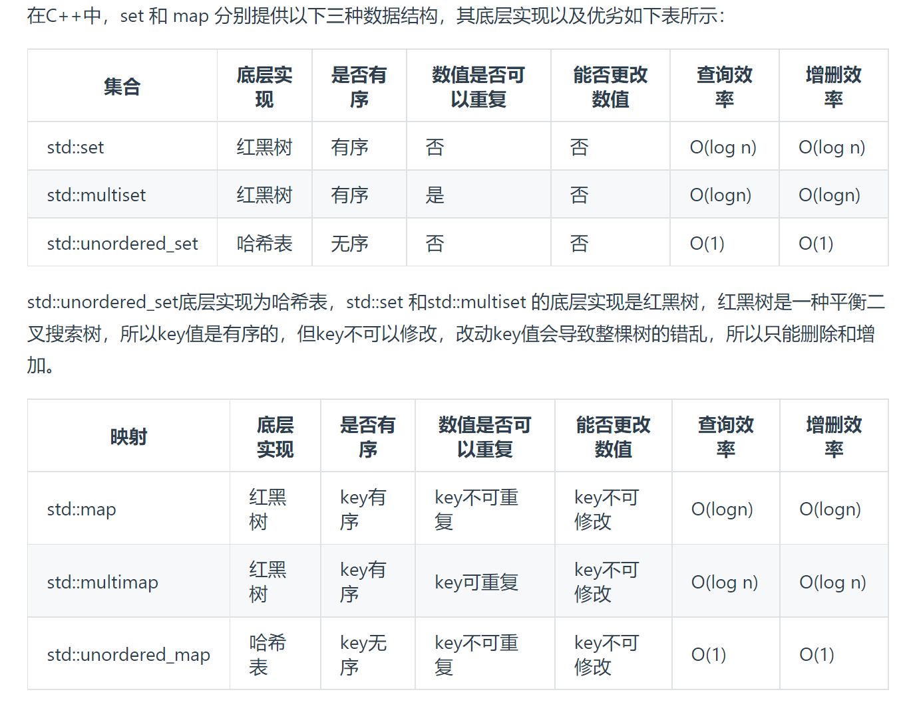

 

和本文无关，但是推荐阅读：https://leetcode.cn/circle/discuss/WMD02i/view/cpLrhM/

注意：这里的介绍只为满足最基本的使用；在搜索引擎搜索，可以找到更多的用法。当自己编程而不是在 LeetCode 之类的地方做函数题时，请自行搜索它们所需的头文件等信息。注意：这里的介绍只为满足最基本的使用；在搜索引擎搜索，可以找到更多的用法。当自己编程而不是在 LeetCode 之类的地方做函数题时，请自行搜索它们所需的头文件等信息。

如未特殊说明，本文讨论的内容都在 `namespace std` 里；本文的例子大多来源于 [cppreference.com](https://en.cppreference.com/)。


## 1 C 基础

## 2 C++基础

### 2.1 引用

参见 https://www.yuque.com/xianyuxuan/coding/apd2_6（看 2.6.1 和应用的第 1 条就够了）。其实引用就是包装了一下的指针，让人用得更舒服。

### 2.2 vector

\#include <vector>
	vector<vector<int>> matrix(n, vector<int>(n)); //构造二维数组

vector 可以理解为一种自动扩展长度的数组。

**begin和end**

- begin：返回指向容器第一个元素的迭代器
- end：返回指向容器最后一个元素下一个位置的迭代器

**构造**。我们可以通过 `vector<int> v;`的方式构造一个空的、每个元素的类型均为`int`的 vector，其名字为`v`。可以用其他类型，包括自定义的结构体替换这里的`int`。也可以通过类似`vector<int> v = {1, 2, 3};`的方式初始化。

**获取长度**。可以通过`v.size()`获取 vector `v`中的元素个数。

**在末尾插入元素**。可以通过`v.push_back(x)`的方式将`x`插入到 vector `v`的末尾。这里的插入是使用拷贝构造的，而使用`v.emplace_back(...)`则可以在`vector`中进行“原地构造”，对于一些特定的数据类型效率更好，写起来也更简单。

**访问（读取 / 修改）元素**。和数组一样，可以通过`v[i]`的方式访问 vector `v`的第`i`个元素，下标从 0 开始。注意，当`i >= v.size()`的时候，程序可能发生运行时错误。

**遍历**。C++11除了使用 `for (int i = 0; i < v.size(); i++) sum += v[i];`的方式遍历以外，还可以这样写：`for (auto a : v) sum += a;`。这种写法叫做 range-based for loop。C++11这里的`auto`会自动推断出`a`的数据类型，也就是 vector`v`中元素的类型，官方称呼是 Placeholder type specifiers。在做 LeetCode 的绝大多数场景下，我们可以使用`for (auto &a : v)`，加上一个引用。加上这个引用后就不会在遍历的过程中每次循环都构造一个临时变量，在遍历二维`vector`的时候尤为有意义。当然加上引用后对这个变量`a`做的改动会真实地影响到`vector v`。

想要拷贝元素：for(auto x:range)
	想要修改元素：for(auto &x:range)
	想要只读元素：for(const auto& x:range)

**二维数组的初始化：**

```
vector<int> vec(4,2); //将含有4个数据的一维动态数组初始为2
vector<vector<int>> asd1(row,vector<int>(column,0)//初始化row*column二维动态数组元素为0
```


### 2.3 string

\#include <string>

string 是 C++ 中的字符串类型。其实现和 C 中的字符数组一致，也是以`'\0'`标识结束。

**构造**。可以通过`string s;`或者`string s = "123";`的方式构造一个字符串。

**获取长度**。可以通过`s.length()`或者`s.size()`的方式获取其长度，该长度不含末尾的`'\0'`。

**拼接**。可以通过`s1 + s2`或者`s + 'a'`的方式将字符串与另一个字符串或字符（均可以是字面量）拼接。

**访问字符**。和数组、vector 一样，可以通过`s[i]`的方式访问字符串的第 i 个字符。

**遍历**。C++11类似 vector，可以通过`for (auto c : s)`的方式遍历字符串中的每一个字符。

**比较**。可以通过`==`, `!=`, `>`等比较运算符按字典序比较两个字符串。

**子字符串。**`substr(size_type _Off = 0,size_type _Count = npos)`

_Off——所需的子字符串的起始位置。字符串中第一个字符的索引为 0,默认值为0。
	_Count——复制的字符数目。注意是个数，不是结束的位置。
	返回值——一个子字符串，从其指定的位置开始

**寻找**。 `find()`返回输入字符在字符串中的位置


### 2.4 pair

\#include <utility>

pair 可以将两个不必相同的类型攒起来，例如`pair<int, int> p1;`或者`pair<int, string> p2;`。

可以用 `pair<int, double> p{1, 1.3};`的方式构造，也可以通过 `p = make_pair(0, -3.1)`的方式赋值。pair 之间也可以直接赋值。

可以用`p1.first`、`p1.second`的方式访问其成员。

pair 默认的比较方法是先按第一个字段比较，相同再按第二个字段比较。


## 3 不那么基础

### 3.1 ☆☆☆ sort

\#include <algorithm>

`sort`用于对数组或 vector 等可以随机访问且元素可比较的数据结构进行排序。复杂度是 。

例如：

```cpp
int a[] = {3, 1, 4, -2, 5, 3};
sort(a, a + 6);
```

此时`a`中的值为 -2 1 3 3 4 5，即升序排列。

这里`a`和`a + 6`是左闭右开的排序区间，也可以用类似`sort(a + 1, a + 4)` 的方式对部分进行排序。


对于 vector，也可以类似使用：

```cpp
vector<int> v = {3, 1, 4, -2, 5, 3};
sort(v.begin(), v.end());
```


如果想要降序怎么办呢？方法之一是：

```cpp
vector<int> v = {3, 1, 4, -2, 5, 3};
sort(v.begin(), v.end(), greater<int>());
```

此时`v`中的值是 5 4 3 3 1 -2。


另一种方法，我们可以自定义比较函数。比较函数接收两个元素的引用，返回一个 bool 值表示前者是否应当在后者之前：

```cpp
bool cmp(const int& a, const int& b) { return a > b; }
vector<int> v = {3, 1, 4, -2, 5, 3};
sort(v.begin(), v.end(), cmp);
```

注意，比较函数逻辑上相当于`a < b`。因此当两个元素相等时，比较函数总是应当返回 false。


C++11也可以使用 lambda 表达式简化写法：

```cpp
vector<int> v = {3, 1, 4, -2, 5, 3};
sort(v.begin(), v.end(), [](const int& a, const int& b) { return a > b; });
```


自定义比较函数可以适用更复杂的排序，例如需要比较的元素本身并没有内置的比较运算符的时候。例如：

```cpp
bool cmp(const vector<int>& a, const vector<int>& b) {
    return a[0] == b[0] ? a[1] < b[1] : a[0] < b[0];
}
```

这个比较函数可以用于`vector<vector<int>>`类型的排序。

常用的标准库（如 libgc++）中对于`std::sort`的实现保证复杂度是，而不会退化成快排的。因为它使用的是一种快排、堆排以及插入排序的结合体。


### 3.2 ☆ upper_bound & lower_bound & binary_search & equal_range

\#include <algorithm>

用于有序的数组！ 可以像`sort`一样指定比较函数。

- `auto u = upper_bound(data.begin(), data.end(), i)`返回第一个 **严格大于** `i`的元素的迭代器（和指针差不多，可以用`*u`获取其值）；如果没有找到，返回第二个参数，即`data.end()`。
- `lower_bound`返回第一个 **大于等于** `i`的元素的迭代器；如果没有找到，返回第二个参数。这里演示的是一个自定义比较函数的例子（可以看到，传入的待查找参数并不一定需要和容器内元素的类型一致，只要和自定义比较函数吻合即可）：

```cpp
auto prc_info = lower_bound(prices.begin(), prices.end(), i,
    [](const PriceInfo& info, double value){ return info.price < value; });
```

- `binary_search(v.begin(), v.end(), i)`返回一个 bool，表示`i`是否在`v`中。

注意：这 3 个函数均使用二分查找，因此如果原数组不是有序的，结果就可能是错误的。复杂度均为。

```cpp
int p = -1;
for (char c : w) {
	auto &ps = pos[c - 'a'];
    auto it = upper_bound(ps.begin(), ps.end(), p);
    if (it == ps.end()) {
        --res;
        break;
    }
    p = *it;
}
```

### 3.3 gcd & lcm C++17

\#include <numeric>

经常记不住辗转相除法怎么写……这下不用记了！

`cout << gcd(18, 12) << " " << lcm(18, 12) << endl;`，输出为 `6 36`。


### 3.4 Algorithm 库里其他看起来有用的东西

（下面的“数组”不仅可以是数组，也可以是其他一些满足相关条件的数据结构，且条件可能各不相同；在此暂不展开）

- C++17返回数组中最大的元素的迭代器，可以和 sort 一样自定义比较函数：`std::max_element`，也有 min https://en.cppreference.com/w/cpp/algorithm/max_element 
- C++17合并两个有序数组：`std::merge`https://en.cppreference.com/w/cpp/algorithm/merge
- C++17逆转一个数组：`std::reverse`https://en.cppreference.com/w/cpp/algorithm/reverse


### 3.5 匿名函数

C++中的匿名函数通常为`[capture](parameters)->return-type{body}`，当parameters为空的时候，()可以被省去，当body只有“return”或者返回为void，那么”->return-type“可以被省去，下面将将对其中的参数一一解释

capture：
[]         //未定义变量.试图在Lambda内使用任何外部变量都是错误的.
[x, &y]  //x 按值捕获, y 按引用捕获.
[&]      //用到的任何外部变量都隐式按引用捕获
[=]      //用到的任何外部变量都隐式按值捕获
[&, x]   //x显式地按值捕获. 其它变量按引用捕获
[=, &z]  //z按引用捕获. 其它变量按值捕获
parameters：存储函数的参数
return-type：函数的返回值
body：函数体

```cpp
#include<iostream>
template <class Callback>
int CollectFeatures(Callback CB)
{
	int count = 0;
	for (int i = 0; i < 10; i++)
	{
		if (CB(i))
		{
			count++;
		}
	}
	return count;
}
bool AddFeature(size_t Feature)
{
	return Feature % 2;
}
void main()
{
	
	int i = CollectFeatures([](size_t Feature) -> bool { return AddFeature(Feature); });
	std::cout << i << std::endl;
}
```

### 3.6 其他

- 内置类型的最大 / 最小值：

- - \#include <limits>
  - `std::numeric_limits<int>::max()`、`std::numeric_limits<char>::min()`之类的

- 可以用 `x & (x - 1) == 0`检验`x`是不是 2 的整数次幂
- 可以用 `x & (-x)`计算`x`最大的 2 的整数次幂因子 (the greatest power of 2 that divides X)
- 可以用 `__builtin_popcount(x)`计算 int `x`在二进制表示中 1 的个数；`__builtin_popcountll`可以用于 long long。


## 4 数据结构之类的东西

这部分其实不太清楚该怎么写QWQ，所以我尝试大概描述每种数据结构是干什么的以及它的用法；关于具体的实现相关的知识我尽量贴上链接~


它们都可以通过`a.size()`获取元素个数、`a.empty()`判断是否为空（返回 bool），就不在每个里面写一遍了！

未特殊说明的操作，复杂度均为。

下面均以元素类型为`int`为例，但是这个类型也可以是其他任意类型，比如`stack<map<string, Foo>>`之类的也都可以！

### 4.1 stack & queue & priority_queue | Container adaptors

这三种数据结构是不能遍历的。“如果你需要遍历它们，那么你就不应当选择它们。”

### 4.1.1 ☆ stack & queue

**栈**（stack）是一个后进先出（LIFO）表，限制了插入和删除只能在表的末端（成为栈顶，top）进行。典型的操作是 Push, Pop 和 Top（读取栈顶元素的值）。

\#include <stack>

- 构造：`stack<int> s;`
- 压栈：`s.push(1)`
- 出栈：`s.pop()`
- 访问栈顶：`s.top()`

**队列**（queue）是一个先进先出（FIFO）表。入队（Enqueue）在队尾（rear）插入一个元素，出队（Dequeue）则删除队头（front）的一个元素。

\#include <queue>

- 构造：`queue<int> q;`
- 入队：`q.push(2)`
- 出队：`q.pop()`
- 访问队首 / 队尾元素：`q.front()`, `q.back()`

（另外还有`deque`，双端队列。好像很少用，省略）

See Also：

- https://www.yuque.com/xianyuxuan/coding/evgh6g


### 4.1.2 ☆☆ priority_queue

**优先队列**（priority queue）是始终保证队头元素是队列中最小的一种数据结构，这里用堆实现。支持的主要操作有：插入（入队），查询和删除最小值（出队）。

\#include <queue>

- 构造

- - `priority_queue<int> q1`：队首始终是最小值
  - `priority_queue<int, vector<int>, greater<int>> q2`：队首始终是最大值
  - 自定义比较函数：

```cpp
auto cmp = [](const int &a, const int &b) {return a > b;};
priority_queue<int, vector<int>, decltype(cmp)> q3(cmp);
```

- - 还可以用已有的数组初始化优先队列：

- - - `priority_queue<int> q1(v.begin(), v.end());`
    - `priority_queue<int, vector<int>, greater<int>> q2(v.begin(), v.end());`
    - `priority_queue<int, vector<int>, decltype(cmp)> q3(v.begin(), v.end(), cmp);`
    - 这样初始化的复杂度是的。


- 入队：`q.push(2)`
- 出队：`q.pop()`
- 入队和出队的复杂度是 的。


- 访问队首（最小）元素：`q.top()`


See Also：

- 优先队列的实现：https://www.yuque.com/xianyuxuan/coding/fpxegv


### 4.2 ☆ set & map & multiset & multimap | Associative containers

`std::set`是唯一、有序元素的集合，这里用红黑树实现。

`std::map`是键值对的集合，键唯一、有序，这里用红黑树实现。

`std::multiset`和`std::multimap`分别是它们的可重版本，即键不唯一。

这四种数据结构是可以遍历的，且遍历时也是有序的。


### 4.2.1 set & multiset

\#include <set>

- 构造：`set<int> s;` 或 `multiset<int> s;`

- - 也可以类似 priority_queue 用数组等构造，复杂度是 的
  - 也可以自定义比较函数：`auto cmp = [](int a, int b) { return ... };  std::set<int, decltype(cmp)> s(cmp);`

- 插入：`s.insert(3);`，复杂度是的
- 删除：`s.erase(2)`，返回删除了多少个，复杂度是的，是找到的个数
- 计数：`s.count(3)`，返回有多少个对应元素，复杂度是的，是找到的个数
- 查找：`s.find(2)`，返回一个值相等的元素的迭代器，如果没找到，返回`s.end()`。复杂度是的
- 也有 `s.lower_bound(2)`、`s.upper_bound(3)`函数。

- 构造：`set<int> s;` 或 `multiset<int> s;`

- - 也可以类似 priority_queue 用数组等构造，复杂度是 的
  - 也可以自定义比较函数：`auto cmp = [](int a, int b) { return ... };  std::set<int, decltype(cmp)> s(cmp);`

- 插入：`s.insert(3);`，复杂度是的
- 删除：`s.erase(2)`，返回删除了多少个，复杂度是的，是找到的个数
- 计数：`s.count(3)`，返回有多少个对应元素，复杂度是的，是找到的个数
- 查找：`s.find(2)`，返回一个值相等的元素的迭代器，如果没找到，返回`s.end()`。复杂度是的
- 也有 `s.lower_bound(2)`、`s.upper_bound(3)`函数。




### 4.2.2 map

\#include <map>

- 构造：`map<int, string> s;`

- - 附注同 set & multiset

- 访问或新建：`s[1]`，如果 key`1`存在则返回对应 value 的引用，否则插入 key 为`1`，value 为对应类型默认值的键值对，并返回 value 的引用。复杂度是的

- - 也就是说，可以直接用 `s[1] = "123"`的方式新建键值对或者覆盖已有的，无论 key `1`之前是否存在。
  - 下面两个并不常用：
  - 插入：`s.insert({1, "123"});`，如果 key `1`已经存在则不会覆盖。复杂度是的
  - 访问：`s.at(1)`，如果 key`1`存在则返回对应 value 的引用，否则抛出异常。复杂度是的

- 删除：`s.erase(2)`，返回删除了多少个，复杂度是的
- 计数：`s.count(3)`，返回有多少个 key 相等的元素，复杂度是
- 查找：`s.find(2)`，返回 key 相等的元素的迭代器，如果没找到，返回`s.end()`。复杂度是的
- 也有 `s.lower_bound(2)`、`s.upper_bound(3)`函数。复杂度是的


### 4.2.3 multimap

\#include <map>

不太常用，暂略！


See Also：

- 红黑树：https://www.yuque.com/xianyuxuan/coding/bgc8rm


### 4.3 ☆☆ unordered_set  & unordered_map | Unordered associative containers

`std::unordered_set`和`std::unordered_map`分别是`std::set`和`std::map`的无序版本，即键不经过排序。这里用哈希实现。

这两种数据结构也是可以遍历的。

\#include <unordered_set>

\#include <unordered_map>

成员函数与 set 和 map 类似，但是因为无序所以没有`lower_bound`和`upper_bound`。

同时由于是使用哈希实现的，因此插入、删除、访问、查找的**平均**复杂度均为![img](data:image/svg+xml;utf8,%3Csvg%20xmlns%3Axlink%3D%22http%3A%2F%2Fwww.w3.org%2F1999%2Fxlink%22%20width%3D%224.745ex%22%20height%3D%222.843ex%22%20style%3D%22vertical-align%3A%20-0.838ex%3B%22%20viewBox%3D%220%20-863.1%202043%201223.9%22%20role%3D%22img%22%20focusable%3D%22false%22%20xmlns%3D%22http%3A%2F%2Fwww.w3.org%2F2000%2Fsvg%22%20aria-labelledby%3D%22MathJax-SVG-1-Title%22%3E%0A%3Ctitle%20id%3D%22MathJax-SVG-1-Title%22%3EEquation%3C%2Ftitle%3E%0A%3Cdefs%20aria-hidden%3D%22true%22%3E%0A%3Cpath%20stroke-width%3D%221%22%20id%3D%22E1-MJMATHI-4F%22%20d%3D%22M740%20435Q740%20320%20676%20213T511%2042T304%20-22Q207%20-22%20138%2035T51%20201Q50%20209%2050%20244Q50%20346%2098%20438T227%20601Q351%20704%20476%20704Q514%20704%20524%20703Q621%20689%20680%20617T740%20435ZM637%20476Q637%20565%20591%20615T476%20665Q396%20665%20322%20605Q242%20542%20200%20428T157%20216Q157%20126%20200%2073T314%2019Q404%2019%20485%2098T608%20313Q637%20408%20637%20476Z%22%3E%3C%2Fpath%3E%0A%3Cpath%20stroke-width%3D%221%22%20id%3D%22E1-MJMAIN-28%22%20d%3D%22M94%20250Q94%20319%20104%20381T127%20488T164%20576T202%20643T244%20695T277%20729T302%20750H315H319Q333%20750%20333%20741Q333%20738%20316%20720T275%20667T226%20581T184%20443T167%20250T184%2058T225%20-81T274%20-167T316%20-220T333%20-241Q333%20-250%20318%20-250H315H302L274%20-226Q180%20-141%20137%20-14T94%20250Z%22%3E%3C%2Fpath%3E%0A%3Cpath%20stroke-width%3D%221%22%20id%3D%22E1-MJMAIN-31%22%20d%3D%22M213%20578L200%20573Q186%20568%20160%20563T102%20556H83V602H102Q149%20604%20189%20617T245%20641T273%20663Q275%20666%20285%20666Q294%20666%20302%20660V361L303%2061Q310%2054%20315%2052T339%2048T401%2046H427V0H416Q395%203%20257%203Q121%203%20100%200H88V46H114Q136%2046%20152%2046T177%2047T193%2050T201%2052T207%2057T213%2061V578Z%22%3E%3C%2Fpath%3E%0A%3Cpath%20stroke-width%3D%221%22%20id%3D%22E1-MJMAIN-29%22%20d%3D%22M60%20749L64%20750Q69%20750%2074%20750H86L114%20726Q208%20641%20251%20514T294%20250Q294%20182%20284%20119T261%2012T224%20-76T186%20-143T145%20-194T113%20-227T90%20-246Q87%20-249%2086%20-250H74Q66%20-250%2063%20-250T58%20-247T55%20-238Q56%20-237%2066%20-225Q221%20-64%20221%20250T66%20725Q56%20737%2055%20738Q55%20746%2060%20749Z%22%3E%3C%2Fpath%3E%0A%3C%2Fdefs%3E%0A%3Cg%20stroke%3D%22currentColor%22%20fill%3D%22currentColor%22%20stroke-width%3D%220%22%20transform%3D%22matrix(1%200%200%20-1%200%200)%22%20aria-hidden%3D%22true%22%3E%0A%20%3Cuse%20xlink%3Ahref%3D%22%23E1-MJMATHI-4F%22%20x%3D%220%22%20y%3D%220%22%3E%3C%2Fuse%3E%0A%20%3Cuse%20xlink%3Ahref%3D%22%23E1-MJMAIN-28%22%20x%3D%22763%22%20y%3D%220%22%3E%3C%2Fuse%3E%0A%20%3Cuse%20xlink%3Ahref%3D%22%23E1-MJMAIN-31%22%20x%3D%221153%22%20y%3D%220%22%3E%3C%2Fuse%3E%0A%20%3Cuse%20xlink%3Ahref%3D%22%23E1-MJMAIN-29%22%20x%3D%221653%22%20y%3D%220%22%3E%3C%2Fuse%3E%0A%3C%2Fg%3E%0A%3C%2Fsvg%3E)。因此，在没有排序需求时可以首选这两个容器。

https://blog.csdn.net/weixin_45745854/article/details/122785542?ops_request_misc=&request_id=&biz_id=102&utm_term=unordered_map&utm_medium=distribute.pc_search_result.none-task-blog-2~all~sobaiduweb~default-1-122785542.142^v63^control,201^v3^add_ask,213^v1^t3_esquery_v2&spm=1018.2226.3001.4187

### 4.3.1 unordered_set

```
#include <unordered_set>
```

1. 不再以键值对的形式存储数据，而是直接存储数据的值。
2. 容器内部存储的各个元素的值都互不相等，且不能被修改。
3. 不会对内部存储的数据进行排序（这和该容器底层采用哈希表结构存储数据有关）。

无序集(unorder sets)是一种不按特定顺序存储唯一元素的容器，允许根据元素的值快速检索单个元素。在unordered_set中，元素的值同时也是唯一标识它的键.

在内部，unordered_set中的元素并不按照任何特定的顺序排序，而是根据它们的散列值组织到桶中，从而允许根据它们的值直接快速访问单个元素(平均时间复杂度为常数)。与set容器相比，Unordered_set容器通过键访问单个元素的速度更快，尽管它们通常在通过元素的子集进行范围迭代时效率较低。

```cpp
unorder_set<string> //first容器定义
first.empty()//判断容器是否是空，是空返回true，反之为false
first.size()//返回容器大小
first.maxsize()//返回容器最大尺寸
first.begin()//返回迭代器开始
first.end()//返回迭代器结束
first.find(value)//返回value在迭代器的位置
first.count(key)//返回key在容器的个数
first.insert(value)//将value插入到容器中
first.emplace(key)//向容器中添加新元素，效率比 insert() 方法高。
first.erase(key)//通过key删除
first.clear()//清空容器
```

### 4.3.2 unordered_map


## 5 结语

事实上，在做力扣周赛和各种笔面试的算法题的过程中，我自己会用到的 C++ 层面上能提供的帮助大概也就上面这些；其中还有相当一部分是可以自己简单实现的。而做出题目的关键更多还是靠算法的设计。我本身也没有做过多少题，目前的水平也是在尝试在周赛中能稳定做出三题，感觉基础算法、思路和见识方面还有很多欠缺。整理上面这些内容，也希望能给自己和读者（如果有）带来一点点帮助！

