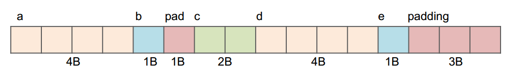
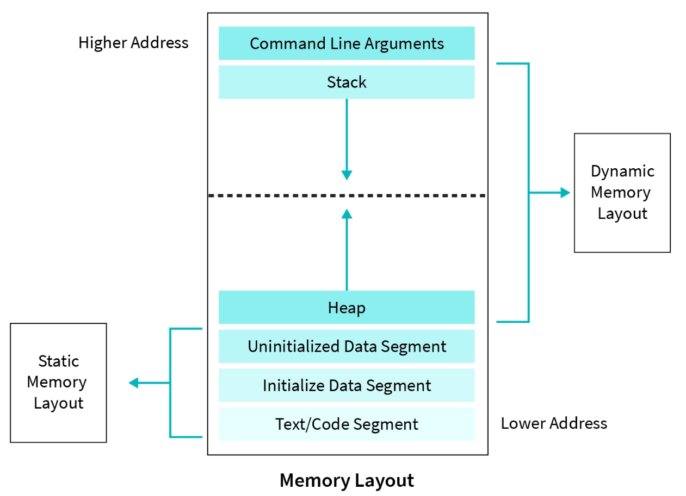
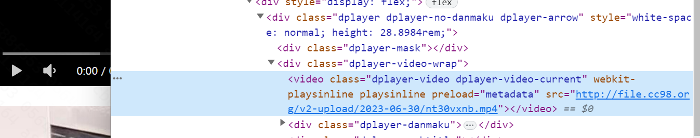
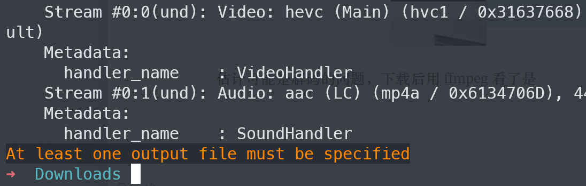

# C Language

## 关键字enum

声明函数原型时，可以不写出形参。Declaring the “prototype” of a  function allows you to use it  before the function’s definition.

```c
// function prototypes
int my_func(int,int);
void sayHello();
// function definitions
int my_func(int x,int y)
{
    sayHello();
    return x * y;
}
void sayHello()
{
	printf(“Hello\n”);
}
```

C 语言标准(C89) 没有定义布尔类型，如果你使用 true 和 false，会出现错误；C99 提供了一个头文件 <stdbool.h> 定义了 bool 代表 Bool，true 代表 1，false 代表 0。只要导入 stdbool.h ，就能非常方便的操作布尔类型了。

struct对齐：

内存对齐主要遵循下面三个原则:

1. 结构体变量的起始地址能够被其最宽的成员大小整除
2. 结构体每个成员相对于起始地址的偏移能够被其自身大小整除，如果不能则在前一个成员后面补充字节
3. 结构体总体大小能够被最宽的成员的大小整除，如不能则在后面补充字节 

实际使用的有效对齐其实是取指定大小和自身大小的最小值，一般默认的对齐大小是4。 

```c
struct hello { 
    int a; 
    char b;
    short c; 
    char *d; 
    char e;
}; 
sizeof(hello) = 16
```



```c
%d      int             有符号10进制整数
%u      unsigned int    无符号10进制整数
%o                      有符号8进制整数
%x 　　                 无符号的16进制数字，并以小写abcdef表示
%X 　                   无符号的16进制数字，并以大写ABCDEF表示
%f　　                  输入输出为浮点型 （%lf双精度浮点型）
%c                      输入输出为单个字符 
%s                      输入输出为字符串
```

`(*p)++` 和 `*p++` returns `*p`, then increments in mem, Post-increment happens last.



- Stack
- Heap: space requested via malloc() and used with pointers; resizes dynamically, grows upward
- Static Data: global , string literals, static variables, does not grow or shrink
- Code: loaded when program starts, does not change


`char *p ="Hello"` here `p` is a character pointer `(char *)` which point to memory address of the first character of the string. **Modifying string literals invokes an undefined behavior**. `"hello"`is string literal. 

`char str []="Hello"` This will put str on the stack.

- 自动变量和结构体的声明不分配内存，在定义后才会分配内存
- 自动变量定义即是初始化
- 结构体的定义和初始化含义不同

`malloc(int n)`		 
`void calloc(size_t nmemb, size_t size)`  It initializes the memory to 0
`void realloc(void *ptr, size_t size)`  		

- Takes in a ptr that has been the return of malloc/calloc/realloc and a new size
- Returns a pointer with now size space (or NULL)  and copies any contents from ptr
- Realloc can move or keep the address the same

`stdin`是C语言中的标准输入流，用于从标准输入设备（通常是键盘）读取输入。在C语言中，标准输入设备、标准输出设备和标准错误输出设备分别用`stdin`、`stdout`和`stderr`表示。

## 文件读写

`fgets(a_word, MAX_LEN, stdin)` 

`stdin`表示输入数据将从标准输入流中获取，`fgets()`函数将从标准输入流中读取一行字符，并将这些字符存储到`a_word`数组中，最多存储`MAX_LEN - 1`个字符。如果读取的行长度超过了`MAX_LEN - 1`个字符，`fgets()`函数将截断该行并在行末添加一个null字符`\0`。

`int fscanf(FILE *stream, const char *format, ...)`

```C
FILE * fp;
fp = fopen ("file.txt", "w+");
fputs("We are in 2012", fp);
rewind(fp);
fscanf(fp, "%s %s %s %d", str1, str2, str3, &year);
printf("Read String1 |%s|\n", str1 );
printf("Read String2 |%s|\n", str2 );
printf("Read String3 |%s|\n", str3 );
printf("Read Integer |%d|\n", year );
```

`int feof(FILE *stream)`

确定是否已到达指定文件（流）的末尾。`feof` 函数用于检测是否已到达文件的末尾，但是它是在文件指针移动之后才会返回，因此在执行读取操作之前调用 `feof` 函数并不能保证能够准确地判断文件是否已经读取完毕。具体来说，当文件指针读到文件尾部时，`feof` 函数不会立即返回1，而是等到下一次读取操作失败（如读取到EOF或出现其它错误）时才会返回1。因此，如果只使用 `feof` 函数来判断文件是否读取完毕，会有可能造成读取不完整或者读取过多的问题。

避免这个问题，通常可以使用读取函数（如 `fscanf`、`fgets` 等）的返回值来判断读取操作是否成功，并根据返回值进行循环控制，从而避免使用 `feof` 函数。例如，在C语言中，通常可以使用以下方式来读取文件直至结尾：

```c
while (fscanf(fp, "%d %d %d", &num1, &num2, &num3) == 3)  
```

`long int strtol(const char *str, char **endptr, int base)`

根据给定的base `str` 中的字符串的初始部分转换为 `long int` 值，该值必须介于 2 和 36 之间（含），或者是特殊值 0。

- **str** -- 这是包含整数表示的字符串。
- **endptr** -- 这是对 char* 类型对象的引用，其值由函数设置为*str*中数值后的下一个字符。
- **base** -- 这是基数，必须介于 2 和 36 之间（含），或者是特殊值 0。

```C
#include <stdio.h>
#include <stdlib.h>

int main()
{
    char str[30] = "16 This is test";
    char *ptr;
    long ret;

    ret = strtol(str, &ptr, 9);
    printf("The number(unsigned long integer) is %ld\n", ret);
    printf("String part is |%s|\n", ptr);
    return (0);
}
The number(unsigned long integer) is 15
String part is | This is test|
```


关于98网页端视频黑屏但有声音的问题

很早注意到了这个问题，但好像没怎么见到有人提过。开始以为是没有完全上传完成，今天找了个视频打开看了下前端链接应该是好的，



估计可能是解码的问题，下载后用 ffmpeg 看了是HEVC即 H.265 编码，估计应该是chrome不能直接解析。



网上搜了下chrome在去年十月份添加了硬件解析功能，软解应该还不可以。


那么解决方式就很显而易见了，在设置里打开硬件加速就行。


不过打开硬件加速会带来一点bug，这我倒没深入研究下，不知道有无人补充。
