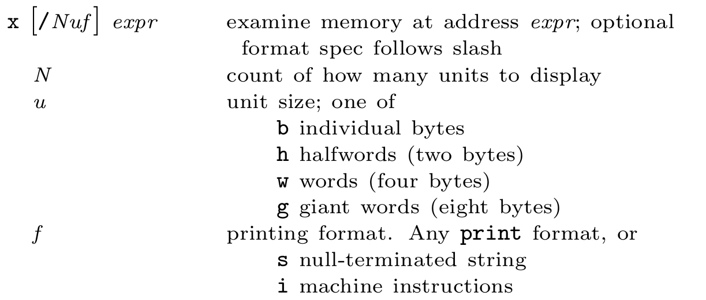

# GDB

要调试C/C++的程序，首先在编译时，要使用gdb调试程序，在使用gcc编译源代码时必须加上`-g`参数。保留调试信息，否则不能使用GDB进行调试。

```bash
gdb bomb
# 载入被调试程序
file XXX
# 获取帮助
help
# 设置断点
break explode_bomb
break phase_1
# 开始运行，简写为 r ，后面可带参数
run
# 检查汇编 会给出对应的代码的汇编
disas main
# 查看寄存器内容
info registers
# 打印指定寄存器 注意不加%
print $rsp
# 单步执行
stepi(si)
nexti(ni)
finish             # 跳出函数体
until    		   # 跳出当前循环 在执行完循环体内的最后一条语句之后执行 until，才可以跳出循环
# 检查寄存器或某个地址 x/s显示储存的数值
x/s $rsp  
x/s 0x402400
```

## 断点

```bash
break [函数名] # 新建断点 简写为 b
b *0x80484a4  # 地址断点
break [行号] 
info breakpoints # 列出所有断点
delete breakpoint_number # 删除断点
break test.c:6 if num>0 # 条件断点
list first,last # 指定序号查看源代码
```

## 执行

1、next命令（可简写为n）用于在程序断住后，继续执行下一条语句。n 2可以单步执行两步

2、step命令（可简写为s），它可以单步跟踪到函数内部。

3、continue命令（可简写为c）或者fg，它会继续执行程序，直到再次遇到断点处。

4、skip  function  使用skip之后，将不会进入函数。好处就是skip可以在step时跳过一些不想关注的函数或者某个文件。想删除skip，使用skip delete [num] 。

5、如果没有该函数源码，需要跳过该函数执行，可使用finish命令，继续后面的执行。

6、查看变量 ：`print [变量名]` ，可简写为`p`。

7、 设置观察点：`watch num` 	

`x/8i $rip` 命令用于显示当前指令的汇编代码。：

- `x` 是GDB中的“Examine”命令，用于检查内存中的数据。
- `/8` 表示要显示8个单位（比如字节）的内容。
- `i` 表示要显示汇编指令。
- `$rip` 是一个GDB的寄存器变量，表示当前指令的地址。



`x/8gx $rbx` 可以打印寄存器的数值，而非字符串形式。

打印一个指向字符串的指针时，使用 `p (char*)prepared_str` 命令。因为 GDB 默认情况下使用的是 C 语言的静态类型系统，它需要明确知道变量的类型才能正确地解析和显示其内容。

32 位程序参数会被放到栈上

`bt`（backtrace）命令用于打印当前程序的函数调用栈，它能够显示当前程序执行到某个位置时，调用了哪些函数以及这些函数的调用关系。

`disas main` 可以打印汇编

