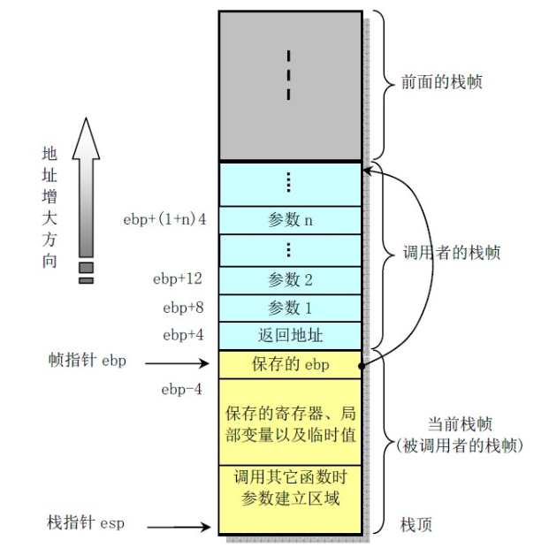

# X86

在x86处理器中，EIP(Instruction Pointer)是指令寄存器，指向处理器下条等待执行的指令地址(代码段内的偏移量)，每次执行完相应汇编指令EIP值就会增加。ESP(Stack Pointer)是堆栈指针寄存器，存放执行函数对应栈帧的栈顶地址(也是系统栈的顶部)，且始终指向栈顶；EBP(Base Pointer)是栈帧基址指针寄存器，存放执行函数对应栈帧的栈底地址，用于C运行库访问栈中的局部变量和参数。

当寄存器不够传递参数时，会使用栈来辅助传递参数。

rbp 是被调用者保存寄存器

https://ttzytt.com/2022/04/function-call/index.html  浅谈函数调用的实现

https://ctf-wiki.org/pwn/linux/user-mode/stackoverflow/x86/stack-intro/ CTF

https://gcc.godbolt.org/  汇编	

x86 函数参数顺序：rdi、rsi、rdx、rcx、r8、r9 的顺序

- x86
  - **函数参数**在**函数返回地址**的上方
- x64
  - System V AMD64 ABI (Linux、FreeBSD、macOS 等采用) 中前六个整型或指针参数依次保存在 **RDI, RSI, RDX, RCX, R8 和 R9 寄存器**中，如果还有更多的参数的话才会保存在栈上。
  - 内存地址不能大于 0x00007FFFFFFFFFFF，**6 个字节长度**，否则会抛出异常。

```c
int add(int a, int b)
    {return a + b;}
int main(){
    int c = add(114, 514);
    int d = c + 1919;
}
```

```asm
add(int, int):
    push    rbp
    mov     rbp, rsp
    mov     DWORD PTR [rbp-4], edi
    mov     DWORD PTR [rbp-8], esi
    mov     edx, DWORD PTR [rbp-4]
    mov     eax, DWORD PTR [rbp-8]
    add     eax, edx
    pop     rbp
    ret
main:
    push    rbp
    mov     rbp, rsp
    sub     rsp, 16
    mov     esi, 514
    mov     edi, 114
    call    add(int, int)
    mov     DWORD PTR [rbp-4], eax
    mov     eax, DWORD PTR [rbp-4]
    add     eax, 1919
    mov     DWORD PTR [rbp-8], eax
    mov     eax, 0
    leave
    ret
```

对于 IA 32，根据惯例，寄存器%eax、%edx和%ecx为主调函数保存寄存器(caller-saved registers)，当函数调用时，若主调函数希望保持这些寄存器的值，则必须在调用前显式地将其保存在栈中；被调函数可以覆盖这些寄存器，而不会破坏主调函数所需的数据。寄存器%ebx、%esi和%edi为被调函数保存寄存器(callee-saved registers)，即被调函数在覆盖这些寄存器的值时，必须先将寄存器原值压入栈中保存起来，并在函数返回前从栈中恢复其原值，因为主调函数可能也在使用这些寄存器。此外，被调函数必须保持寄存器%ebp和%esp，并在函数返回后将其恢复到调用前的值，亦即必须恢复主调函数的栈帧。

%rax 通常用于存储函数调用的返回结果	

```asm
push   0x68732f2f     
push   0x6e69622f     
mov    ebx, esp    
```

0x68732f2f --> hs//
0x6e69622f --> nib/

小端存储，在栈中：小 0x6e69622f 	0x68732f2f 大        ====       小 nib/ hs// 大 （栈从低到高读取字节）
而 ebx 即可指向 `'/bin//sh'` 。 6e -- n 69-- i 62--b

假设我们有一个十六进制数 `0x12345678`，它由四个字节组成，分别是 `0x12`、`0x34`、`0x56` 和 `0x78`。在小端存储中，这个数的各个字节会按照以下方式存储：

| 内存地址 | 0x100 | 0x101 | 0x102 | 0x103 |
| :------- | :---- | :---- | :---- | :---- |
| 存储内容 | 0x78  | 0x56  | 0x34  | 0x12  |

我们想让内存中从小到大为`//sh`，那么意味着为从低到高为 2f2f7368。又因为小端存储低位内存放置低位数据，所以为0x68732f2f。


```
 → 0x555555555349 <get_password+0> endbr64 
   0x55555555534d <get_password+4> push   rbp
   0x55555555534e <get_password+5> mov    rbp, rsp
   0x555555555351 <get_password+8> sub    rsp, 0x20
```

## 栈帧

函数每次被调用时，需要在在调用栈 (call stack) 上占用一段空间，在这段空间上保存调用者栈帧的基址 (ebp) 、本函数的局部变量、调用其他函数时的返回地址，并在需要时保存调用者使用的寄存器值，被调函数结束后 `esp` 上移表示释放这段空间，然后回到调用者的占用的空间与代码位置继续执行，函数运行阶段在调用栈上占用的这段空间就叫做栈帧。

栈帧主要通过 ebp、esp 两个寄存器维护，ebp 始终指向栈底，esp 始终指向栈顶

每个函数被调用时执行下面两条命令

```assembly
pushl	%ebp			; ebp入栈，保存调用者的栈帧基址，以便返回
movl	%esp, %ebp		; 将当前 esp 的位置作为当前栈帧的基址
```

这样在当前栈帧向上一栈帧退回时，只需要取出之前压栈的基址
另一方面，调用过程的指令 call

`call a_func` 会将 `call` 指令的下一条指令地址压栈，`a_func` 函数返回时执行指令

```assembly
leave		; 相当于 movl %ebp %esp   popl %ebp
ret			; 相当于 popl %eip, 返回到 call 压栈保存的地址, 即调用 a_func 的函数中
```

这样被调函数返回调用函数前就可以将 ebp、esp 置回调用函数的栈帧位置，并返回 call 指令的下一条指令执行。此外，在 call 指令前，主调函数会将被调函数的参数保存到栈上



x86-32位程序使用的是 cdecl（C调用约定），其定义了函数参数的传递方式、栈的使用方式以及返回值的处理方式。

在 cdecl 调用约定中，参数传递是通过栈来实现的。函数调用者负责将参数按照从右到左的顺序依次压入栈中。这意味着最右边的参数最先被压入栈，而最左边的参数最后被压入栈。然后，调用者将控制权转移到被调用函数的入口点。

被调用函数在开始执行时，会在栈上创建一个新的栈帧。它使用栈指针（stack pointer）和基址指针（base pointer）来访问传递进来的参数和局部变量。栈指针指向当前栈帧的顶部，而基址指针用于访问当前栈帧中的参数和局部变量。

在函数内部，被调用函数负责从栈上弹出参数，并使用它们进行计算和操作。在函数执行完毕后，返回值（如果有的话）会通过寄存器进行返回。

```c
#include<stdio.h>

int func(int n){
	int i, res = 1;
	for(i = 2;i<=n;i++){
		res *= i;
	}
	return res;
}

int main(){
	int n;
	scanf("%d", &n);
	printf("%d", func(n));
}
```

`gcc -m32 -S intel32.c -masm=intel` 可以生成 intel 汇编

AT&T 汇编：

```asm
	.file	"hello.c"
	.text
	.globl	_func
	.def	_func;	.scl	2;	.type	32;	.endef
_func:
	pushl	%ebp			; 保存上个栈帧的 ebp
	movl	%esp, %ebp		; 设置 ebp 为当前栈帧的基址
	subl	$16, %esp		; 为栈帧分配 16 Byte 的空间
	movl	$1, -8(%ebp)	; 在 ebp-8 的位置存放 1, res
	movl	$2, -4(%ebp)	; 在 ebp-4 的位置存放 2, i
	jmp	L2					; 转到L2
L3:
	movl	-8(%ebp), %eax	; eax = res
	imull	-4(%ebp), %eax	; eax = res * i
	movl	%eax, -8(%ebp)	; res = eax
	addl	$1, -4(%ebp)	; i++
L2:
	movl	-4(%ebp), %eax	; 将 i 读入eax
	cmpl	8(%ebp), %eax	; 比较 i 与 n 的大小
	jle	L3					; i<n goto L3
	movl	-8(%ebp), %eax	; 将res放入eax 作为返回值
	leave					; 恢复栈帧指针
	ret						; 返回到main
	.def	___main;	.scl	2;	.type	32;	.endef
	.section .rdata,"dr"
LC0:
	.ascii "%d\0"
	.text
	.globl	_main
	.def	_main;	.scl	2;	.type	32;	.endef
_main:
	pushl	%ebp			;
	movl	%esp, %ebp		;
	andl	$-16, %esp		; 将 esp 下移到16字节对齐处
	subl	$32, %esp		; 为栈帧分配 32 字节的空间
	call	___main			;
	leal	28(%esp), %eax	; eax = esp+28
	movl	%eax, 4(%esp)	; esp+4 处存放, 可以看出 esp+28 处存放变量 n
	movl	$LC0, (%esp)	; esp 处存放“%d”
	call	_scanf			;
	movl	28(%esp), %eax	; eax = n
	movl	%eax, (%esp)	; esp 处存放 n
	call	_func			;
	movl	%eax, 4(%esp)	; func 返回值放在 esp+4 处
	movl	$LC0, (%esp)	; esp 处存放“%d”
	call	_printf			;
	leave					;
	ret						;
	.ident	"GCC: (tdm64-1) 4.9.2"
	.def	_scanf;	.scl	2;	.type	32;	.endef
	.def	_printf;	.scl	2;	.type	32;	.endef
```

