# 1 从C到C++

**参考资料：**

- https://www.runoob.com/cplusplus/cpp-tutorial.html
- 《essential C++》

​       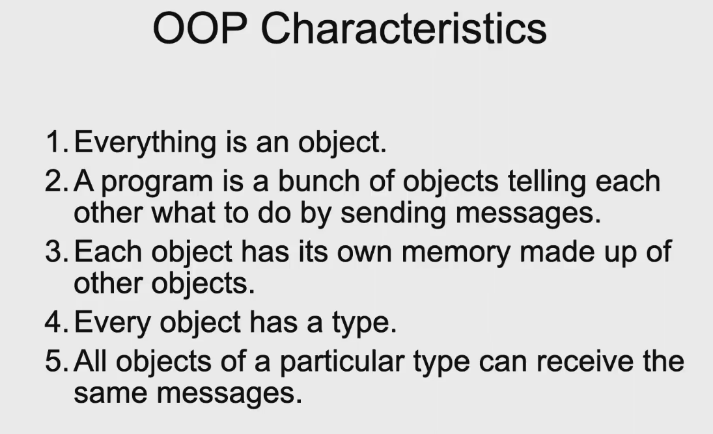

## 1.1 引用

下面的写法定义了一个引用，并将其初始化为引用某个变量。 类型名 & 引用名 = 某变量名;`int n = 4; int & r = n; // r引用了 n, r的类型是 int &`某个变量的引用，等价于这个变量，相当于该变量的一个别名。**注意事项：** 定义引用时一定要将其初始化成引用某个变量。初始化后，它就一直引用该变量，不会再引用别的变量了。 引用只能引用变量，不能引用常量和表达式，引用不能计算没有引用的引用**引用作为函数的返回值:**`int n = 4; int & SetValue() { return n; }//这里返回的是对于n的引用 int main() {    SetValue() = 40;    cout << n;    return 0; } //输出： 40`**引用只能绑定左值**

## 1.2 const

常引用 定义引用时，前面加const关键字，即为“常引用”`int n;``const int & r = n;`r 的类型是 const int &不能通过常引用去修改其引用的内容`int n = 100; const int & r = n; r = 200; //编译错 n = 300; // 没问题`“const”关键字的用法定义常量定义常量指针不可通过常量指针修改其指向的内容可以重新指向别的位置不能把常量指针赋值给非常量指针，反过来可以`int n,m; const int * p = & n; * p = 5; //编译出错 n = 4; //ok p = &m; //ok, 常量指针的指向可以变化 const int * p1; int * p2; p1 = p2; //ok p2 = p1; //error p2 = (int * ) p1; //ok,强制类型转换`函数参数为常量指针时，可避免函数内部不小心改变参数指针所指地方的内容

## 1.3 动态内存分配

用 `new` 运算符实现动态内存分配new是一个运算符使用方式 `P = new T`

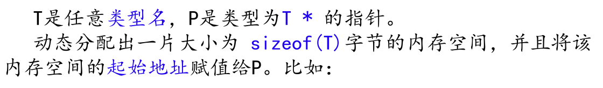`P = new T[N]`

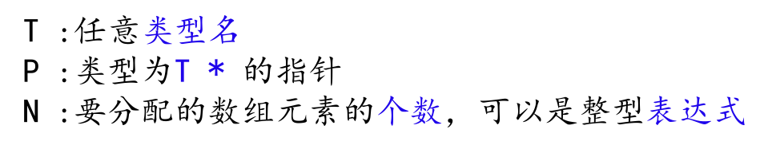Test * test3=new Test();在堆中分配了内存，堆上的内存分配，亦称动态内存分配。程序在运行的期间用malloc申请的内存，这部分内存由程序员自己负责管理，其生存期由开发者决定：在何时分配，分配多少，并在何时用free来释放该内存。**栈中内存的分配和管理由操作系统决定，而堆中内存的分配和管理由管理者决定**用delete运算符释放动态分配的内存delete 指针；//该指针必须指向new出来的空间用“delete”释放动态分配的数组，要加“[]”

## 1.4 内联函数和函数重载

为了减少函数调用的开销，引入了内联函数机制。编译器处理对内联函数的调用语句时，是将整个函数的代码插入到调用语句处，而不会产生调用函数的语句   使用方式是在函数前加inline `inline int Max(int a,int b)` 一个或多个函数，名字相同，然而参数个数或参数类型不相同，这叫做函数的重载函数重载使得函数命名变得简单。编译器根据调用语句的中的实参的个数和类型判断应该调用哪个函数

## 1.5函数的缺省参数

 C++中，定义函数的时候可以让最右边的连续若干个参数有缺省值，那么调用函数的时候，若相应位置不写参数，参数就是缺省值    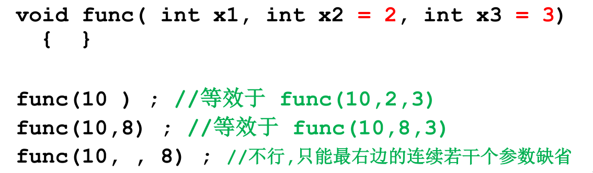函数参数可缺省的目的在于提高程序的可扩充性。 即如果某个写好的函数要添加新的参数，而原先那些调用该函数的语句，未必需要使用新增的参数，那么为了避免对原先那些函数调用语句的修改，就可以使用缺省参数。如果两个函数只有返回值类型不同，视为重复定义

# 2 类和对象

## 2.1 类成员

### 2.1.1类成员的可访问范围

private: 私有成员，只能在成员函数内访问public : 公有成员，可以在任何地方访问protected: 保护成员，以后再说在类的成员函数内部，能够访问：当前对象的全部属性、函数；同类其它对象的全部属性、函数。在类的成员函数以外的地方，只能够访问该类对象的公有成员未说明的定义为私有变量用struct定义类和用"class"的唯一区别，就是未说明是公有还是私有的成员，就是公有的

### 2.1.2成员函数的重载及参数缺省

- 要注意避免有函数重载时的二义性

```cpp
class Location {
private :
int x, y;
public:
void init( int x =0, int y = 0 );
void valueX( int val = 0) { x = val; }
int valueX() { return x; }
};
Location A;
A.valueX(); //错误，编译器无法判断调用哪个valueX
```

## 2.2 构造函数

### 2.2.1概念

成员函数的一种名字与类名相同，可以有参数，不能有返回值(void也不行)作用是对对象进行初始化，如给成员变量赋初值如果定义类时没写构造函数，则编译器生成一个默认的无参数的构造函数默认构造函数无参数，不做任何操作如果定义了构造函数，则编译器不生成默认的无参数的构造函数对象生成时构造函数自动被调用。对象一旦生成，就再也不能在其上执行构造函数一个类可以有多个构造函数。
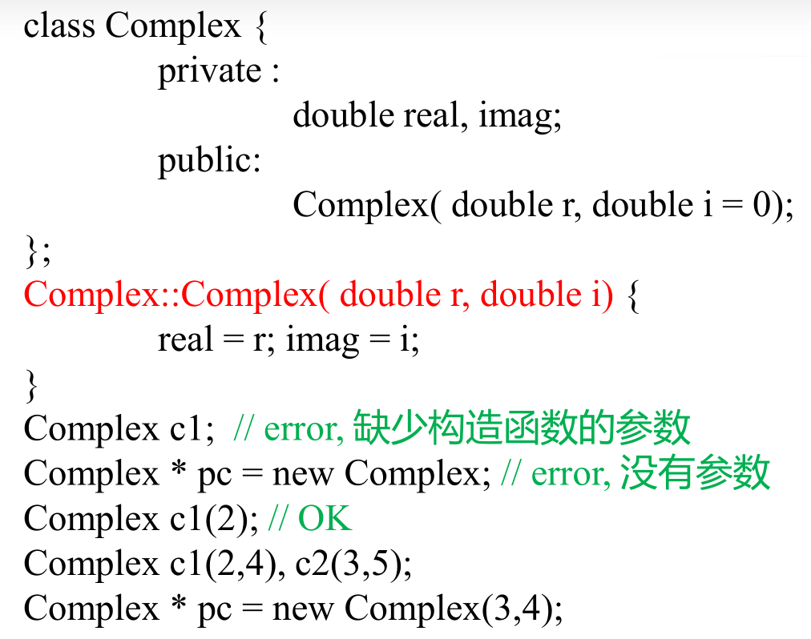构造函数最好是public的，private构造函数不能直接用来初始化对象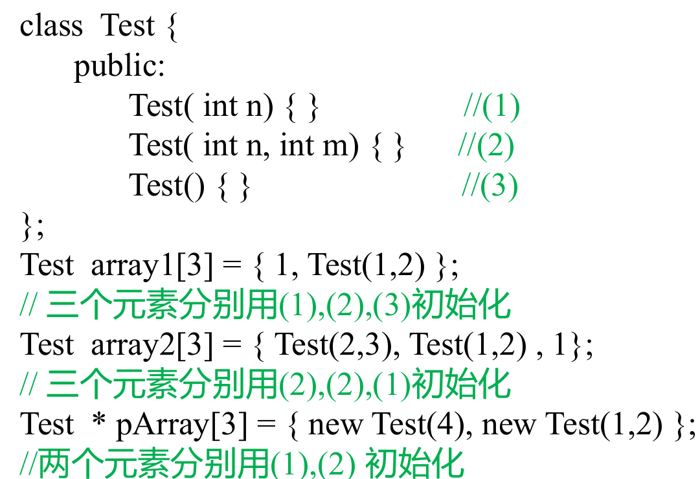pArray[2]实际并未生成

### 2.2.2 复制构造函数

只有一个参数,即对同类对象的引用。形如 X::X( X& )或X::X(const X &), 二者选一后者能以常量对象作为参数如果没有定义复制构造函数，那么编译器生成默认复制构造函数,该构造函数完成复制功能。`class Complex { public :    double real,imag;    Complex(){ }    Complex( const Complex & c )     {        real = c.real;        imag = c.imag;        cout << "Copy Constructor called";    } }; Complex c1; Complex c2(c1);//调用自己定义的复制构造函数，输出 Copy Constructor called`**起作用的情景：**当用一个对象去初始化同类的另一个对象时。对象间赋值并不导致复制构造函数被调用`Complex c2(c1);``Complex c2 = c1; //初始化语句，非赋值语句`如果某函数有一个参数是类 A 的对象，那么该函数被调用时，类A的复制构造函数将被调用。形参是对实参的复制，复制过程中调用复制构造函数。 如果函数的返回值是类A的对象时，则函数返回时，A的复制构造函数被调用。也就是实际返回的值是return 的复制。**C++中临时变量不能作为非const的引用参数,所以最好加上const****常量引用参数的使用：**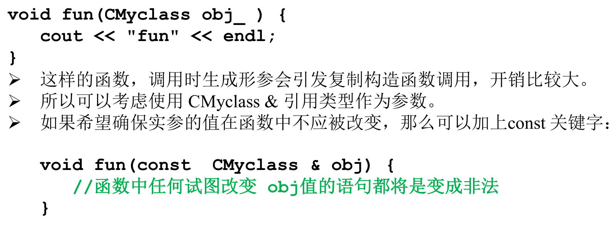

### 2.2.3 类型转换构造函数

定义转换构造函数的目的是实现类型的自动转换。只有一个参数，而且不是复制构造函数的构造函数，一般就可以看作是转换构造函数。当需要的时候，编译系统会自动调用转换构造函数，建立一个无名的临时对象(或临时变量)`class Complex { public:    double real, imag;	    Complex( int i)     {//类型转换构造函数        cout << "IntConstructor called" << endl;        real = i; imag = 0;    }    Complex(double r,double i) {real = r; imag = i; } }; int main () {    Complex c1(7,8);    Complex c2 = 12;    c1 = 9; // 9被自动转换成一个临时Complex对象    cout << c1.real << "," << c1.imag << endl;    return 0; }`

## 2.3 析构函数

名字与类名相同，在前面加‘~’， 没有参数和返回值，一个类最多只能有一个析构函数。析构函数对象消亡时即自动被调用。可以定义析构函数来在对象消亡前做善后工作，比如释放分配的空间等。如果定义类时没写析构函数，则编译器生成缺省析构函数。缺省析构函数什么也不做。如果定义了析构函数，则编译器不生成缺省析构函数。**注意：**对象数组生命期结束时，对象数组的每个元素的析构函数都会被调用。若new一个对象数组，那么用delete释放时应该写 []。否则只delete一个对象(调用一次析构函数)析构函数在对象作为函数返回值返回后被调用`class CMyclass { public:    ~CMyclass() { cout << "destructor" << endl; } }; CMyclass obj; CMyclass fun(CMyclass sobj) { //参数对象消亡也会导致析    //构函数被调用    return sobj; //函数调用返回时生成临时对象返回 } int main() {    obj = fun(obj); //函数调用的返回值（临时对象）被    return 0;    //用过后，该临时对象析构函数被调用 }//会调用三次析构函数`先初始化的对象后析构，this出来的对象如果没有delete会一直存在不析构。

## 2.4 this、静态变量、友元

### 2.4.1 this

​         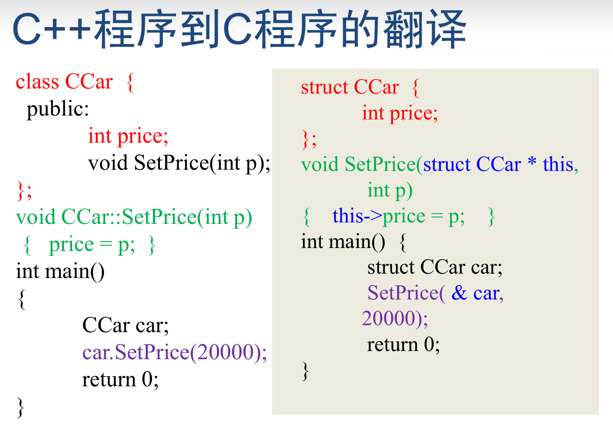其作用就是指向成员函数所作用的对象，非静态成员函数中可以直接使用this来代表指向该函数作用的对象的指针，可以认为this是参数之一静态成员函数中不能使用 this 指针，因为静态成员函数并不具体作用与某个对象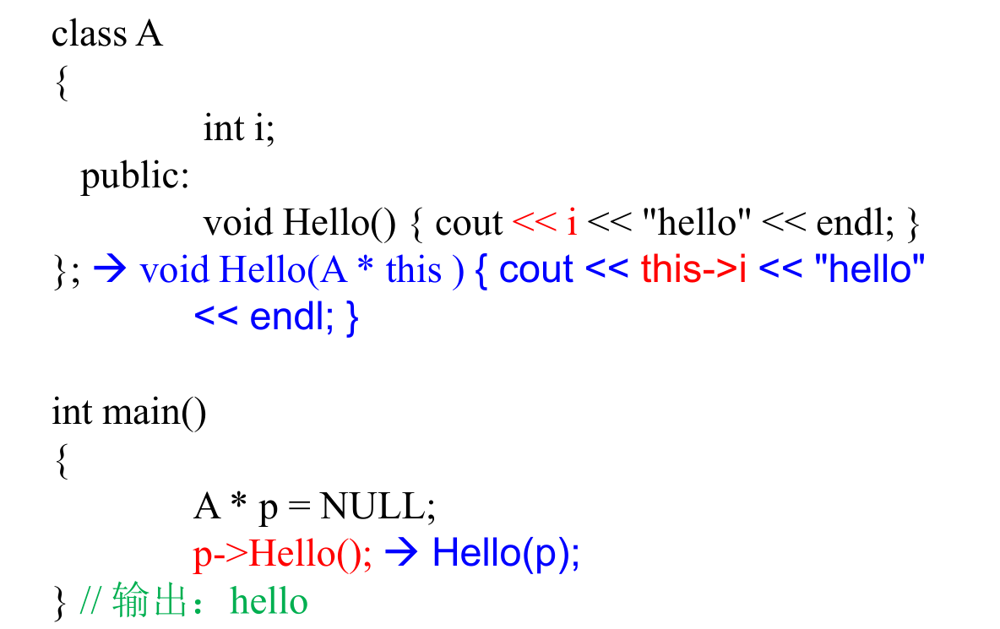

### 2.4.2 静态成员

静态成员：在说明前面加了static关键字的成员，有变量也有函数普通成员变量每个对象有各自的一份，而静态成员变量一共就一份，为所有对象共享。sizeof不会计算静态成员变量普通成员函数必须具体作用于某个对象，而静态成员函数并不具体作用于某个对象，不需要通过对象就能访问静态成员变量本质上是全局变量，哪怕一个对象都不存在，类的静态成员变量也存在静态成员函数本质上是全局函数。设置静态成员这种机制的目的是将和某些类紧密相关的全局变量和函数写到类里面，看上去像一个整体，易于维护和理解在静态成员函数中，不能访问非静态成员变量，也不能调用非静态成员函数`int CRectangle::nTotalNumber = 0;``int CRectangle::nTotalArea = 0;``//必须在定义类的文件中对静态成员变量进行一次说明  //或初始化。否则编译能通过，链接不能通过`

### 2.4.3 成员对象和封闭类

有成员对象的类叫 封闭（enclosing)类，任何生成封闭类对象的语句，都要让编译器明白，对象中的成员对象，是如何初始化的。`class CTyre //轮胎类 { private:    int radius;    //半径    int width; //宽度 public:    CTyre(int r, int w) : radius(r), width(w) {} }; class CEngine //引擎类 { }; class CCar { //汽车类 private:    int price; //价格    CTyre tyre;    CEngine engine; public:    CCar(int p, int tr, int tw); }; CCar::CCar(int p, int tr, int w) : price(p), tyre(tr, w){}; int main() {    CCar car(20000, 17, 225);    return 0; }`如果CCar类不定义构造函数， 则`CCar car;`会出错。因为编译器不明白 car.tyre该如何初始化，它没有默认构造函数。而car.engine 的初始化用默认构造函数即可。**执行顺序：**封闭类对象生成时，先执行所有对象成员的构造函数，然后才执行封闭类的构造函数。对象成员的构造函数调用次序和对象成员在类中的说明次序一致，与它们在成员初始化列表中出现的次序无关。当封闭类的对象消亡时，先执行封闭类的析构函数，然后再执行成员对象的析构函数。次序和构造函数的调用次序相反，先初始化的后析构封闭类的对象，如果是用默认复制构造函数初始化的，那么它里面包含的成员对象，也会用复制构造函数初始化。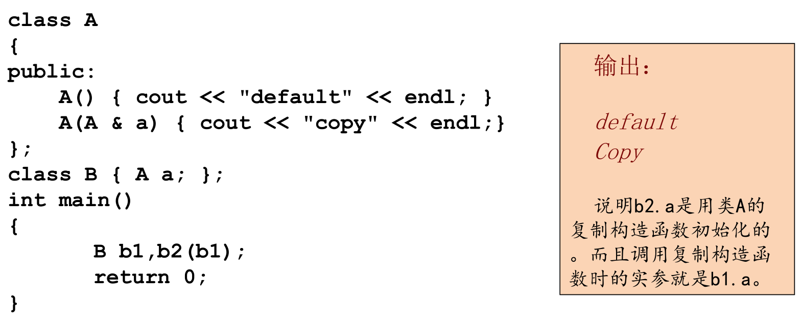

### 2.4.4 常量对象和常量成员函数

如果不希望某个对象的值被改变，则定义该对象的时候可以在前面加 const关键字，即常量对象。常量 对象只能使用构造函数、析构函数和有const 说明的函数(常量方法）在类的成员函数说明后面加上const关键字，则该成员函数成为常量成员函数，常量成员函数内部不能改变属性的值，也不能调用非常量成员函数**在定义常量成员函数和声明常量成员函数时都应该使用const 关键字：**`class Sample { private:    int value; public:    void PrintValue() const; }; void Sample::PrintValue() const { //此处不使用const会导致编译出错    cout << value; } void Print(const Sample &o) {    o.PrintValue(); //若 PrintValue非const则编译错 }`**常量成员函数的重载：**名字和参数表都一样，const有或无，视为重载。`class CTest { private:    int n; public:    CTest() { n = 1; }    int GetValue() const { return n; }    int GetValue() { return 2 * n; } }; int main() {    const CTest objTest1;    CTest objTest2;    cout << objTest1.GetValue() << "," << objTest2.GetValue();    return 0; }`**mutable成员变量**可以在const成员函数中修改的成员变量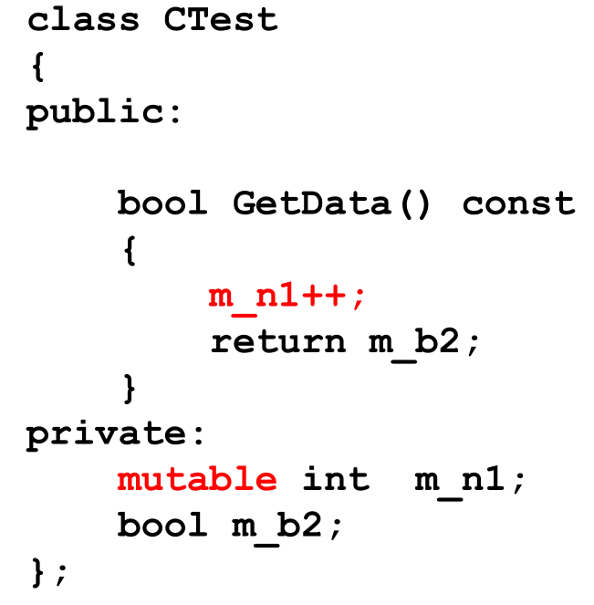

### 2.4.5 友元

**友元函数：一个类的友元函数可以访问该类的私有成员**`class CCar; //提前声明 CCar类，以便后面的CDriver类使用 class CDriver { public:    void ModifyCar(CCar *pCar); //改装汽车 }; class CCar { private:    int price;    friend int MostExpensiveCar(CCar cars[], int total); //声明友元    friend void CDriver::ModifyCar(CCar *pCar);    //声明友元 }; void CDriver::ModifyCar( CCar * pCar){} int MostExpensiveCar( CCar cars[],int total){} //可以将一个类的成员函数(包括构造、析构函数)说明为另一个类的友元`**友元类: 如果A是B的友元类，那么A的成员函数可以访问B的私成员**`class CCar { private:    int price;    friend class CDriver; //声明CDriver为友元类 }; class CDriver { public:    CCar myCar;    void ModifyCar()    {                        //改装汽车        myCar.price += 1000; //因CDriver是CCar的友元类，        //故此处可以访问其私有成员    } }; int main() {    return 0; }`

# 3 运算符重载

## 3.1 基本概念

运算符重载的实质是函数重载，可以重载为普通函数，也可以重载为成员函数 把含运算符的表达式转换成对运算符函数的调用，把运算符的操作数转换成运算符函数的参数运算符被多次重载时，根据实参的类型决定调用哪个运算符函数重载为成员函数时，参数个数为运算符目数减一重载为普通函数时，参数个数为运算符目数`class Complex { public:    double real, imag;    Complex(double r = 0.0, double i = 0.0) : real(r), imag(i) {}    Complex operator-(const Complex &c); }; Complex operator+(const Complex &a, const Complex &b) {    return Complex(a.real + b.real, a.imag + b.imag); //返回一个临时对象 } Complex Complex::operator-(const Complex &c) {    return Complex(real - c.real, imag - c.imag); //返回一个临时对象 } int main() {    Complex a(4, 4), b(1, 1), c;    c = a + b; //等价于c=operator+(a,b);    cout << c.real << "," << c.imag << endl;    cout << (a - b).real << "," << (a - b).imag << endl;    // a-b等价于a.operator-(b)    return 0; }`

## 3.2 赋值运算符的重载

有时候希望赋值运算符两边的类型可以不匹配，比如，把一个int类型变量赋值给一个Complex对象，或把一个 char * 类型的字符串赋值给一个字符串对象,此时就需要重载赋值运算符“=”赋值运算符“=”只能重载为成员函数`class String { private:    char *str; public:    String() : str(new char[1]) { str[0] = 0; }    const char *c_str() { return str; };    String &operator=(const char *str);    ~String() { delete[] str; }; }; String &String::operator=(const char *s) {    if( this == & s)        return * this;    delete[] str;    str = new char[strlen(str) + 1];    strcpy(str, s);    return *this; } int main() {    String a;    a = "hello";    cout << a.c_str(); }`**为什么要定义赋值运算符？**如不定义自己的赋值运算符，那么S1=S2实际上导致 S1.str和 S2.str指向同一地方。如果S1对象消亡，析构函数将释放 S1.str指向的空间，则S2消亡时还要释放一次，不妥。另外，如果执行 S1 = "other"；会导致S2.str指向的地方被delete（见代码16行）一般情况下，将运算符重载为类的成员函数，是较好的选择。但有时，重载为成员函数不能满足使用要求，重载为普通函数，又不能访问类的私有成员，所以需要将运算符重载为友元。`class Complex {    double real,imag; public:    Complex( double r, double i):real(r),imag(i){ };    Complex operator+( double r );    friend Complex operator + (double r,const Complex & c); };//满足c = 5 + c;`

## 3.3 可变长数组类的实现

```
class CArray {    int size; //数组元素的个数    int *ptr; //指向动态分配的数组 public:    CArray(int s = 0); //s代表数组元素的个数    CArray(CArray & a);    ~CArray();    void push_back(int v); //用于在数组尾部添加一个元素v    CArray & operator=( const CArray & a);    //用于数组对象间的赋值    int length() { return size; } //返回数组元素个数    int & CArray::operator[](int i) //返回值为 int 不行!不支持 a[i] = 4    {	//用以支持根据下标访问数组元素，        // 如n = a[i] 和a[i] = 4; 这样的语句        return ptr[i];    } }; CArray & CArray::operator=( const CArray & a) { //赋值号的作用是使"="左边对象里存放的数组，大小和内容都和右边的对象一样    if( ptr == a.ptr) //防止a=a这样的赋值导致出错        return * this;    if( a.ptr == NULL) { //如果a里面的数组是空的        if( ptr )            delete [] ptr;        ptr = NULL;        size = 0;        return * this;    }    if( size < a.size) { //如果原有空间够大，就不用分配新的空间        if(ptr)            delete [] ptr;            ptr = new int[a.size];    }    memcpy( ptr,a.ptr,sizeof(int)*a.size);    size = a.size;    return * this; }
```

## 3.4 流插入运算符和流提取运算符的重载

cout 是在 iostream 中定义的，ostream 类的对象,所以只能将其重载为全局函数。

```
class CStudent{ public: int nAge; }; int main(){    CStudent s ;	    s.nAge = 5;    cout << s <<"hello";    return 0; } ostream & operator<<( ostream & o,const CStudent & s) {    o << s.nAge ;    return o; }
```

## 3.5 类型转换运算符和自增、自减运算符的重载

类型强制转换运算符被重载时不能写返回值类型，实际上其返回值类型就是该类型强制转换运算符代表的类型。`#include <iostream> using namespace std; class Complex {    double real,imag;    public:    Complex(double r=0,double i=0):real(r),imag(i) { };    operator double () { return real; }    //重载强制类型转换运算符 double }; int main() {    Complex c(1.2,3.4);    cout << (double)c << endl; //输出 1.2    double n = 2 + c; //等价于 double n=2+c.operator double()    cout << n;    //输出 3.2 }`前置运算符作为一元运算符重载**重载为成员函数：**T & operator++();T & operator--();**重载为全局函数：**T1 & operator++(T2);T1 & operator—(T2);后置运算符作为二元运算符重载，多写一个没用的参数**重载为成员函数：**T operator++(int);T operator--(int);**重载为全局函数：**T1 operator++(T2,int );T1 operator—( T2,int);C++不允许定义新的运算符 ；运算符重载不改变运算符的优先级；以下运算符不能被重载：“.”、“.*”、“::”、“?:”、sizeof；重载运算符()、[]、->或者赋值运算符=时，运算符重载函数必须声明为 类的成员函数

# 4 继承和派生

## 4.1 概念

**继承**：在定义一个新的类B时，如果该类与某个已有的类A相似(指的是B拥有A的全部特点)，那么就可以把A作为一个基类，而把B作为基类的一个派生类(也称子类)。派生类是通过对基类进行修改和扩充得到，在派生类中，可以扩充新的成员变量和成员函数。派生类一经定义后，可以独立使用，不依赖于基类。派生类拥有基类的全部成员函数和成员变量，不论是private、protected、public 。在派生类的各个成员函数中，不能访问基类中的private成员。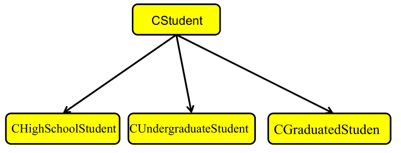`class CStudent { private: string sName; int nAge; public: bool IsThreeGood() { }; void SetName( const string & name ) { sName = name; } //...... }; class CUndergraduateStudent: public CStudent { private: int nDepartment; public: bool IsThreeGood() { ...... }; //覆盖 bool CanBaoYan() { .... }; }; // 派生类的写法是：类名: public 基类名`**派生类对象的内存空间**派生类对象的体积等于基类对象的体积，再加上派生类对象自己的成员变量的体积。在派生类对象中，包含着基类对象，而且基类对象的存储位置位于派生类对象新增的成员变量之前。

## 4.2 继承关系和复合关系

- 继承：“是”关系。基类 A，B是基类A的派生类。逻辑上要求：“一个B对象也是一个A对象”
- 复合：“有”关系。类C中“有”成员变量k，k是类D的对象，则C和D是复合关系。一般逻辑上要求：“D对象是C对象的固有属性或组成部分”

## 4.3 派生类覆盖基类成员

派生类可以定义一个和基类成员同名的成员，即为覆盖。在派生类中访问这类成员时，缺省的情况是访问派生类中定义的成员。要在派生类中访问由基类定义的同名成员时，要使用作用域符号:: 。

## 4.4 类的保护成员

- 基类的private成员：可以被下列函数访问

- - 基类的成员函数	
  - 基类的友元函数

- 基类的public成员：可以被下列函数访问

- - 基类的成员函数
  - 基类的友元函数
  - 派生类的成员函数
  - 派生类的友元函数
  - 其他的函数

- 基类的protected成员：可以被下列函数访问

- - 基类的成员函数
  - 基类的友元函数
  - 派生类的成员函数可以访问当前对象的基类的保护成员

## 4.5 派生类的构造函数

**包含成员对象的派生类的构造函数写法**`class Bug { private:    int nLegs;    int nColor; public:    int nType;    Bug(int legs, int color);    void PrintBug(){}; }; class Skill { public:    Skill(int n) {} }; class FlyBug : public Bug {    int nWings;    Skill sk1, sk2; public:    FlyBug(int legs, int color, int wings); }; FlyBug::FlyBug(int legs, int color, int wings) :  Bug(legs, color), sk1(5), sk2(color), nWings(wings) { }`在创建派生类的对象时:1) 先执行基类的构造函数，用以初始化派生类对象中从基类继承的成员；2) 再执行成员对象类的构造函数，用以初始化派生类对象中成员对象;3) 最后执行派生类自己的构造函数在派生类对象消亡时：1) 先执行派生类自己的析构函数;2) 再依次执行各成员对象类的析构函数;3) 最后执行基类的析构函数析构函数的调用顺序与构造函数的调用顺序相反

## 4.6 public继承的赋值兼容规则

**4.6.1 public继承的赋值兼容规则**`class base { }; class derived : public base { }; base b; derived d;`1） 派生类的对象可以赋值给基类对象`b = d;`2） 派生类对象可以初始化基类引用`base & br = d;`3） 派生类对象的地址可以赋值给基类指针`base * pb = & d;`**4.6.2 protected继承和private继承**protected继承时，基类的public成员和protected成员成为派生类的protected成员。private继承时，基类的public成员成为派生类的private成员，基类的protected成员成为派生类的不可访问成员。protected和private继承不是“是”的关系

## 4.7 直接基类和间接基类

类A派生类B，类B派生类C，类C派生类D，……类A是类B的直接基类类B是类C的直接基类，类A是类C的间接基类类C是 类D的直接基类，类A、B是类D的间接基类                            在声明派生类时，只需要列出它的直接基类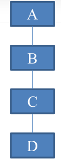

# 5 多态

## 5.1 虚函数和多态

**在类的定义中，前面有 virtual 关键字的成员函数就是虚函数**多态的表现形式：派生类的指针可以赋给基类指针和基类引用通过基类指针调用基类和派生类中的同名虚函数时：该引用引用的是一个基类的对象，那么被调用是基类的虚函数；若该引用引用的是一个派生类的对象，那么被调用的是派生类的虚函数若调用的不是同名虚函数，则调用基类函数在面向对象的程序设计中使用多态，能够增强程序的可扩充性，即程序需要修改或增加功能的时候，需要改动和增加的代码较少**例子：几何形体处理程序**`#include <iostream> #include <stdlib.h> #include <math.h> using namespace std; class CShape { public:    virtual double Area() = 0; //纯虚函数    virtual void PrintInfo() = 0; }; class CRectangle : public CShape { public:    int w, h;    virtual double Area();    virtual void PrintInfo(); }; class CCircle : public CShape { public:    int r;    virtual double Area();    virtual void PrintInfo(); }; class CTriangle : public CShape { public:    int a, b, c;    virtual double Area();    virtual void PrintInfo(); }; CShape *pShapes[100]; int MyCompare(const void *s1, const void *s2); int main() {    int i;    int n;    CRectangle *pr;    CCircle *pc;    CTriangle *pt;    cin >> n;    for (i = 0; i < n; i++)    {        char c;        cin >> c;        switch (c)        {        case 'R':            pr = new CRectangle();            cin >> pr->w >> pr->h;            pShapes[i] = pr;            break;        case 'C':            pc = new CCircle();            cin >> pc->r;            pShapes[i] = pc;            break;        case 'T':            pt = new CTriangle();            cin >> pt->a >> pt->b >> pt->c;            pShapes[i] = pt;            break;        }    }    qsort(pShapes, n, sizeof(CShape *), MyCompare);    for (i = 0; i < n; i++)        pShapes[i]->PrintInfo();    return 0; } int MyCompare(const void *s1, const void *s2) {    double a1, a2;    CShape **p1; // s1,s2 是 void * ，不可写 “* s1”来取得s1指向的内容    CShape **p2;    p1 = (CShape **)s1; // s1,s2指向pShapes数组中的元素，数组元素的类型是CShape *    p2 = (CShape **)s2; // 故 p1,p2都是指向指针的指针，类型为 CShape **    a1 = (*p1)->Area(); // * p1 的类型是 Cshape * ,是基类指针，故此句为多态    a2 = (*p2)->Area();    if (a1 < a2)        return -1;    else if (a2 < a1)        return 1;    else        return 0; }`用基类指针数组存放指向各种派生类对象的指针，然后遍历该数组，就能对各个派生类对象做各种操作，是很常用的做法

## 5.2 构造函数和析构函数中调用虚函数

在构造函数和析构函数中调用虚函数，不是多态。编译时即可确定，调用的函数是自己的类或基类中定义的函数，不会等到运行时才决定调用自己的还是派生类的函数

派生类中和基类中虚函数同名同参数表的函数，不加virtual也自动成为虚函数

```cpp
class myclass
{
public:
    virtual void hello() { cout << "hello from myclass" << endl; };
    virtual void bye() { cout << "bye from myclass" << endl; }
};
class son : public myclass
{
public:
    void hello() { cout << "hello from son" << endl; };
    son() { hello(); };
    ~son() { bye(); };
};
class grandson : public son
{
public:
    void hello() { cout << "hello from grandson" << endl; };
    void bye() { cout << "bye from grandson" << endl; }
    grandson() { cout << "constructing grandson" << endl; };
    ~grandson() { cout << "destructing grandson" << endl; };
};
int main()
{
    grandson gson;
    son *pson;
    pson = &gson;
    pson->hello(); //多态
    return 0;
}
```

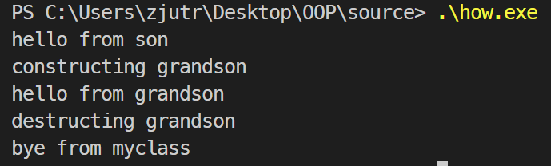

## 5.3 虚函数的访问权限

- 编译出错是因为 fun2() 是Base的私有成员。即使运行到此时实际上调用的应该是Derived的公有成员 fun2()也不行，因为语法检查是不考虑运行结果的。
- 如果 将Base中的 private换成public,即使Derived中的fun2() 是private的，编译依然能通过，也能正确调用Derived::fun2()。

```cpp
class Base {
private:
	virtual void fun2() { cout << "Base::fun2()" << endl; }
};
class Derived:public Base {
public:
	virtual void fun2() { cout << "Derived:fun2()" << endl; }
};
Derived d;
Base * pBase = & d;
pBase -> fun2();
```

## 5.4 多态的实现原理

“多态”的关键在于通过基类指针或引用调用一个虚函数时，编译时不确定到底调用的是基类还是派生类的函数，运行时才确定 ---- 这叫“动态联编”。

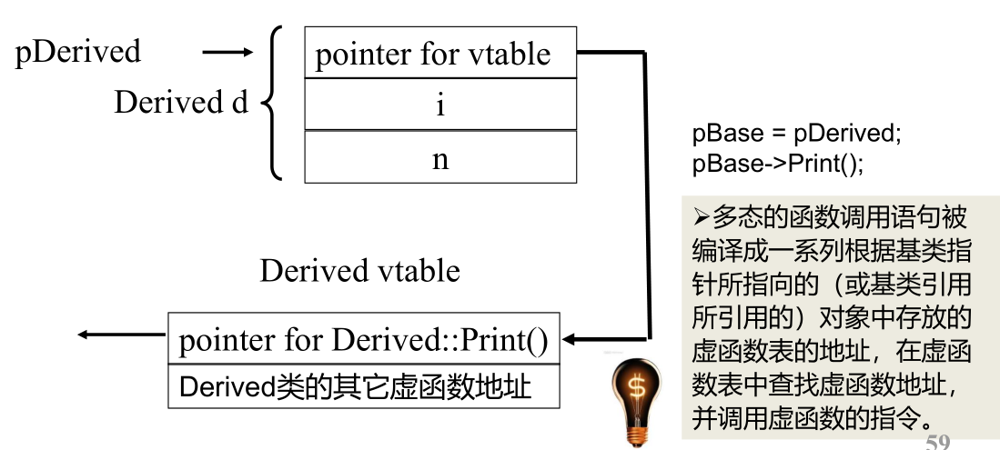

```cpp
class A
{
public:
    virtual void Func() { cout << "A::Func" << endl; }
};
class B : public A
{
public:
    virtual void Func() { cout << "B::Func" << endl; }
};
int main()
{
    A a;
    A *pa = new B();
    pa->Func();
    // 64位程序指针为8字节
    long long *p1 = (long long *)&a;
    long long *p2 = (long long *)pa;
    *p2 = *p1;//B对象头部存放的8字节虚函数表地址指针变成了A对象的
    pa->Func();
    return 0;
}//输出为B::Func
//A::Func
```

## 5.5 虚析构函数

- 通过基类的指针删除派生类对象时，通常情况下只调用基类的析构函数。
- 把基类的析构函数声明为virtual(派生类的析构函数可以virtual不进行声明)通过基类的指针删除派生类对象时，首先调用派生类的析构函数，然后调用基类的析构函数。
- 一个类如果定义了虚函数，则应该将析构函数也定义成虚函数。或者，一个类打算作为基类使用，也应该将析构函数定义成虚函数。
- 不允许以虚函数作为构造函数

```cpp
class son{
public:
	virtual ~son() {cout<<"bye from son"<<endl;};
};
class grandson:public son{
public:
	~grandson(){cout<<"bye from grandson"<<endl;};
};
int main() {
	son *pson;
	pson= new grandson();
	delete pson;
	return 0;
}
//输出
//bye from grandson
//bye from son
```

## 5.6 纯虚函数和抽象类

纯虚函数： 没有函数体的虚函数`class A { private: int a; public: virtual void Print( ) = 0 ; //纯虚函数 void fun() { cout << "fun"; } };`包含纯虚函数的类叫抽象类抽象类只能作为基类来派生新类使用，不能创建抽象类的对象抽象类的指针和引用可以指向由抽象类派生出来的类的对象`A a ; // 错，A 是抽象类，不能创建对象` `A * pa ; // ok,可以定义抽象类的指针和引用` `pa = new A ; //错误, A 是抽象类，不能创建对象`在抽象类的成员函数内可以调用纯虚函数，但是在构造函数或析构函数内部不能调用纯虚函数如果一个类从抽象类派生而来，当且仅当实现了基类中的所有纯虚函数，它才能成为非抽象类

# 6 输入输出和文件操作

## 6.1 输入输出相关的类

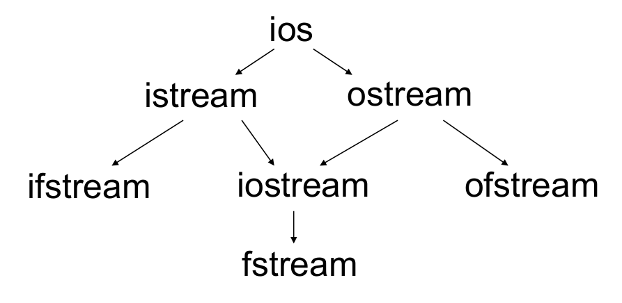

istream是用于输入的流类，cin就是该类的对象

ostream是用于输出的流类，cout就是该类的对象

ifstream是用于从文件读取数据的类

ofstream是用于向文件写入数据的类

iostream是既能用于输入，又能用于输出的类

fstream 是既能从文件读取数据，又能向文件写入数据的类

- cin对应于标准输入流，用于从键盘读取数据，也可以被重定向为从文件中读取数据。

- cout对应于标准输出流，用于向屏幕输出数据，也可以被重定向为向文件写入数据。

- cerr和clog对应于标准错误输出流，用于向屏幕输出出错信息，cerr和clog的区别在于cerr不使用缓冲区,直接向显示器输出信息；而输出到clog中的信息先会被存放在缓冲区,缓冲区满或者刷新时才输出到屏幕。

```
istream & getline(char * buf, int bufSize);
```

从输入流中读取bufSize-1个字符到缓冲区buf，或读到碰到‘\n’为止（哪个先到算哪个）

```
istream & getline(char * buf, int bufSize,char delim);
```

从输入流中读取bufSize-1个字符到缓冲区buf，或读到碰到delim字符为止（哪个先到算哪个）
	两个函数都会自动在buf中读入数据的结尾添加‘\0’。 ‘\n’或delim都不会被读入buf，但会被从输入流中取走。可以用 if(!cin.getline(…)) 判断输入是否结束

**输入输出重定向**

```cpp
#include <iostream>
using namespace std;
int main() {
	int x,y;
	cin >> x >> y;
	freopen("test.txt","w",stdout); //将标准输出重定向到 test.txt文件
	if( y == 0 ) //除数为0则在屏幕上输出错误信息
		cerr << "error." << endl;
	else
		cout << x /y ; //输出结果到test.txt
    //***************************************************************
    double f;
	int n;
	freopen("t.txt","r",stdin); //cin被改为从 t.txt中读取数据
	cin >> f >> n;
	cout << f << "," <<n << endl;
	return 0;
}
```

## 6.2 流操纵算子

## 6.3 文件读写

可以将顺序文件看作一个有限字符构成的顺序字符流，然后像对cin, cout 一样的读写**创建文件:****直接创建**`#include <fstream> // 包含头文件`       `ofstream outFile("clients.dat", ios::out|ios::binary);//创建文件`clients.dat  要创建的文件的名字ios::out       文件打开方式ios:out        输出到文件, 删除原有内容ios::app      输出到文件, 保留原有内容，总是在尾部添加ios::binary 以二进制文件格式打开文件**也可以先创建ofstream对象，再用 open函数打开**`ofstream fout;` `fout.open("test.out",ios::out|ios::binary);`**判断是否打开成功**`if(!fout){``cout << "File open error!"<<endl;``}`**文件名的绝对路径和相对路径**绝对路径:"c:\\tmp\\mydir\\some.txt"相对路径："\\tmp\\mydir\\some.txt"当前盘符的根目录下的tmp\dir\some.txt"tmp\\mydir\\some.txt"当前文件夹的tmp子文件夹里面的….."..\\tmp\\mydir\\some.txt"当前文件夹的父文件夹下面的tmp子文件夹里面的…..**文件的读写指针**对于输入文件,有一个读指针;对于输出文件,有一个写指针;对于输入输出文件,有一个读写指针;标识文件操作的当前位置, 该指针在哪里,读写操作就在哪里进行**显式关闭文件**`ifstream fin("test.dat",ios::in);``fin.close();``ofstream fout("test.dat",ios::out);``fout.close();`**字符文件读写**`//因为文件流也是流，所以流的成员函数和流操作算子也同样适用于文件流 //程序将文件 in.txt 里面的整数排序后，输出到out.txt #include <iostream> #include <fstream> #include <vector> #include <algorithm> using namespace std; int main() { vector<int> v; ifstream srcFile("in.txt",ios::in); ofstream destFile("out.txt",ios::out); int x; while( srcFile >> x ) v.push_back(x); sort(v.begin(),v.end()); for( int i = 0;i < v.size();i ++ ) 	destFile << v[i] << " "; destFile.close(); srcFile.close(); return 0; }`**二进制文件读写**二进制读文件ifstream 和 fstream的成员函数：`istream& read (char* s, long n);`将文件读指针指向的地方的n个字节内容，读入到内存地址s，然后将文件读指针向后移动n字节 (以ios::in方式打开文件时，文件读指针开始指向文件开头) 二进制写文件ofstream 和 fstream的成员函数：`istream& write (const char* s, long n);`将内存地址s处的n个字节内容，写入到文件中写指针指向的位置，然后将文件写指针向后移动n字节(以ios::out方式打开文件时，文件写指针开始指向文件开头, 以ios::app方式打开文件时，文件写指针开始指向文件尾部 ) **从键盘输入几个学生的姓名的成绩，并以二进制文件形式保存**`#include <iostream> #include <fstream> using namespace std; struct Student { char name[20]; int score; }; int main() { Student s; ofstream OutFile( "c:\\tmp\\students.dat",ios::out|ios::binary); while( cin >> s.name >> s.score ) 	OutFile.write( (char * ) & s, sizeof( s) ); OutFile.close(); return 0; } //输入 //Tom 60 //Jack 80 //Jane 40 //^Z+回车`**将 students.dat 文件的内容读出并显示**`#include <iostream> #include <fstream> using namespace std; struct Student { char name[20]; int score; }; int main() {    Student s;    ifstream inFile("students.dat",ios::in | ios::binary );    if(!inFile) {        cout << "error" <<endl;        return 0;    }    while( inFile.read( (char* ) & s, sizeof(s) ) ) {        int readedBytes = inFile.gcount(); //看刚才读了多少字节        cout << s.name << " " << s.score << endl;    }    inFile.close();    return 0; }`**将 students.dat 文件的Jane的名字改成Mike**`int main() {    Student s;    fstream iofile( "c:\\tmp\\students.dat",    ios::in|ios::out|ios::binary);    if( !iofile) {        cout << "error" ;        return 0;    }    iofile.seekp( 2 * sizeof(s),ios::beg); //定位写指针到第三个记录    iofile.write("Mike",strlen("Mike")+1);    iofile.seekg(0,ios::beg); //定位读指针到开头    while( iofile.read( (char* ) & s, sizeof(s)) )        cout << s.name << " " << s.score << endl;    iofile.close();    return 0; }`**文件拷贝程序mycopy 示例**`/*用法示例： mycopy src.dat dest.dat 即将 src.dat 拷贝到 dest.dat 如果 dest.dat 原来就有，则原来的文件会被覆 盖 */ #include <iostream> #include <fstream> using namespace std; int main(int argc, char * argv[]) {    if( argc != 3 ) {        cout << "File name missing!" << endl;        return 0;    }    ifstream inFile(argv[1],ios::binary|ios::in); //打开文件用于读    if( ! inFile ) {        cout << "Source file open error." << endl;        return 0;    }    ofstream outFile(argv[2],ios::binary|ios::out); //打开文件用于写    if( !outFile) {        cout << "New file open error." << endl;        inFile.close(); //打开的文件一定要关闭        return 0;    }    char c;    while( inFile.get(c)) //每次读取一个字符        outFile.put(c); //每次写入一个字符    outFile.close();    inFile.close();    return 0; }`**二进制文件和文本文件的区别**Linux,Unix下的换行符号：‘\n’ (ASCII码: 0x0a) Windows 下的换行符号：‘\r\n’ (ASCII码： 0x0d0a) endl 就是 '\n' Mac OS下的换行符号： ‘\r’ (ASCII码：0x0d) **导致 Linux, Mac OS 文本文件在Windows 记事本中打开时不换行**Unix/Linux下打开文件，用不用 ios::binary 没区别Windows下打开文件，如果不用 ios::binary，则：读取文件时，所有的 '\r\n’会被当做一个字符'\n'处理，即少读了一个字符'\r'。写入文件时，写入单独的'\n'时，系统自动在前面加一个'\r'，即多写了一个'\r'。

# 7 函数模板和类模板

## 7.1 函数模板


 