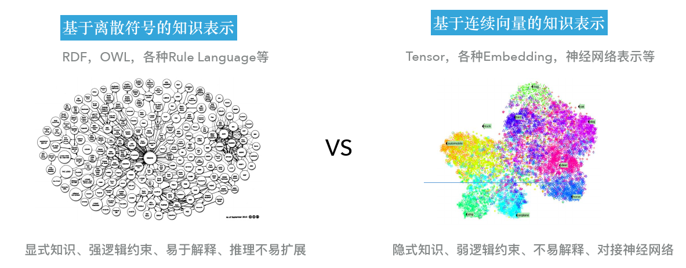
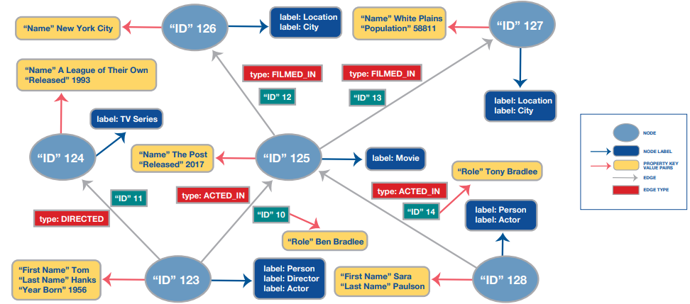
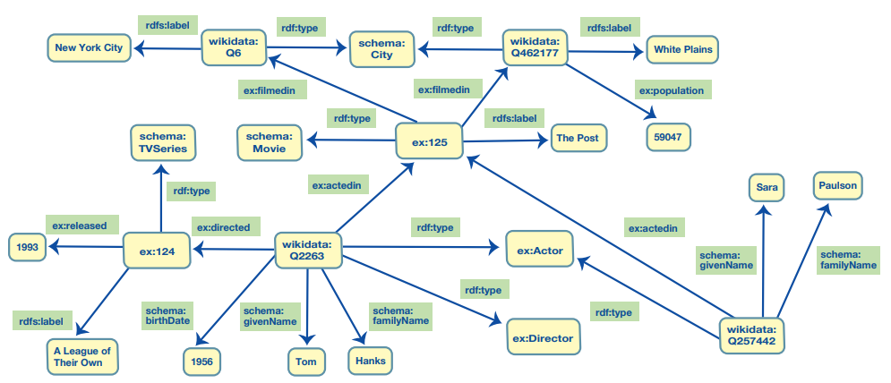
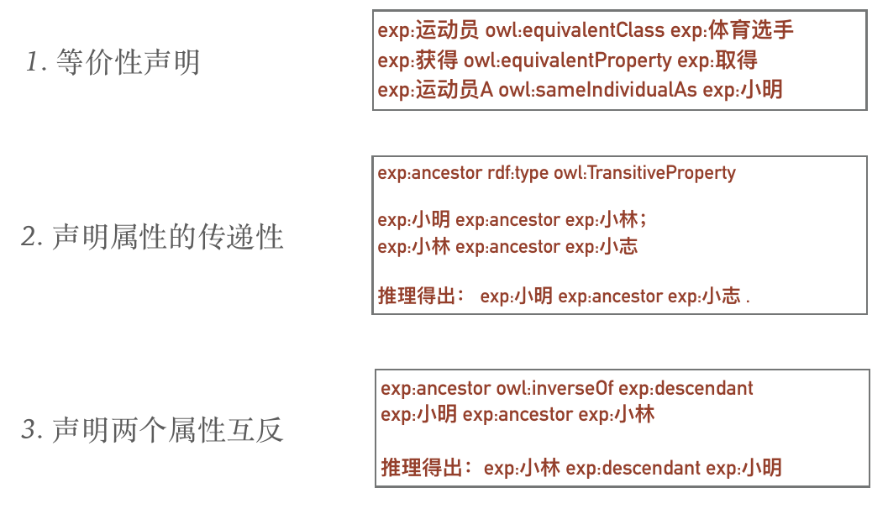

> 知乎上的知识图谱笔记
>
> https://zhuanlan.zhihu.com/p/352088232
>
> https://zhuanlan.zhihu.com/p/352513650
>
> https://zhuanlan.zhihu.com/p/353043426
>
> 专栏
>
> https://www.zhihu.com/column/knowledgegraph
>
> 一个小知识图谱项目
>
> https://github.com/Skyellbin/neo4j-python-pandas-py2neo-v3
>
> 同济子豪兄的问答项目

知识图谱是一个具有属性的实体通过关系连接而成的网状[知识库](https://www.zhihu.com/search?q=知识库&search_source=Entity&hybrid_search_source=Entity&hybrid_search_extra={"sourceType"%3A"answer"%2C"sourceId"%3A1758435012})，是知识的符号表达。本质上知识图谱技术从[非结构化数据](https://www.zhihu.com/search?q=非结构化数据&search_source=Entity&hybrid_search_source=Entity&hybrid_search_extra={"sourceType"%3A"answer"%2C"sourceId"%3A1758435012})中抽取结构化知识，并将其组织为事实[三元组](https://www.zhihu.com/search?q=三元组&search_source=Entity&hybrid_search_source=Entity&hybrid_search_extra={"sourceType"%3A"answer"%2C"sourceId"%3A1758435012})的形式。通过知识图谱表示学习可以获得实体和关系的嵌入，从而与当前基于[神经网络](https://www.zhihu.com/search?q=神经网络&search_source=Entity&hybrid_search_source=Entity&hybrid_search_extra={"sourceType"%3A"answer"%2C"sourceId"%3A1758435012})的模型融合，将实体和关系的知识隐式地融入到模型中。

semantic web

向量化丢失可解释性

知识表示 对于人工智能而言,数据与知识的区别在于KR支持推理。

早期Web 的标准语言HTML和XML无法适应语义网对知识表示的要求，所以W3C 提出了新的标准语言**RDF**、**RDFS和OWL**

- 基于离散符号的知识表示 RDF、 OWL、各种Rule Language
- 基于连续向量的知识表示

将知识图谱中包括实体和关系的内容映射到连续向量空间方法的研究领域称为**知识图谱嵌入（Knowledge Graph Embedding）**、**知识图谱的向量表示**、 知识图谱的**表示学习（Representation Learning）**或者**知识表示学习**。

## 概念相关

语义网络更侧重于描述概念与概念之间的关系，（有点像生物的层次分类体系——界门纲目科属种），而知识图谱则更偏重于描述实体之间的关联。

## 知识表示

知识表示(KR)就是用易于计算机处理的方式来描述人脑的知识。

常见的知识图谱的知识表示框架

- Freebase
- Wikidata
- ConceptNet

> [属性图和RDF图简要介绍与比较](https://zhuanlan.zhihu.com/p/260430189) 

### 属性图 （property Graph）

工业界最常见的图谱建模方法，最著名的Neo4j就是基于属性图实现的。属性图不存在统一的标准，但有一些核心共性，一般包含以下三种元素：

1. 节点（Node）：图中的实体，可以包含0个或多个文本标签
2. 边（Edges）：节点之间的有向连接，从源节点指向目标节点，每条边都属于一个类型
3. 属性（Properties）：一个键值对，顶点和边都可以有属性；属性值可以有数据类型

属性图数据库片段可视化示例（包含演员、导演和电影或电视节目）：

> 其中蓝色椭圆表示节点；深蓝色框表示节点的标签；黄色框表示属性（键值对）；绿色方框表示边，红色方框表示边的类型，边也可以有属性。需要注意的是节点和边都会有唯一的ID。

==不支持符号推理。==

### RDF

RDF，即资源描述框架（Resource Description Framework），是W3C推动的语义数据交换标准，其本身的定位首先是数据交换标准规范，而非存储模型。形式上主要由主谓宾（SPO, 即subject, predicate, object）三元组组成，其拥有更严格的语义逻辑基础，支持推理，并兼容更复杂的本体描述语言OWL。RDF图存在统一的标准，由万维网联盟(W3C)负责管理。

1. 节点（Nodes）：可以是具备唯一性的资源或字面值（如数值、字符串）
2. 边（Edges）：节点之间的有向连接，也被称为谓语（predicate），一般由主语指向宾语。边的入节点称为主语，出节点称为宾语，由一条边连接的两个节点形成一个主语-谓词-宾语的陈述，也称为三元组。

RDF有标准的查询语言SPARQL，SPARQL既是一种功能齐全的查询语言，也是一种HTTP协议，可以接收通过HTTP发送的查询请求。

RDF图的标准化有一个关键点就是序列化。通过序列化可以在不同RDF图数据库之间无缝切换，常用的序列化格式包括Turtle（最常用）、JSON-LD、XML。

RDFS，全称为"RDF Schema"（Resource Description Framework Schema），是一种用于描述RDF（Resource Description Framework）数据的元数据模型和词汇。RDFS 是一种语义建模语言，它可以用来定义数据模式、数据类别、类层次结构、属性和关系，以及一些基本的推理规则。

> 在RDF中存在一个重要的概念：统一资源标识符（URI ，即Uniform Resource Identifier）
>
> - RDF中的资源可以通过URI来指定一个命名空间，从而使用命名空间内置的定义
> - 上图中每个资源的URI使用Qname表示法（命名空间缩写：资源名，比如`rdf:type`）
> - `rdf:`对应的[命名空间](http://w3.org/1999/02/22-rdf-syntax-ns#)为最基本的命名描述；`rdfs(schema)`则是在`rdf`上的拓展；`owl`则是在`rdfs`上的进一步拓展； `wikidata`是维基百科相关数据的命名描述；`ex`则指示例数据的描述
> - 借助URI可以实现资源在WEB上的唯一命名，而且如果不同节点具有同样的URI时，可以自动合并节点，使得最终的RDF图更简约（比如上图中`wikidata:Q2263`和`wikidata:Q257442`都指向了`ex:Actor`）

### OWL

OWL是对RDF的拓展 具有多个表达控件，如：

OWL有许多语言家族，具有不同复杂度。

### 向量表示

注：

> 知识图谱嵌入（Knowledge Graph Embedding）是指将知识图谱中的实体和关系映射到低维向量空间的过程。这些向量表示可以捕捉实体之间的语义和关系之间的语义关联。知识图谱嵌入的目标是通过学习嵌入向量的方式，使得在向量空间中的距离和相似度能够反映实体之间的语义关系。常见的知识图谱嵌入方法包括TransE、TransH、TransR、DistMult等。
> 	知识图谱的向量化表示是指将知识图谱中的实体和关系表示为向量的形式。这种向量化表示可以是基于嵌入方法得到的向量，也可以是基于其他特征工程技术得到的向量表示。向量化表示可以用于实体或关系的分类、聚类、相似度计算等任务。常见的向量化方法包括词袋模型、TF-IDF、Word2Vec、Doc2Vec等。
>
> 因此，知识图谱嵌入是一种特定的向量化表示方法。

   z知识图谱嵌入模型 词向量  向量表示

分布式语义表示： 

- CBoW

- Skip-gram

嵌入模型：

- TransE

推理

**知识抽取**按任务可以分为**实体识别、关系抽取、事件抽取和规则抽取**等。

## 知识存储

知识图谱领域形成了负责存储RDF图（RDF graph）数据的三元组库（Triple Store）和管理属性图（Property Graph）的图数据库（Graph Database）。

**基于关系数据库的存储方案**：包括三元组表（Triple Store）、水平表、属性表（Property Tables）、垂直划分（二元组Binary Tables）、六重索引和DB2RDF等。

- 关系模型将语义关联关系隐藏在外键结构中，不能显示表达，并带来关联查询和计算的复杂性。
- 数据来源多样性带来大量离群数据，导致数据集的宏观结构的复杂和不规整。

**原生图数据库**：主要包括开源的Neo4j、Nebula（国内自研)、JanusGraph和商用的OrientDB等。

面向 RDF 的三元组数据库：主要的 RDF 三元组库包括：商用的 Virtuoso、AllegroGraph、GraphDB和BlazeGraph，开源系统**Jena、RDF4J、 RDF-3X**和**gStore**。

## 知识抽取

即自动化地从文本中发现和抽取相关信息，是实现自动化构建大规模知识图谱的重要技术。

- NER命名实体识别 （实体抽取）
- 术语抽取
- 关系抽取
- 事件抽取
- 规则抽取

### 实体抽取

- 基于规则的方法
  - 早期采用的人工编写规则的方式，比如正则匹配
  - 这种实体抽取方式在小数据集上可以达到很高的准确率和召回率， 但随着数据集的增大，规则集的构建周期变长，并且移植性较差。

- 基于统计模型的方法

基于统计模型的方法需要完全标注或部分标注的语料进行模型训练，主要采用的模型包括隐马尔可夫模型（Hidden Markov Model）、条件马尔可夫模型（Conditional Markov Model）、最大熵模型（Maximum Entropy Model）以及条件随机场模型（Conditional Random Fields）。该类方法将命名实体识别作为序列标注问题处理。与普通的分类问题相比，序列标注问题中当前标签的预测不仅与当前的输入特征相关，还与之前的预测标签相关，即预测标签序列是有强相互依赖关系的。从自然文本中识别实体是一个典型的序列标注问题。基于统计模型构建命名实体识别方法主要涉及训练语料标注、特征定义和模型训练三个方面。

### 实体识别

基于序列标注的方法

HMM（隐马尔可夫模型）

