---
沈博的项目，有类似的研究 Multi-Agent Reinforcement Learning with Hierarchical Coordination for Emergency Responder Stationing

两篇医学信息学相关的综述：
- Subbiah Vivek. Fragmentation in medicine harms patients and hinders research [J]. Nature Medicine, 2024: 医学碎片化伤害患者并阻碍研究
- Tang Alice S., Woldemariam Sarah R., Miramontes Silvia, Norgeot Beau, Oskotsky Tomiko T., Sirota Marina. Harnessing EHR data for health research [J]. Nature Medicine, 2024, 30 (7): 1847-1855.

---
生成式人工智能
Segment anything in Ultrasound image
CLIP 

谢伟迪
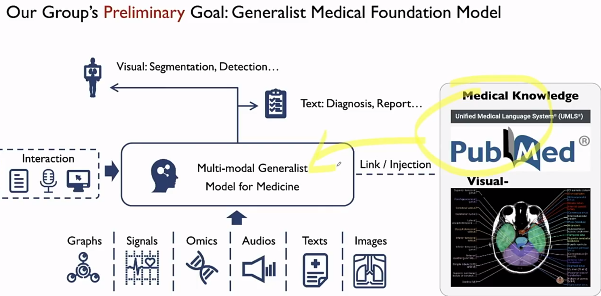

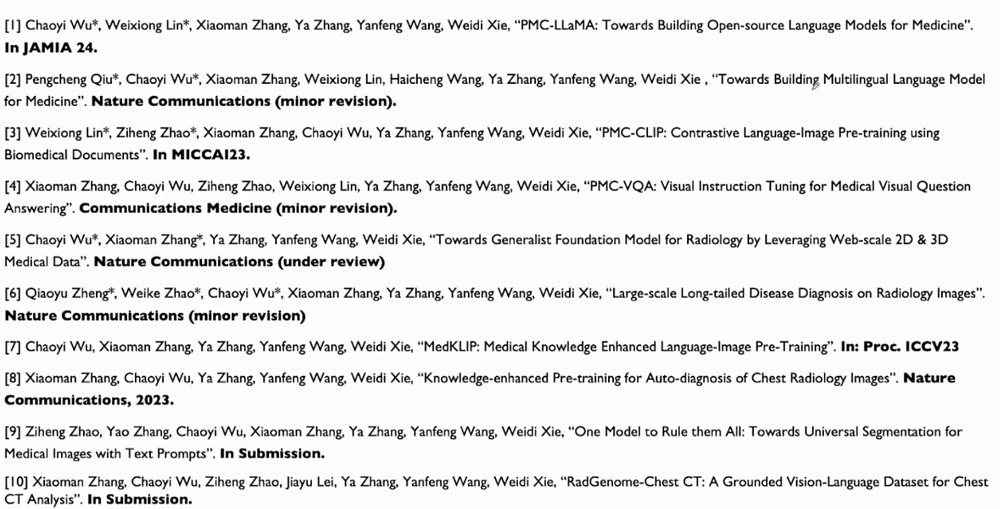

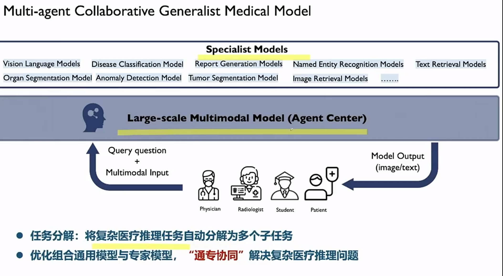

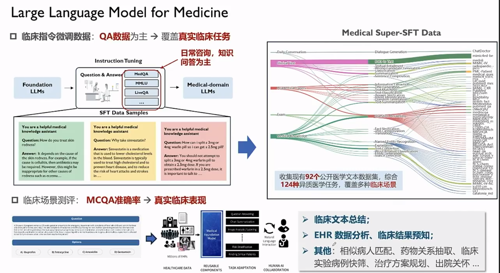

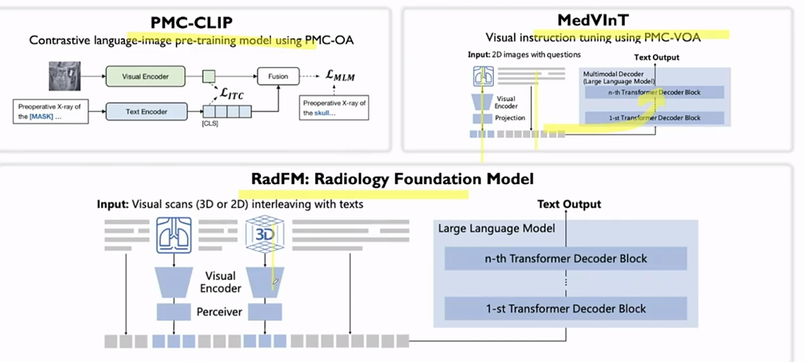

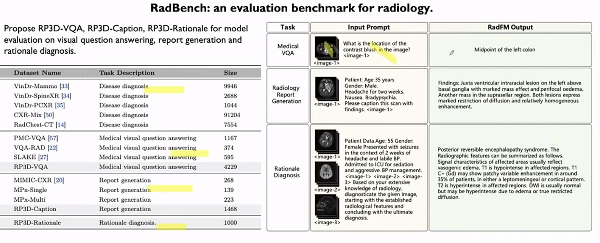

UMLS、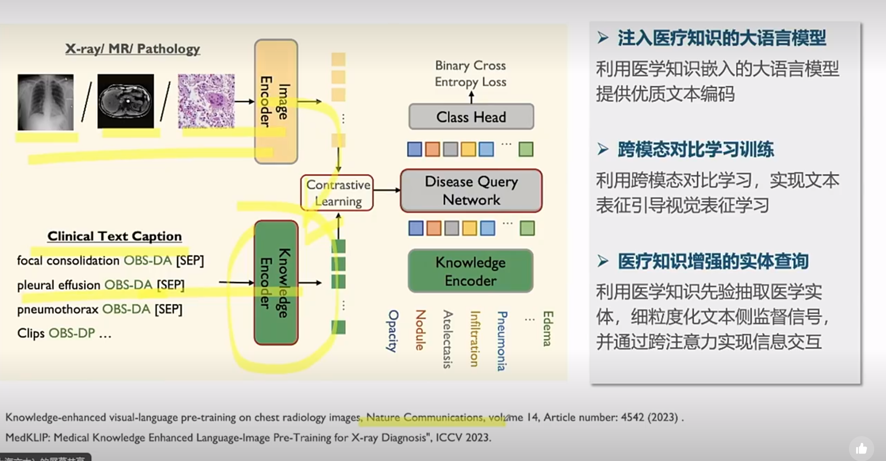
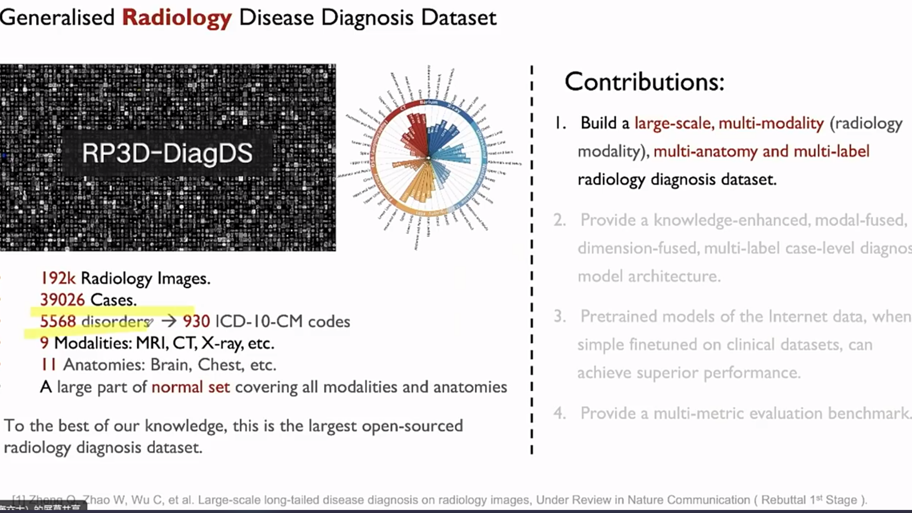

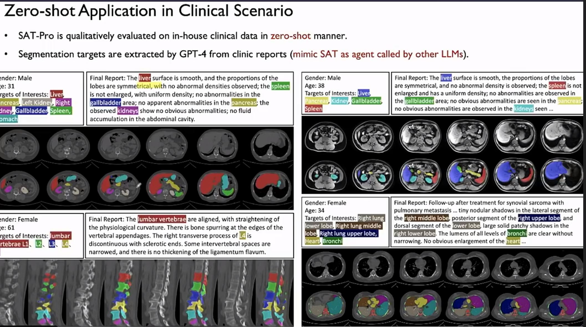
Grounded report generation
40  A100

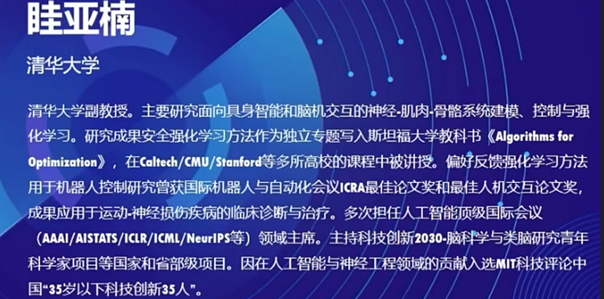

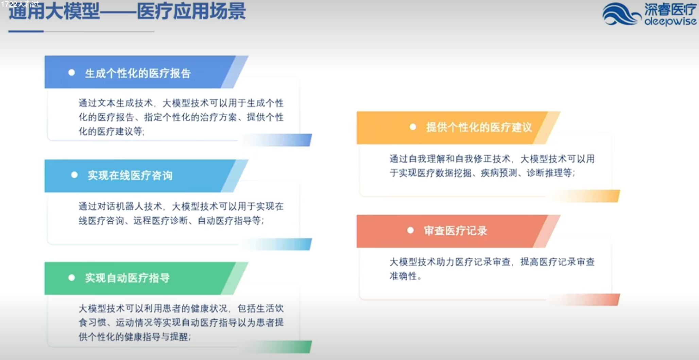

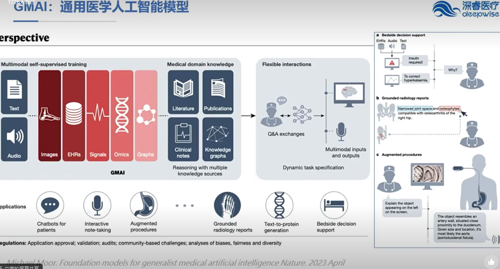

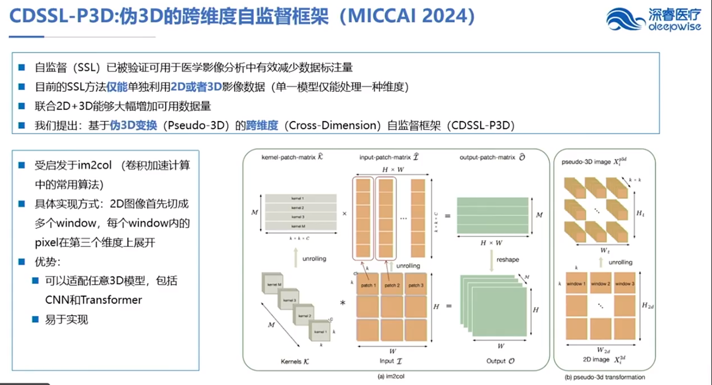

放射、病理
**深睿医疗**
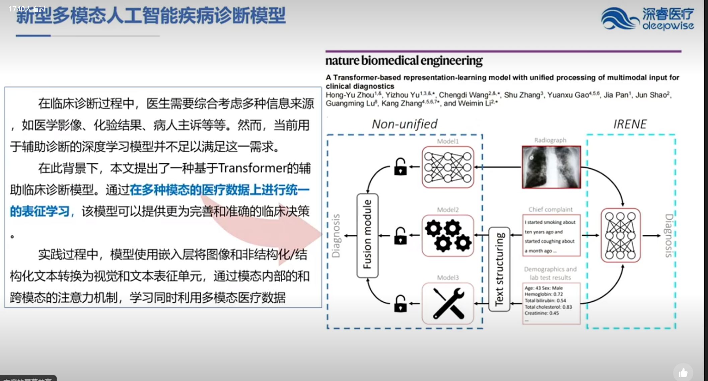

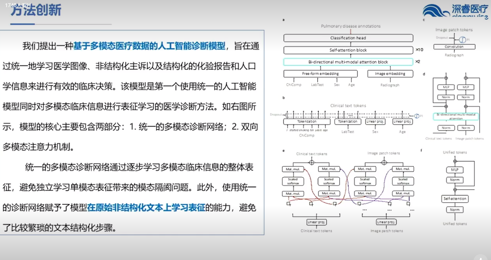

周少华
MICCAI

生成式 AI 医学图像
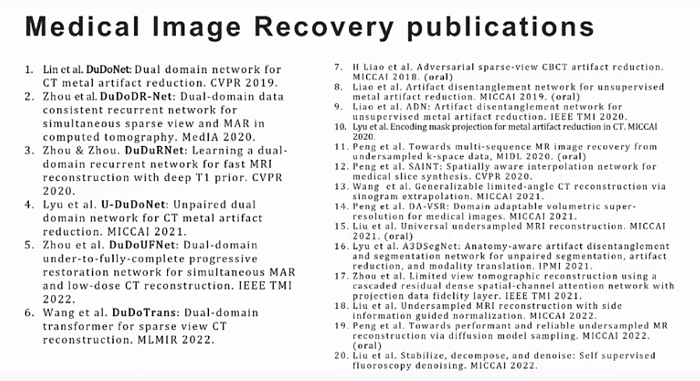

