# What do if network fails to train

## General Guidance

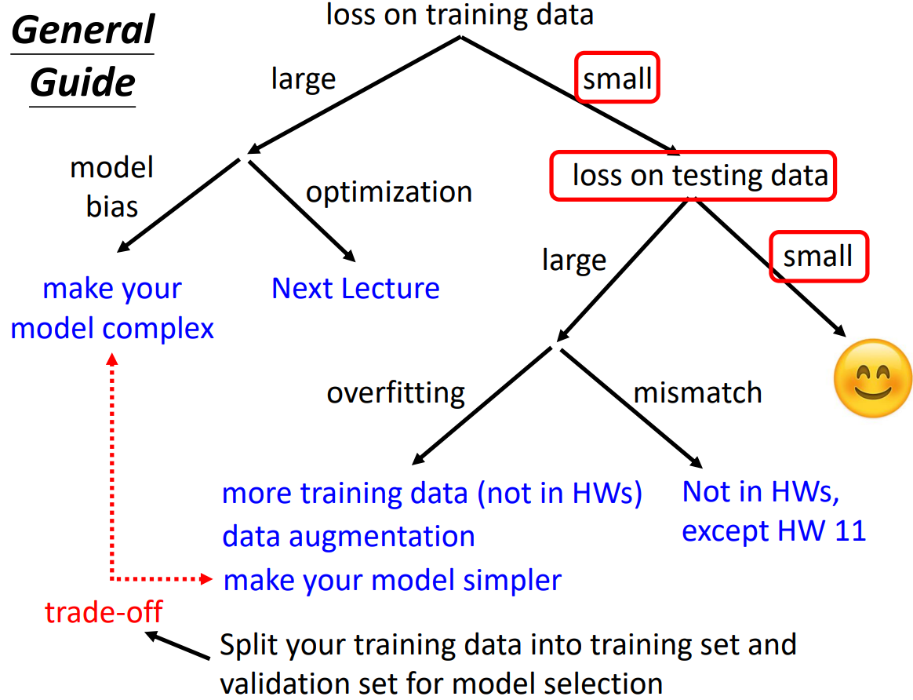

可以先跑一些比较小的、比较浅的网络，或甚至用一些非深度学习的方法，比如线性模型、SVM，（SVM相比较下不会有优化失败的问题）在它们的能力范围之内,找出一组最好的参数，观察可以得到什么样的损失。接下来再使用深一些的模型，如果比较起来，深的模型明明灵活性比较大，但损失却比浅的模型更低，说明优化有问题。 

**Overfitting** 

Small loss on training data, large loss on testing data. 

- More training data
- Data augmentation
    - 如图片进行左右翻转

- Constrain
    - Less parameters, sharing parameters
    - Less features
    - Early stopping
    - Regularization
    - Dropout

**Cross Validation**

Split training set to traing set and validation set. 

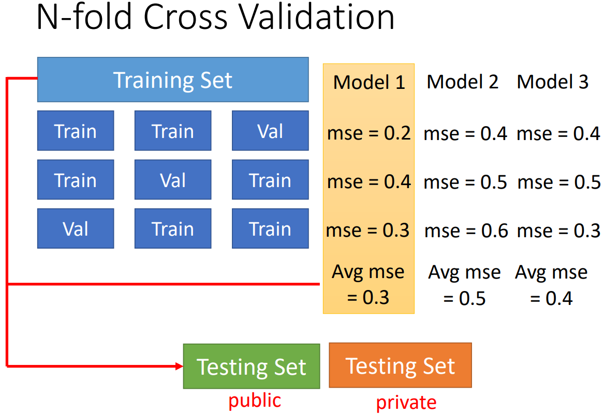

**Mismatch**

Your training and testing data have different distributions. Simply increasing the training data will not help.

## Optimization Strategy

### Small-gradient

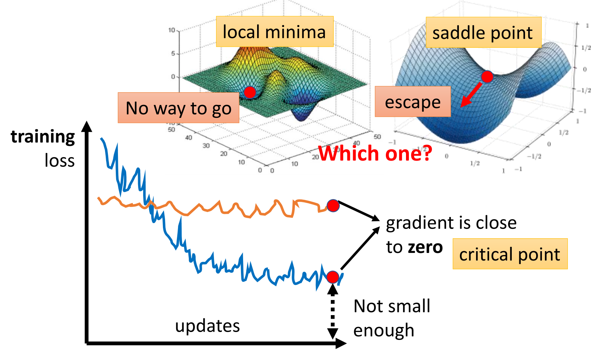

local minima 和 saddle point 都会出现 0，如何判断？

$L(\theta)$ around $\theta = {\theta}^{\prime}$ can be **approximated** below: 

$L(\boldsymbol{\theta}) \approx L\left(\boldsymbol{\theta}^{\prime}\right)+\left(\boldsymbol{\theta}-\boldsymbol{\theta}^{\prime}\right)^{T} g+\frac{1}{2}\left(\boldsymbol{\theta}-\boldsymbol{\theta}^{\prime}\right)^{T} H\left(\boldsymbol{\theta}-\boldsymbol{\theta}^{\prime}\right)$

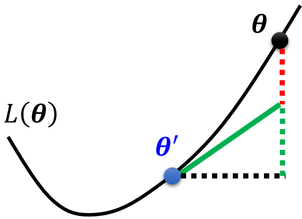

- Gradient $g$ is a vector:

$g=\nabla L\left(\boldsymbol{\theta}^{\prime}\right) \quad g_{i}=\frac{\partial L\left(\boldsymbol{\theta}^{\prime}\right)}{\partial \boldsymbol{\theta}_{i}}$

- Hessian 𝐻 is a matrix:
  $$H_{ij}=\dfrac{\partial^2}{\partial\theta_i\partial\theta_j}L(\theta')$$

**At critical point**, $\left(\boldsymbol{\theta}-\boldsymbol{\theta}^{\prime}\right)^{T} g = 0$ :

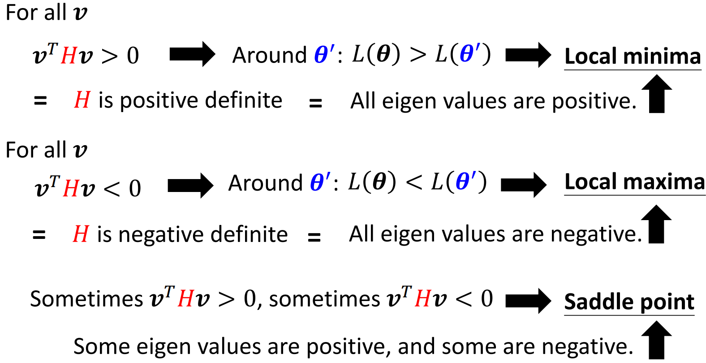

- To deal with saddle point:

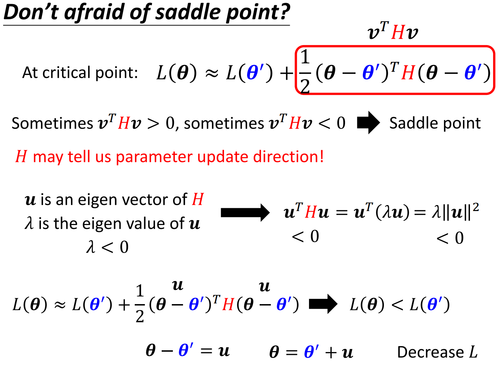

> 但实际上,我们几乎不会真的把海森矩阵算出来，因为海森矩阵需要算二次微分，计算这个矩阵的运算量非常大，何况我们还要把它的特征值跟特征向量找出来。

### Batch

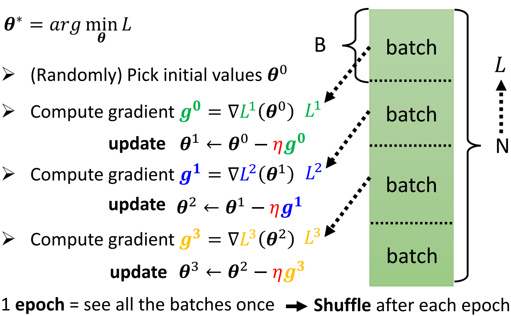

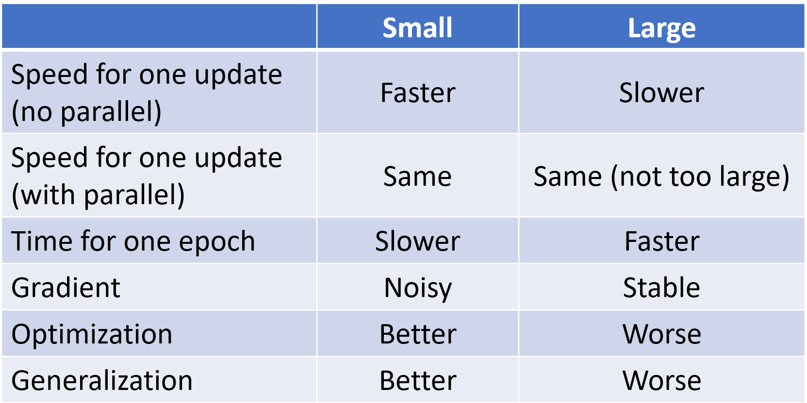

Batch size is a hyperparameter we have to decide.

- Larger batch size does not require longer time to compute gradient (unless batch size is too large)
- Smaller batch requires longer time for one epoch (longer time for seeing all data once)
- Smaller batch size has better performance, "Noisy" update is better for training

### Momentum

考虑物理世界的小球从高处滚下，因为有前面的积累速度，小球并不会卡在鞍点处。

$\theta^{i+1} = \theta^{i}-\eta g^{i}$

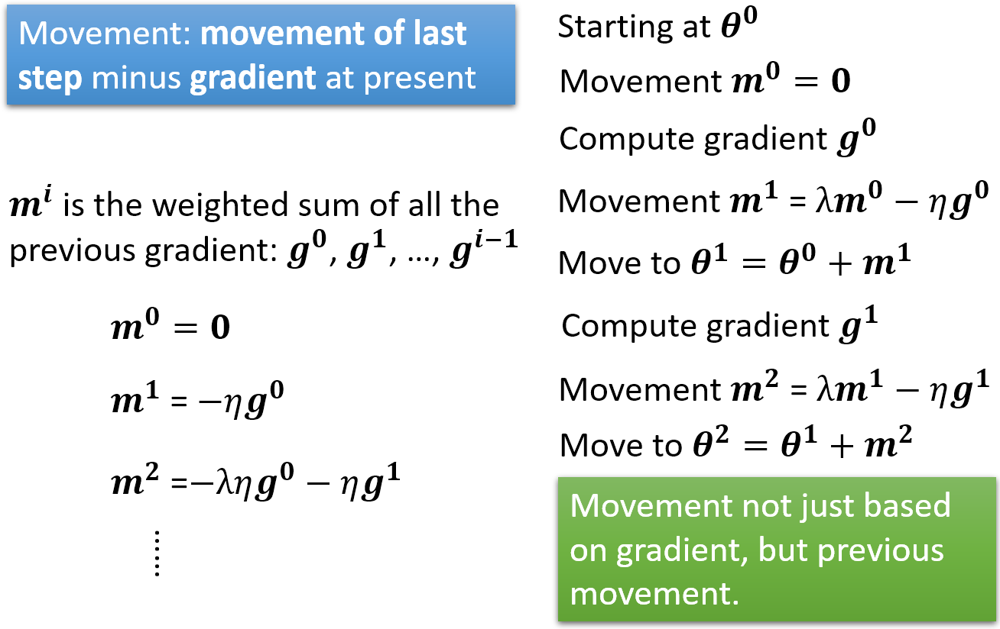

### Learing Rate Adjustment

> 事实上，critical point 往往不是训练卡住的原因。对于一般的梯度下降训练，往往梯度还很大，损失就已经降了下去，训练在还没有走到临界点的时候就已经停止了。对于某一个方向，如果梯度的值很小，我们会希望学习率调大一点；而如果某一个方向上非常陡峭，坡度很大，我们会希望学习率可以小一点。不同的参数需要被设置不同的学习率。

Loss keep stable does not mean small gradient. Different parameters needs different learning rate.

#### Root Mean Square

Used in Adarad.

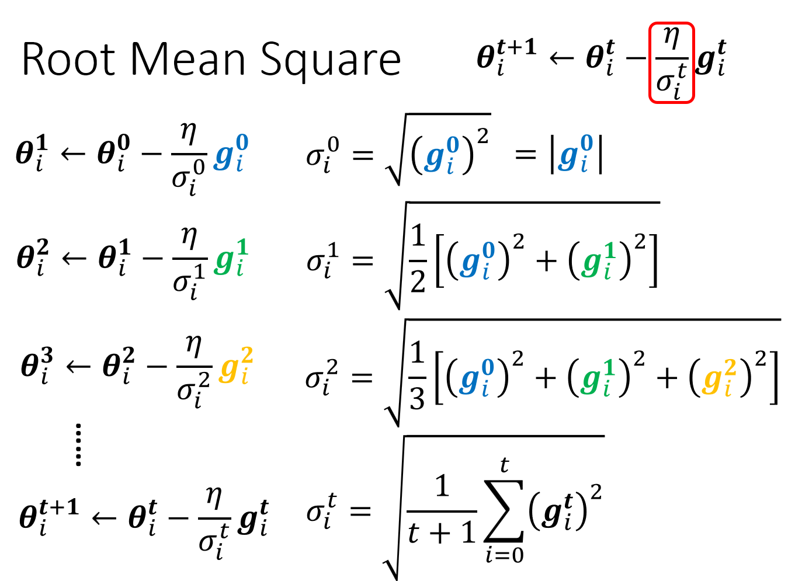

#### RMSProp

可以调整过去的 $\sigma$ 的重要性。

#### **Adam**: RMSProp + Momentum

pytorch 有完备的套件，默认参数效果就已经很好。

#### Learning Rate Scheduling

If learning date $\eta$ keeps invariant, picture will be left below. 

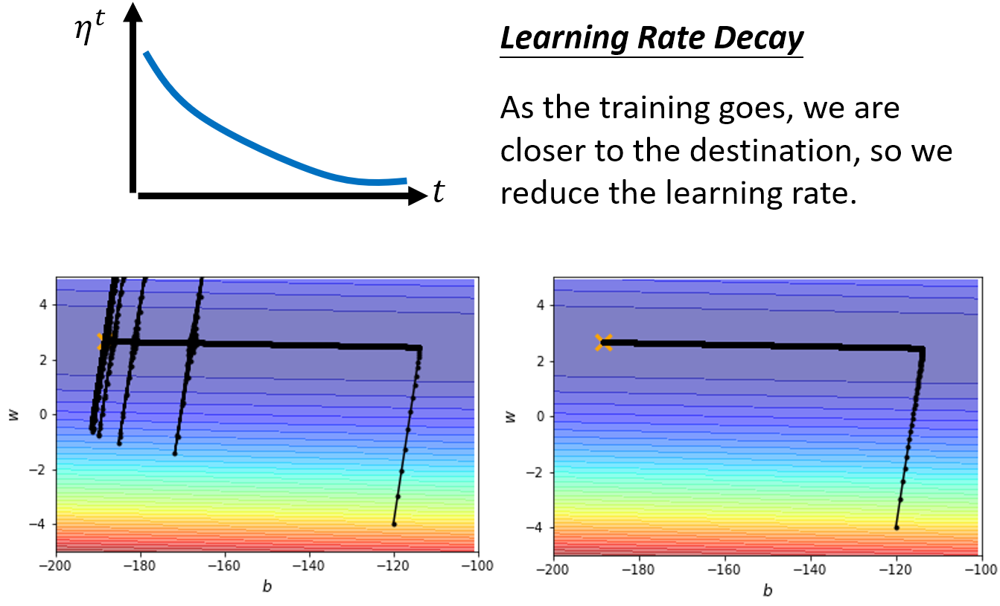

在 BC 段，纵轴的方向梯度很小，因此纵轴方向累积了很小的 $σ_t$ ，而累积到一定程度以后，步伐就会变得很大。

So let $\eta$ be a variable of $t$.

$\theta_i^{t+1}\leftarrow\theta_i^t-\dfrac{\eta^t}{\sigma_i^t}g_i^t$

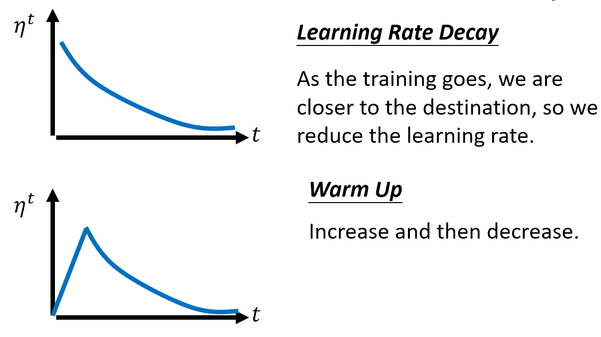

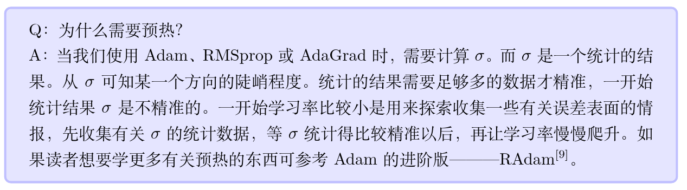

> 除了残差网络，BERT 和 Transformer 的训练也都使用了预热法。

### Loss Function

Consider classification as regression, think each class as one-hot vector. 

$\hat{y}=\begin{bmatrix}1\\ 0\\ 0\end{bmatrix}\text{or}\begin{bmatrix}0\\ 1\\ 0\end{bmatrix}\text{or}\begin{bmatrix}0\\ 0\\ 1\end{bmatrix}$

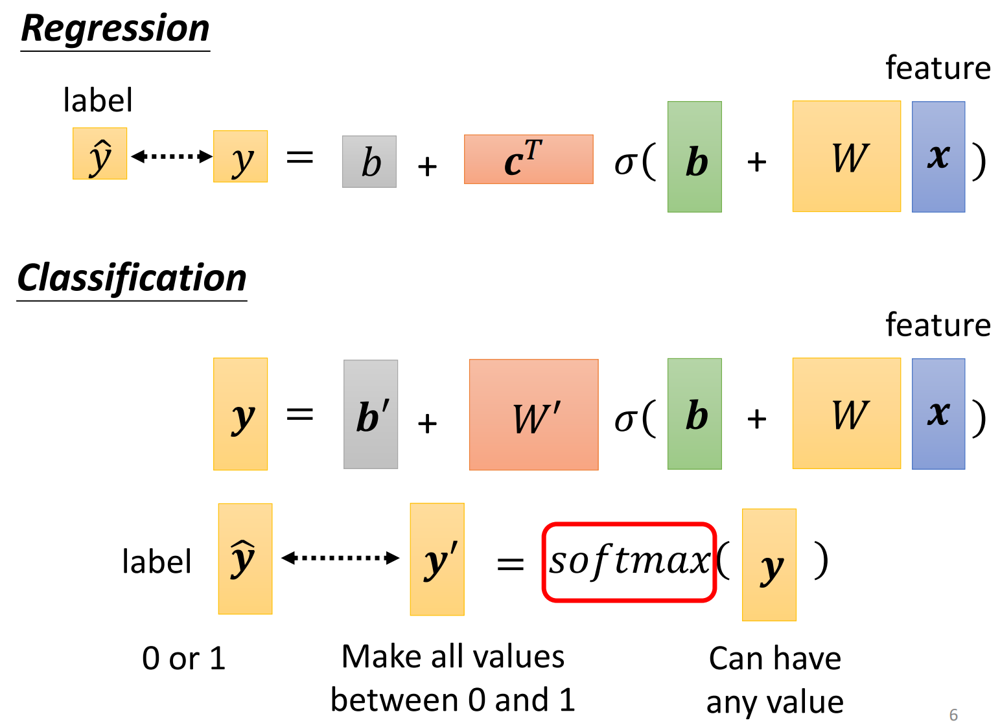

**softmax:** $y_i'=\frac{exp(y_i)}{\sum_jexp(y_i)}$

Loss of Classification:

- Mean Square Error (MSE): $e=\sum(\hat y_i-y'_i)^2$

- Cross-entropy: $e=-\sum\hat y_i\ln y'_i$  效果最好 

**Minimizing cross-entropy** is equivalent to **maximizing likelihood**. Changing the loss function can change the difficulty of optimization.

见下图所示，假设 $y_3$ 固定，选取 MSE 方法时，训练会被卡住，而 cross-entropy 会有斜坡可以前进。

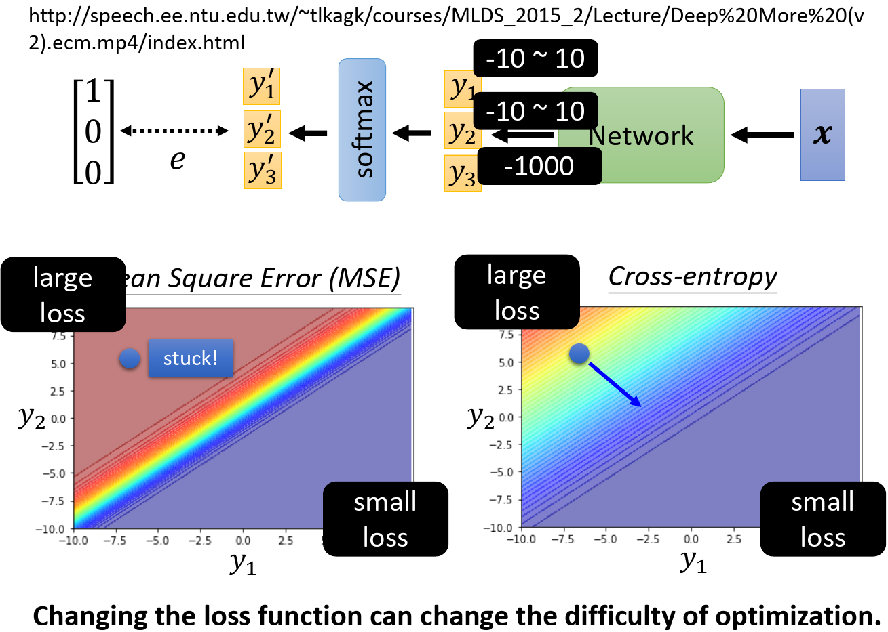

## 机器学习原理浅谈

> 寻找合适的参数$h$对数码宝贝和宝可梦进行分类。

$h^{all}=arg\underset{h}{\text{min}}L(h,D_{all})$
$h^{train}=arg\underset{h}{\text{train}}L(h,D_{all})$

we hope $L(h^{train},D_{all})$ and $L(h^{all},D_{D_{all}})$ are close.

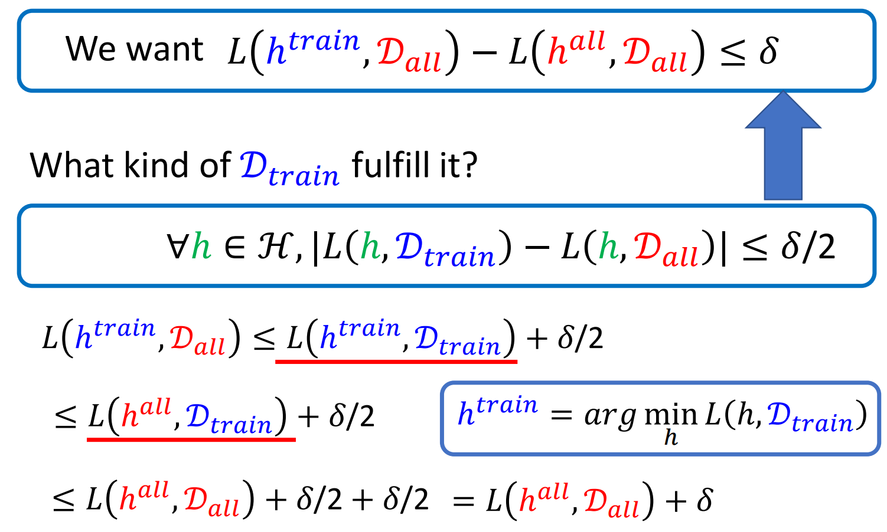

So the key question is the choice of $D_{train}$.

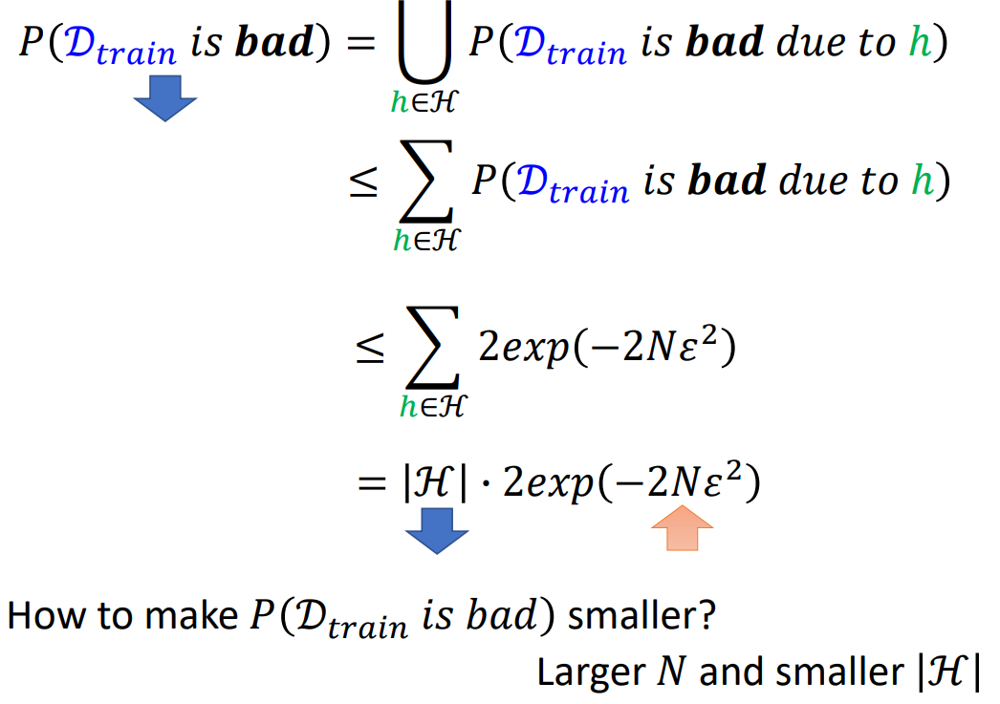

