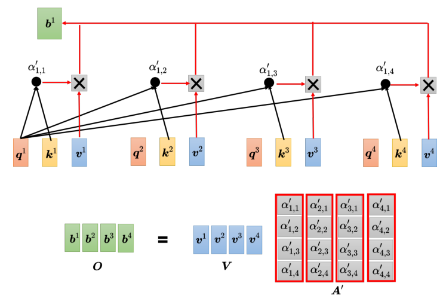

## self-attention
> [层层剖析，让你彻底搞懂Self-Attention、MultiHead-Attention和Masked-Attention的机制和原理_masked multi-head attention](https://blog.csdn.net/zhaohongfei_358/article/details/122861751)
### 理论解释
Vector Set as Input 
**Find the relevant vectors in a sequence** 
计算 vector 之间的相关性：

利用$W^q\ W^k$计算关联性，$\alpha$ 代表两个 vector 之间的相关性。

$v^i=W^va^i$ 引入v变量，累加获得b。对于每一个输出的b，和每个输入都有关系。
**矩阵乘法形式：**

总结一下：

### 矩阵公式
$$
\operatorname{Attention}(Q ,K,V ) =\operatorname{softmax}\left(\frac{Q K^{T}}{\sqrt{d_{k}}}\right)V
$$
$$
 \begin{aligned}
O _{n × d_v} = \operatorname{Attention}(Q _{n × d_k},K _{n × d_k} ,V _{n × d_v} ) &= \operatorname{softmax} ⁡( \frac{Q_{n × d_k}K^T _{d_k \times n} }{\sqrt{d_k}}) V_{n × d_v} \\&= A'_{n\times n} V_{n\times d_v} 
\end{aligned}​​​
$$
输入向量 $a$ 的矩阵化，假设列向量 $a^i$ 维度为 $d$，显然可以将输入转化为矩阵 $I$:
$$
I_{d \times n}=(a^1,a^2,\cdots ,a^n)
$$
接下来定义 $W^q, W^k, W^v$ 阵，其中 $W^q, W^k$ 的矩阵维度必须一致，为 $d_k\times d$，而 $W^v$ 的矩阵维度为 $d_v\times d$，其中 $d_k, d_v$ 都是需要调的超参数（一般与词向量的维度 $d$ 保持一致）。$d_k$ ​只影响过程，但 $d_v$ 会影响结果，即 $d_v$ 是Attention的输出向量 $b$ 的维度。
向量 $q$ 的矩阵化：
$$
Q_{d_k\times n}=(q^1,q^2,\cdots ,q^n)=W^q_{d_k \times d} \cdot I_{d \times n}
$$
向量 $k$ 的矩阵化：
$$
Q_{d_k\times n}=(k^1,k^2,\cdots ,k^n)=W^k_{d_k \times d} \cdot I_{d \times n}
$$
向量 $v$ 的矩阵化：
$$
Q_{d_v\times n}=(v^1,v^2,\cdots ,v^n)=W^v_{d_v \times d} \cdot I_{d \times n}
$$
相关矩阵 $\alpha$ ：
$$
A_{n\times n}=\begin{bmatrix}\alpha_{1,1}&\alpha_{2,1}&\cdots&\alpha_{n,1}\\\alpha_{1,2}&\alpha_{2,2}&\cdots&\alpha_{n,2}\\\vdots&\vdots&&\vdots\\\alpha_{1,n}&\alpha_{2,n}&\cdots&\alpha_{n,n}\end{bmatrix}=K^T\cdot Q=\begin{bmatrix}{k^1}^T\\{k^2}^T\\\vdots\\{k^n}^T\end{bmatrix}\cdot(q^1,q^2,\cdots,q^n)
$$
进一步，$\alpha'$ ：
$$
A_{n\times n}'=\text{softmax}(A)=\begin{bmatrix}\alpha_{1,1}'&\alpha_{2,1}'&\cdots&\alpha_{n,1}'\\\alpha_{1,2}'&\alpha_{2,2}'&\cdots&\alpha_{n,2}'\\\vdots&\vdots&&\vdots\\\alpha_{1,n}'&\alpha_{2,n}'&\cdots&\alpha_{n,n}'\end{bmatrix}
$$

输出向量 $b$：
$$
O_{d_v \times n}=(b^1,b^2, \cdots,b^n)=V_{d_v \times n} \cdot A_{n\times n}'=(v^1,v^2,\cdots,v^n)\cdot\begin{bmatrix}\alpha_{1,1}'&\alpha_{2,1}'&\cdots&\alpha_{n,1}'\\\alpha_{1,2}'&\alpha_{2,2}'&\cdots&\alpha_{n,2}'\\\vdots&\vdots&&\vdots\\\alpha_{1,n}'&\alpha_{2,n}'&\cdots&\alpha_{n,n}'\end{bmatrix}
$$
## Multi-head Self-attention

## 位置编码
位置向量用 $e_i$ 来表示，上标 $i$ 代表位置，不同的位置都有一个专属的 $e$，把 $e$ 叠加到 $a_i$ 上。

## CNN和attention、RNN
卷积神经网络是自注意力的一个子集（On the Relationship between Self-attention and Convolutional Layers）
关于RNN
- 如果最右边向量要考虑最左边的输入，它就必须把最左边的输入存在记忆里面，才能不“忘掉”，一路带到最右边，才能够在最后一个时间点被考虑。但自注意力输出一个查询，输出一个键，观察它们是否match，自注意力可以轻易地从整个序列上非常远的向量上抽取信息
- 并行
    - 
