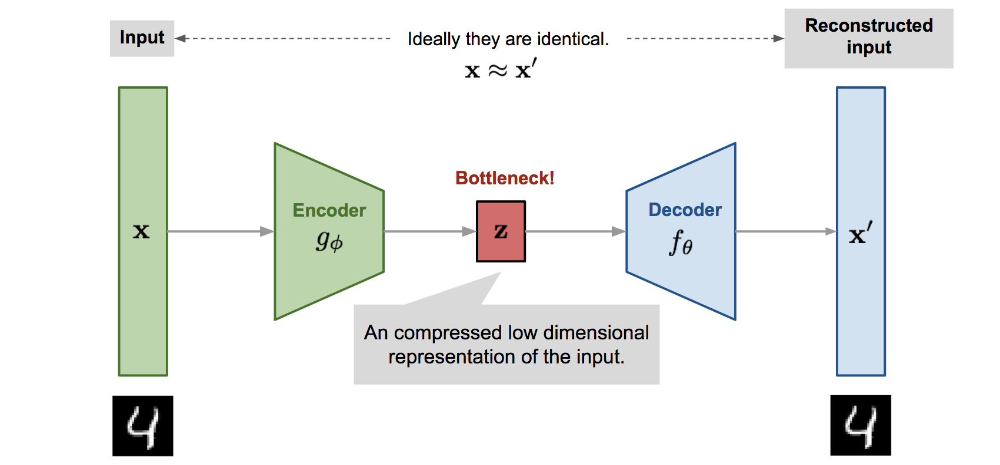
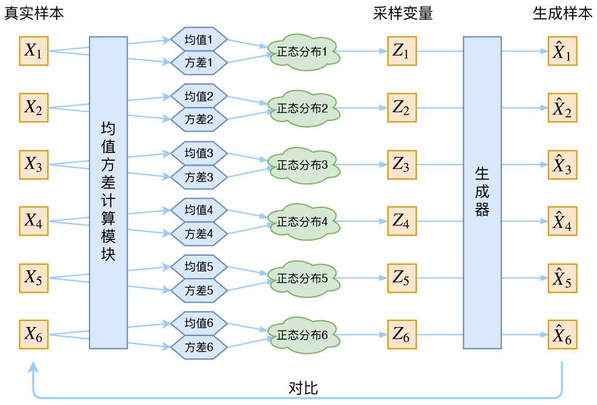

## 自编码器

**自动编码器**是一种神经网络，旨在以无监督的方式学习恒等函数来重建原始输入，同时压缩过程中的数据，从而发现更有效和压缩的表示

## VAE
>Kingma D P. Auto-encoding variational bayes[J]. arXiv preprint arXiv:1312.6114, 2013.

VAE 和 AE 的不同点就在于，AE 中间输出的是隐变量的具体取值，而 VAE 中间要输出的是隐变量的具体分布情况，这样我们就可以从这个分布中另外取样，送入到 decoder 中，从而生成类似输入样本 $x$ 的其他样本 $x′$ 。
对于一批数据样本 $\{X_1, X_2, ..., X_3\}$，我们想要获取其样本分布 $p(x)$ ，做法是通过构建一个从隐变量 $Z$ 生成目标数据 $X$ 的模型。具体地来说是假设 $Z$ 符合某种分布，然后训练出一个模型 $X=g (Z)$ ，从而将原来的概率分布映射到训练集的概率分布。但是直接从正态分布中采样 $Z_1$ 并生成 $\hat{X_1}$ 的做法无法获知真实样本 $X$。
事实上，我们真正的假设是后验分布 $p(Z|X)$ 是正态分布。具体来说，给定一个真实样本 $X_k$，我们假设存在一个专属于 $X_K$ 的分布 $p(Z|X_k)$，并进一步假设这个分布是（独立、多元的）正态分布。为什么要强调“专属”呢？因为我们后面要训练一个生成器 $X=g (Z)$，希望能够把从分布 $p(Z|X_k)$ 采样出来的一个 $Z_k$ 还原为 $X_k$。现在我们知道了 $p(Z|X_k)$ 专属于 $X_k$，我们有理由说从这个分布采样出来的 $Z$ 应该要还原到 $X_k$ 中去。
我们使用神经网络来拟合对应的方差和均值，$\mu_k=f_1(X_k),\log\sigma_k^2=f_2(X_k)$，拟合 $\log\sigma_k^2$ 可正可负，不需要添加额外的激活函数。

为了避免模型最后的方差收敛到 0，VAE 尝试让所有的p $(Z|X)$ 都向标准正态分布看齐 $\mathcal{N}(0,I)$，做法是在重构误差的基础上加上额外的 loss：
$$
\mathcal{L}_\mu=\|f_1(X_k)\|^2\quad\text{和}\quad\mathcal{L}_{\sigma^2}=\|f_2(X_k)\|^2
$$
原论文直接算了一般（各分量独立的）正态分布与标准正态分布的KL散度 $KL\left(N(\mu,\sigma^2)|N(0,I)\right)$ 作为这个额外的loss，计算结果为：
$$
\mathcal{L}_{\mu,\sigma^2}=\frac12\sum_{i=1}^d\left(\mu_{(i)}^2+\sigma_{(i)}^2-\log\sigma_{(i)}^2-1\right)
$$
这里的 $d$ 是隐变量 $Z$ 的维度，而 $μ(i)$ 和 $\sigma_{(i)}$ 分别代表一般正态分布的均值向量和方差向量的第 $i$ 个分量。直接用这个式子做补充loss，就不用考虑均值损失和方差损失的相对比例问题了。
$$
\begin{aligned}
&\mathcal{L}_{\mu,\sigma^2}=\mathcal{L}_\mu+\mathcal{L}_{\sigma^2} \\
&\mathcal{L}_\mu=\frac12\sum_{i=1}^d\mu_{(i)}^2=\frac12\|f_1(X)\|^2 \\
&\mathcal{L}_{\sigma^2}=\frac12\sum_{i=1}^d\left(\sigma_{(i)}^2-\log\sigma_{(i)}^2-1\right)
\end{aligned}
$$
