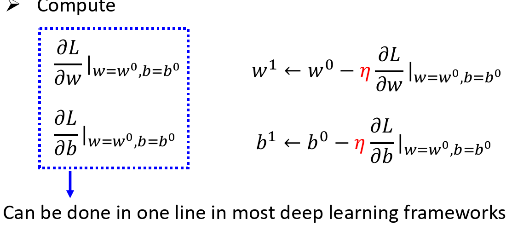
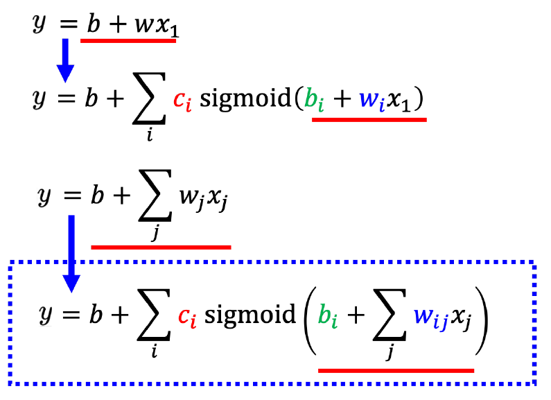
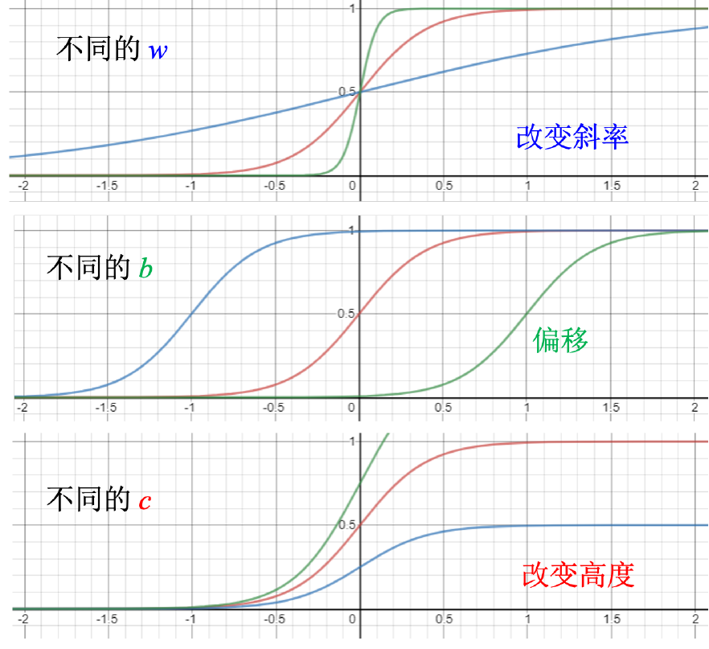
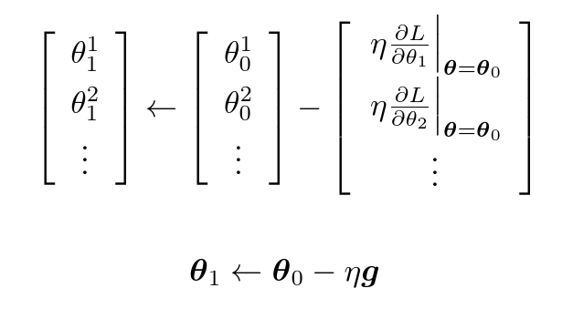
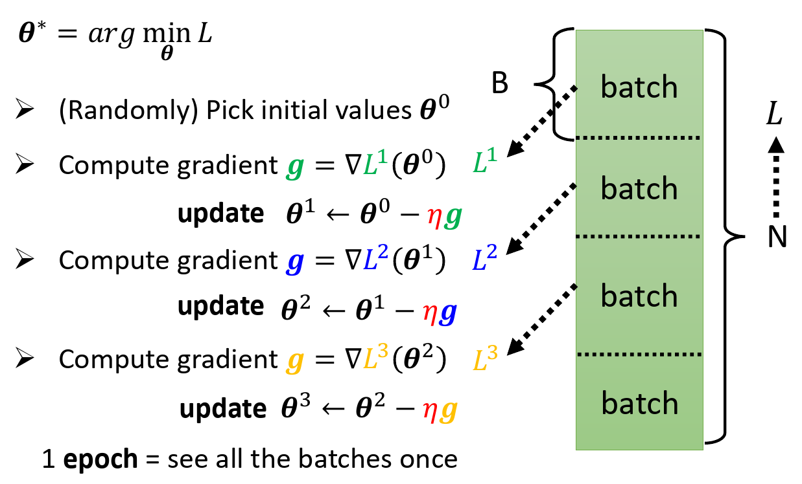

---
Reinforcement Learning  强化学习

Supervised Learning

Self-Supervised Learning

Generative Adversarial Network

Reinforcement Learning

Anomaly Detection 

Explainable AI

Model Attack

Domain Adaptation

Network Compression

Domain Adaptation

Network Compression

Life-Long Learning

Meta Learning & Few-Shot Learning
---

---

- 模型

- 学习准则

- 优化算法 Optimization

  - Gradient Descent  

  

Sigmoid 函数用于拟合曲线  即 $y=c\frac{1}{1+e^{-(b+wx_1)}}$

如果改动 w，就会改变斜率进而改变斜坡的坡度。改动 b，就可以把这一个 Sigmoid 函数左右移动；如果改变 c,就可以改变它的高度。多个累加，构建更有灵活性的函数。

超参数(hyperparameter) 指需要自己设定的东西，如学习率。

更新参数：

Hard Sigmoid 可以看作是两个 ReLU(Rectified Linear Unit,修正线性单元)的加总：

$c ∗ max(0, b + wx_1 )$

 
