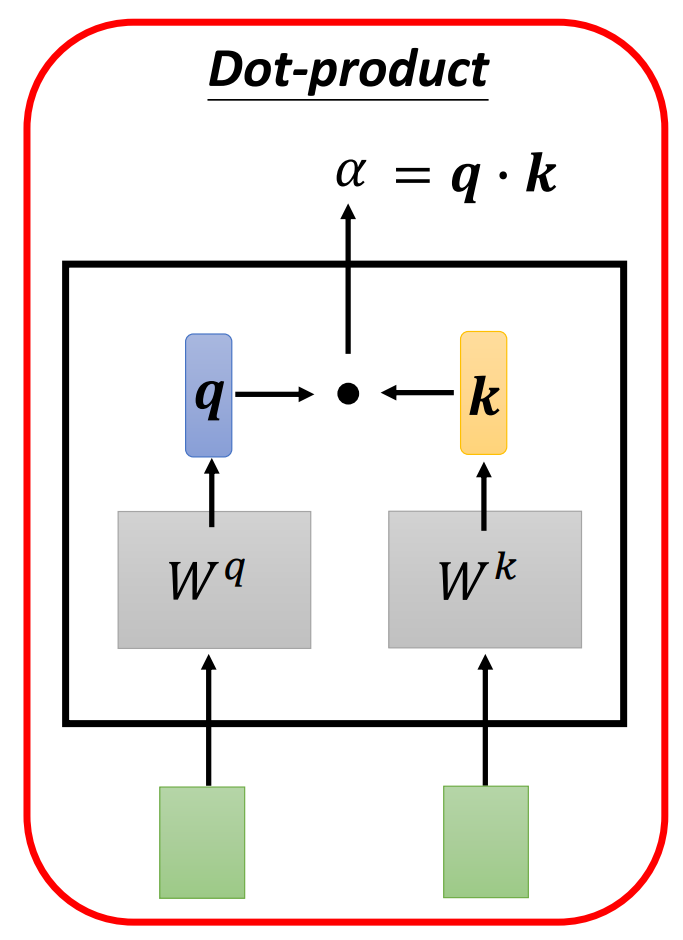
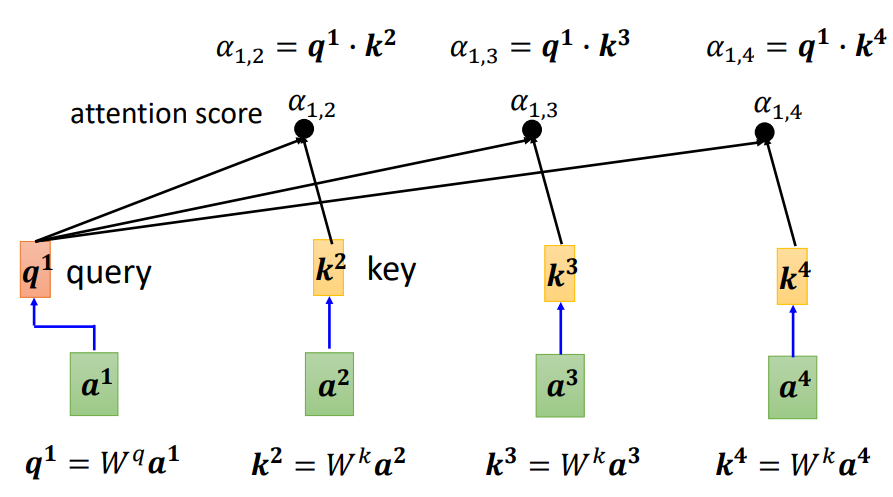
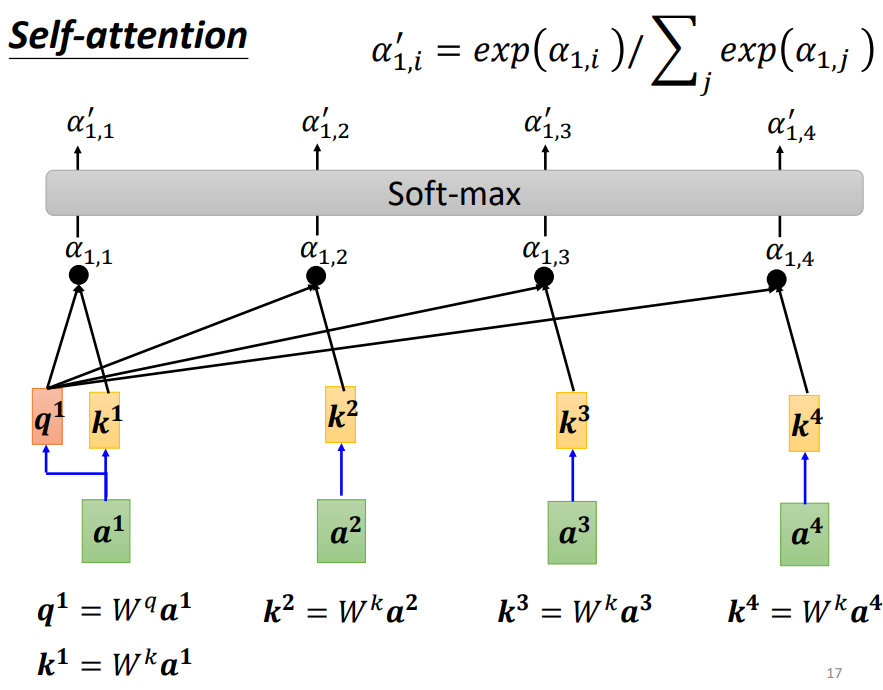
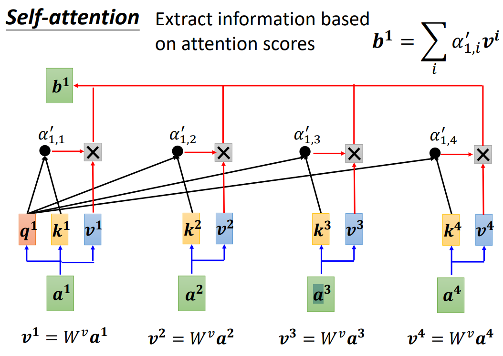

# week 4

## Self-attention 

Vector Set as Input 

1. Find the relevant vectors in a sequence 

常见的计算方法：

利用$W^q\ W^k$计算关联性。

$v^i=W^va^i$ 引入v变量，累加获得b。对于每一个输出的b，和每个输入都有关系。

Multi-head Self-attention