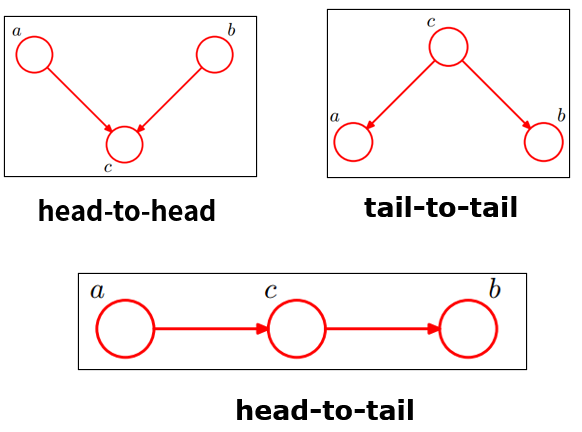

> https://zhuanlan.zhihu.com/p/542482587
> https://zhuanlan.zhihu.com/p/240747757
## 概念
- 贝叶斯（决策）理论：是统计决策模型的组成部分。 贝叶斯决策就是在不完全情报下，对部分未知的状态用主观概率估计，然后用贝叶斯公式对发生概率进行修正，最后再利用期望值和修正概率做出最优决策。过程就是先验-后验-分类（决策）。
- 贝叶斯定理：也称贝叶斯推理，是由A概率和条件概率 $\mathrm P(B|A)$ 计算后验概率 $\mathrm P(A|B)$ 的理论，贝叶斯定理包含贝叶斯公式。
- 贝叶斯统计：基于贝叶斯理论的系统的统计推断方法，贝叶斯学派的产出。
- 贝叶斯估计：利用贝叶斯定理结合新的证据和以往的经验，形成一种计算假设概率的方法，基于假设的先验概率、给定假设下观察到不同数据的概率以及观察到的数据本身。
## 贝叶斯定理
$$
P(A\mid B)=\frac{P(A)P(B\mid A)}{P(B)}
$$
- $P(A\mid B)$ 已知 𝐵 发生后， 𝐴 的条件概率，也称作 𝐴 的事后概率。
- $P(A)$ 是 𝐴 的先验概率（或边缘概率）。
- $P(B\mid A)$ 是已知𝐴 发生后，𝐵 的条件概率。也可称为 𝐵 的后验概率。某些文献又称其为在特定 𝐵 时， 𝐴 的似然性。
按这些术语，贝叶斯定理可表述为：
后验概率 = (似然性 \* 先验概率)/标准化常量
>注：贝叶斯估计和极大似然估计的区别所在，极大似然估计中要估计的参数是个一般变量，而贝叶斯估计中要估计的参数是个随机变量。

##  贝叶斯网络
贝叶斯网络(Bayesian network)，又称信念网络(Belief Network)，或有向无环图模型(directed acyclic graphical model)，是一种概率图模型，于1985年由Judea Pearl首先提出。它是一种模拟人类推理过程中因果关系的不确定性处理模型，其网络拓朴结构是一个有向无环图(DAG)。
有向无环图中的节点表示随机变量，$\{X_{1},X_{2},...,X_{n}\}$，它们可以是可观察到的变量，或隐变量、未知参数等。认为有因果关系（或非条件独立）的变量或命题则用箭头来连接。若两个节点间以一个单箭头连接在一起，表示其中一个节点是“因(parents)”，另一个是“果(children)”，两节点会产生一个条件概率值。**总而言之，连接两个节点的箭头代表此两个随机变量是具有因果关系，或非条件独立。**
令 $G = (L,E)$ 表示一个有向无环图（DAG），其中 $L$ 代表图形中所有的节点的集合，而 $E$ 代表有向连接线段的集合，且令 $X = (X_i),i ∈ L$为其有向无环图中的某一节点 $i$ 所代表的随机变量，若节点 X 的联合概率可以表示成：
$$
p(x)=\prod_{i\in I}p\big(x_i\big|x_{\mathrm{pa}(i)}\big)
$$
则称 $X$ 为相对于一有向无环图 $G$ 的贝叶斯网络，其中 $𝑝𝑎(𝑖)$ 表示节点 $i$ 之“因”。而对任意的随机变量，其联合分布可由各自的局部条件概率分布相乘而得出：
$$
\mathrm P(X_1=x_1, \ldots, X_n=x_n) = \prod_{i=1}^n \mathrm P\big(X_i=x_i \mid X_{i+1}=x_{i+1}, \dots, X_n=x_n\big)
$$
因此，我们可以将一贝叶斯网络的联合概率分布写成：
$$
\mathrm P(X_1=x_1, \ldots, X_n=x_n) = \prod_{i=1}^n \mathrm P(X_i=x_i \mid X_j=x_j)
$$
**head-to-head（共同作用）**

## 贝叶斯统计
贝叶斯统计中，我们在建模前需要给出模型参数的先验分布（prior distribution） 。例如，对于抛掷一枚硬币一次可能出现的结果，我们可以构建一个参数为 $\theta$ 的伯努利分布概率模型。那么在使用数据估计参数之前，我们需要给这个参数设定一个分布$p(\theta)$（注意，先验分布是关于模型参数的分布，而不是我们建模的对象本身）。
**理论上，我们可以使用任何的分布作为先验分布**。但一个好的先验分布需要囊括我们对参数的经验判断信息
在得到了模型参数的先验分布之后，我们便可以通过样本数据 $x_1,...,x_n$ 来进一步更新模型参数的分布。这便是贝叶斯学派与频率学派的另一个重要的不同之处：**在贝叶斯统计中，数据被用于更新参数的分布，而非作为参数极大似然估计的组成部分。** 更新模型参数分布的过程，本质上是在给定 $x_1,...,x_{10}$ 下得到的关于 $\theta$ 的新的分布，即 $p(\theta|x_1,...,x_{10})=p(\theta|X)$，其中 $p(\theta|X)$ 被称作 $\theta$ 的后验分布（posterior distribution）。根据贝叶斯定理，我们有：
$$
p(\theta|X)=\frac{p(\theta,X)}{p(X)}=\frac{p(X|\theta)p(\theta)}{\int_{-\infty}^{+\infty}p(X|\theta)p(\theta)d\theta}. \\
$$
可以看到，通过贝叶斯公式，我们将 $\theta$ 的后验分布 $p(\theta|X)$ 与先验分布 $p (\theta)$ 结合在了一起。而在这个公式中， $p (X|\theta)$ 是在给定 $\theta$ 下关于数据样本的似然函数。
事实上，我们可以发现式子中的 ${\int_{-\infty}^{+\infty}p(X|\theta)p(\theta)d\theta}$ 是某个常数 ，因此我们可以极大地化简我们后验分布的形式为
$$
p(\theta|X)\propto p(X|\theta)p(\theta)$$
后验预测分布：
1. 后验预测分布$p(x_{new}|X)$，指的是在**给定已知样本数据下**，预测新数据所使用的分布。因此，这个分布是关于数据，而非参数的分布。通过这个描述，熟悉机器学习的同学们能够很容易地想象到使用机器学习方法进行数据预测的场景。在使用机器学习方法进行预测的过程中，我们会使用**训练集**拟合一个模型，并利用模型去预测**测试集**中的数据。而在这里，**后验预测分布实际上就是我们结合先验分布** p(θ)p(\theta) **与已知数据** XX **得到的一个模型。**
2. 后验分布 $p(\theta|X)$ 或 $p_{posterior}(\theta)$ ，指的是我们用已有数据对参数先验分布进行更新得到的分布。

两个分布关系如下：
$$
p(x_{new}|X)=\int_{-\infty}^{+\infty}p(x_{new}|X, \theta)p_{posterior}(\theta)d\theta. \\
$$
如果我们假设训练集的数据与测试集的数据在给定参数 $\theta$ 下独立（实际上，此假设在大多情况下成立），那么可以整理上式得到：
$$
p(x_{new}|X)=\int_{-\infty}^{+\infty}p(x_{new}|\theta)p_{posterior}(\theta)d\theta. \\
$$
这里[@linCausalityAwareInferringSequential2023]我们成功将后验预测分布的形式转化成了似然函数与后验分布乘积的积分。