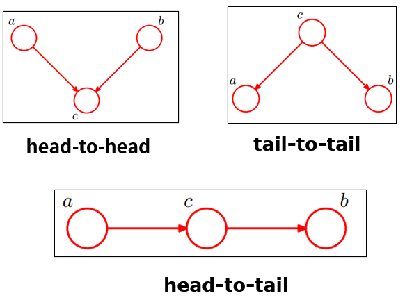

> https://zhuanlan.zhihu.com/p/542482587
> https://zhuanlan.zhihu.com/p/240747757
## 概念
- 贝叶斯（决策）理论：是统计决策模型的组成部分。 贝叶斯决策就是在不完全情报下，对部分未知的状态用主观概率估计，然后用贝叶斯公式对发生概率进行修正，最后再利用期望值和修正概率做出最优决策。过程就是先验-后验-分类（决策）。
- 贝叶斯定理：也称贝叶斯推理，是由A概率和条件概率 $\mathrm P(B|A)$ 计算后验概率 $\mathrm P(A|B)$ 的理论，贝叶斯定理包含贝叶斯公式。
- 贝叶斯统计：基于贝叶斯理论的系统的统计推断方法，贝叶斯学派的产出。
- 贝叶斯估计：利用贝叶斯定理结合新的证据和以往的经验，形成一种计算假设概率的方法，基于假设的先验概率、给定假设下观察到不同数据的概率以及观察到的数据本身。
## 贝叶斯定理
$$
P(A\mid B)=\frac{P(A)P(B\mid A)}{P(B)}
$$
- $P(A\mid B)$ 已知 𝐵 发生后， 𝐴 的条件概率，也称作 𝐴 的事后概率。
- $P(A)$ 是 𝐴 的先验概率（或边缘概率）。
- $P(B\mid A)$ 是已知𝐴 发生后，𝐵 的条件概率。也可称为 𝐵 的后验概率。某些文献又称其为在特定 𝐵 时， 𝐴 的似然性。
按这些术语，贝叶斯定理可表述为：
后验概率 = (似然性 \* 先验概率)/标准化常量
>注：贝叶斯估计和极大似然估计的区别所在，极大似然估计中要估计的参数是个一般变量，而贝叶斯估计中要估计的参数是个随机变量。

##  贝叶斯网络
贝叶斯网络(Bayesian network)，又称信念网络(Belief Network)，或有向无环图模型(directed acyclic graphical model)，是一种概率图模型，于1985年由Judea Pearl首先提出。它是一种模拟人类推理过程中因果关系的不确定性处理模型，其网络拓朴结构是一个有向无环图(DAG)。
有向无环图中的节点表示随机变量，$\{X_{1},X_{2},...,X_{n}\}$，它们可以是可观察到的变量，或隐变量、未知参数等。认为有因果关系（或非条件独立）的变量或命题则用箭头来连接。若两个节点间以一个单箭头连接在一起，表示其中一个节点是“因(parents)”，另一个是“果(children)”，两节点会产生一个条件概率值。**总而言之，连接两个节点的箭头代表此两个随机变量是具有因果关系，或非条件独立。**
令 $G = (L,E)$ 表示一个有向无环图（DAG），其中 $L$ 代表图形中所有的节点的集合，而 $E$ 代表有向连接线段的集合，且令 $X = (X_i),i ∈ L$为其有向无环图中的某一节点 $i$ 所代表的随机变量，若节点 X 的联合概率可以表示成：
$$
p(x)=\prod_{i\in I}p\big(x_i\big|x_{\mathrm{pa}(i)}\big)
$$
则称 $X$ 为相对于一有向无环图 $G$ 的贝叶斯网络，其中 $𝑝𝑎(𝑖)$ 表示节点 $i$ 之“因”。而对任意的随机变量，其联合分布可由各自的局部条件概率分布相乘而得出：
$$
\mathrm P(X_1=x_1, \ldots, X_n=x_n) = \prod_{i=1}^n \mathrm P\big(X_i=x_i \mid X_{i+1}=x_{i+1}, \dots, X_n=x_n\big)
$$
因此，我们可以将一贝叶斯网络的联合概率分布写成：
$$
\mathrm P(X_1=x_1, \ldots, X_n=x_n) = \prod_{i=1}^n \mathrm P(X_i=x_i \mid X_j=x_j)
$$
**head-to-head（共同作用）**

