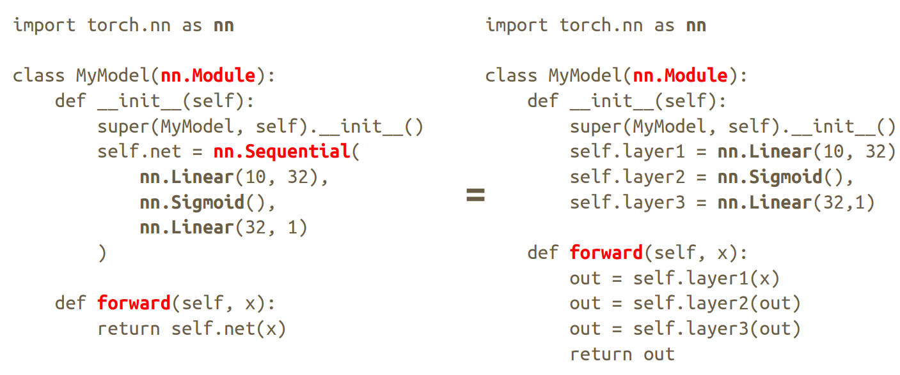

> https://pytorch.zhangxiann.com/ pytorch学习笔记
## 数据形式
`torch.FloatTensor()`
转换为一个浮点型张量
`.long()`
将张量中的每个元素转换为长整型，在处理分类任务时，标签（通常是类的索引）需要是整数类型。例如，损失函数如 `CrossEntropyLoss` 期望标签是 `LongTensor` 类型

## Dataset & Dataloader

```python
import numpy as np
import pandas as pd
import torch

# utils是工具包
from torch.utils.data import Dataset     # Dataset 是个抽象类，只能用于继承
from torch.utils.data import DataLoader  # DataLoader 需实例化，用于加载数据


class MyDataset(Dataset):  # 继承Dataset类
    def __init__(self, df):
        # 把数据和标签拿出来
        self.x_data = df[["feature_1", "feature_2"]].values
        self.y_data = df[["label"]].values

        # 数据集的长度
        self.length = len(self.y_data)

    def __getitem__(self, index):  # 参数index必写
        return self.x_data[index], self.y_data[index]

    def __len__(self):
        return self.length  # 只需返回数据集的长度即可


# 实例化
data = np.random.rand(128,3)
data = pd.DataFrame(data, columns=['feature_1', 'feature_2', 'label'])
# 产生数据如下：
#	feature_1	feature_2	label
#	0.408721	0.636639	0.494727
#	0.413075	0.459534	0.033539
#	0.019225	0.949354	0.498976
#	0.925239	0.313291	0.342724

my_dataset = MyDataset(data)
train_loader = DataLoader(
    dataset=my_dataset,  # 要传递的数据集
    batch_size=32,  # 一个小批量数据的大小是多少
    shuffle=True,  # 数据集顺序是否要打乱，一般是要的。测试数据集一般没必要
    num_workers=0,
)  # 需要几个进程来一次性读取这个小批量数据，默认 0
# 一般用 0 就够了，多了有时会出一些底层错误。
```

## 模型
```python
torch.nn.Linear(in_features, # 输入的神经元个数
           out_features, # 输出神经元个数
           bias=True # 是否包含偏置
           )
```

Linear其实就是对输入 $X_{n \times i}​$ 执行了一个线性变换，即：
$$
Y _{n\times o} = X _{n \times i} W_{i \times o} + b Y_{n \times o}
$$
左右等价：



## Save/Load Trained Models 

- Save 
  - `torch.save(model.state_dict(), path) `
- Load  
  - `ckpt = torch.load(path) `
  - `model.load_state_dict(ckpt)`

初始化张量

```python
data = [[1, 2], [3, 4]]
x_data = torch.tensor(data)
# from numpy array
np_array = np.array(data)
x_np = torch.from_numpy(np_array)
# retains the properties of x_data
x_ones = torch.ones_like(x_data) 
print(f"Ones Tensor: \n {x_ones} \n")
x_rand = torch.rand_like(x_data, dtype=torch.float) # overrides the datatype of x_data
print(f"Random Tensor: \n {x_rand} \n")


# with given shape
shape = (2, 3,)
rand_tensor = torch.rand(shape)
ones_tensor = torch.ones(shape)
zeros_tensor = torch.zeros(shape)
tensor = torch.eyes(shape)
A = torch.arange(20, dtype=torch.float32).reshape(5, 4)

# some attributes
tensor = torch.rand(3, 4)
print(f"Shape of tensor: {tensor.shape}")
print(f"Datatype of tensor: {tensor.dtype}")
print(f"Device tensor is stored on: {tensor.device}")
```

一些操作

```python
# numpy-like indexing and slicing
tensor = torch.ones(4, 4)
tensor[:,1] = 0
# tensor([[1., 0., 1., 1.],
#         [1., 0., 1., 1.],
#         [1., 0., 1., 1.],
#         [1., 0., 1., 1.]])

# Joining tensors 
t1 = torch.cat([tensor, tensor, tensor], dim=1)
r = torch.ones(1,2,2)
g = torch.ones(1,2,2) + 1
b = torch.ones(1,2,2) + 2

# 拼合 RGB 图像
r = torch.ones(1,2,2)
g = torch.ones(1,2,2) + 1
b = torch.ones(1,2,2) + 2

img = torch.cat(
    (r,g,b)
    ,dim=0
)
> torch.Size([3, 2, 2])
# 最外面一层即为 0 维，括号里面依次增加

# Multiplying tensors
print(f"tensor.mul(tensor) \n {tensor.mul(tensor)} \n")
# Alternative syntax:
print(f"tensor * tensor \n {tensor * tensor}")

# matrix multiplication
print(f"tensor.matmul(tensor.T) \n {tensor.matmul(tensor.T)} \n")
# Alternative syntax:
print(f"tensor @ tensor.T \n {tensor @ tensor.T}")

# 张量元素数 
t.numel()

# 挤压张量会删除长度为 1 的尺寸或轴
# 取消挤压张量会添加一个长度为 1 的维度
print(t.reshape([1,12]))
print(t.reshape([1,12]).shape)
# tensor([[1., 1., 1., 1., 2., 2., 2., 2., 3., 3., 3., 3.]])
# torch.Size([1, 12])

print(t.reshape([1,12]).squeeze())
print(t.reshape([1,12]).squeeze().shape)
# tensor([1., 1., 1., 1., 2., 2., 2., 2., 3., 3., 3., 3.])
# torch.Size([12])

print(t.reshape([1,12]).squeeze().unsqueeze(dim=0))
print(t.reshape([1,12]).squeeze().unsqueeze(dim=0).shape)
# tensor([[1., 1., 1., 1., 2., 2., 2., 2., 3., 3., 3., 3.]])
# torch.Size([1, 12])

# 展平张量，调整张量形状，使其形状等于张量中包含的元素数
# 对于(3,1,4,4)
t.reshape(1,-1)[0]
t.flatten()
t.view(t.numel())
t.flatten(start_dim=1).shape
# torch.Size([3, 16])
t.flatten(start_dim=1)
tensor(
[
    [1, 1, 1, 1, 1, 1, 1, 1, 1, 1, 1, 1, 1, 1, 1, 1],
    [2, 2, 2, 2, 2, 2, 2, 2, 2, 2, 2, 2, 2, 2, 2, 2],
    [3, 3, 3, 3, 3, 3, 3, 3, 3, 3, 3, 3, 3, 3, 3, 3]
]
)

# 创建一个形状为[2, 3]的张量
t = torch.tensor([[1, 2, 3], [4, 5, 6]], dtype=torch.float32)
# 在维度0上计算元素积
p0 = t.prod(dim=0)
# tensor([ 4., 10., 18.])

# stack
t = torch.stack((t1, t2, t3))
t.shape
> torch.Size([3, 4, 4])


```

**torch.gather**

`torch.gather(input, dim, index, *, sparse_grad=False, out=None) → Tensor`

input 和 index 必须维度相同，本质上是一种索引取值。

- **输入index的shape等于输出value的shape**
- **输入index的索引值仅替换该index中对应dim的index值**
- **最终输出为替换index后在原tensor中的值**


```python
out[i][j][k] = input[index[i][j][k]][j][k]  # if dim == 0
out[i][j][k] = input[i][index[i][j][k]][k]  # if dim == 1
out[i][j][k] = input[i][j][index[i][j][k]]  # if dim == 2
```

```python
>>>t = torch.tensor([[1, 2], [3, 4]])
>>>torch.gather(t, 1, torch.tensor([[0, 0], [1, 0]]))
tensor([[ 1,  1],
        [ 4,  3]])
```


numpy 和 pytorch

```python
t = torch.ones(5)
print(f"t: {t}")
n = t.numpy()
print(f"n: {n}")
n = np.ones(5)
t = torch.from_numpy(n)
```

| Share Data         | Copy Data      |
| ------------------ | -------------- |
| torch.as_tensor()  | torch.tensor() |
| torch.from_numpy() | torch.Tensor() |

- `torch.tensor()`
- `torch.as_tensor()`是最佳选择

广播机制

`np.broadcast_to(t2.numpy(), t1.shape)`可以帮助我们查看广播后的结果

ArgMax 

