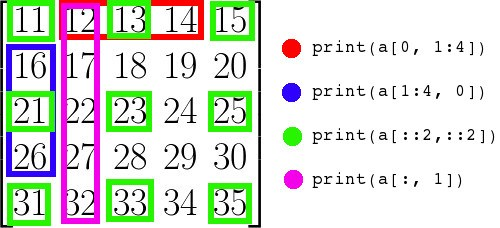

# Numpy
> https://www.numpy.org.cn/
>
> https://www.labri.fr/perso/nrougier/from-python-to-numpy/

NumPy 词源于-- `Numerical` 和 `Python`
## 数组

```python
import numpy as np 
my_array = np.array([1, 2, 3, 4, 5])
c = np.arange(5) # >>>[0 1 2 3 4]
print my_array
print my_array.shape # 打印数组的形状：(5, ),my_array 是一个包含5个元素的数
# 组。
my_random_array = np.random.random((5)) # array([0.33138638, 0.71825239, 0.03292306, 0.85634021, 0.76558753])
a.astype(int) # 转换数据类型
my_random_array = np.random.rand(2,4)
matrix_product = a.dot(b) # 矩阵乘法
```


| np                | 类型    |
| ----------------- | ----- |
| np.int8/16/32/64  | 整形    |
| np.uint8/16/32/64 | 无符号整型 |
| np.float32/64     | 浮点数   |
类型转换：
`ndarray.astype`
创建：

```PYTHON
array = np.arange(20).reshape(4,5)
array = np.arange(27).reshape(3,3,3)
np.arange(10, 35, 5) # array([10, 15, 20, 25, 30])
np.full((2,2), 3) # array([[3, 3],[3, 3]])
np.eye(3,3) # eye函数可以创建一个n * n矩阵，对角线为1s，其他为0。
```


### 切片



### 属性

```PYTHON
# Array properties
a = np.array([[11, 12, 13, 14, 15],
              [16, 17, 18, 19, 20],
              [21, 22, 23, 24, 25],
              [26, 27, 28 ,29, 30],
              [31, 32, 33, 34, 35]])
print(type(a)) # >>><class 'numpy.ndarray'>
print(a.dtype) # >>>int64
print(a.size) # >>>25
print(a.shape) # >>>(5, 5)
print(a.itemsize) # >>>8
print(a.ndim) # >>>2
print(a.nbytes) # >>>200
```
`itemsize`属性是每个项占用的字节数。这个数组的数据类型是int 64。`ndim` 属性是数组的维数。
### 数组计算
```PYTHON
print(a.sum()) # >>>45
print(a.min()) # >>>0
print(a.max()) # >>>9
print(a.cumsum()) # >>>[ 0  1  3  6 10 15 21 28 36 45]
```
### 索引

```PYTHON
# Fancy indexing
a = np.arange(0, 100, 10)
indices = [1, 5, -1]
b = a[indices]
print(a) # >>>[ 0 10 20 30 40 50 60 70 80 90]
print(b) # >>>[10 50 90]

```

```PYTHON
a[[1,3], [2,3]] = 0
# >>> (1, 2) (3, 3) 置0
# array(
# [[ 0,  1,  2,  3,  4],
# [ 5,  6,  0,  8,  9],
# [10, 11, 12, 13, 14],
# [15, 16, 17,  0, 19],
# [20, 21, 22, 23, 24]])
```

#### 布尔屏蔽

```python
# Boolean masking
import matplotlib.pyplot as plt

a = np.linspace(0, 2 * np.pi, 50)
b = np.sin(a)
plt.plot(a,b)
mask = b >= 0
plt.plot(a[mask], b[mask], 'bo')
mask = (b >= 0) & (a <= np.pi / 2)
plt.plot(a[mask], b[mask], 'go')
plt.show()
```

#### 向量拼接
```python
a = np.array([[1, 2], [3, 4]]) 
b = np.array([[5, 6]]) 
c = np.concatenate((a, b), axis=0)
```
#### where 索引

```PYTHON
# Where
a = np.arange(0, 100, 10)
b = np.where(a < 50) 
c = np.where(a >= 50)[0]
print(b) # >>>(array([0, 1, 2, 3, 4], dtype=int64),)
print(c) # >>>[5 6 7 8 9]
```


## 图像处理

```PYTHON
import numpy as np
 
arr = np.array([[1, 2, 3],
               [4, 5, 6]])
np.save('weight.npy', arr)
 
loadData = np.load('weight.npy')
 
print("----type----")
print(type(loadData))
print("----shape----")
print(loadData.shape）
```

````python
import numpy as np
test=np.load('./bvlc_alexnet.npy',encoding = "latin1")  #加载文件
doc = open('1.txt', 'a')  #打开一个存储文件，并依次写入
print(test, file=doc)  #将打印内容写入文件中
````

```python
import numpy as np
import matplotlib.pyplot as plt
a=plt.imread("1.jpg")  # 将图片信息读取成数组信息
# 返回的信息是一个三维的数组
# 最高维度：一共有332个元素
# 次高维：一共有500个元素
# 最低维：每个像素点的颜色信r g b
a #已知数组信息，使用imshow读取成图片
plt.imshow(a)
# 将数组信息存储成图片
plt.imsave("./numpy.jpg",a)
```

## 统计相关
`numpy.percentile(a, q, axis)`
百分位数是统计中使用的度量，表示小于这个值的观察值占总数q的百分比（至少有p%的数据项小于或等于这个值，且至少有(100-p)%的数据项大于或等于这个值）。函数 `numpy.percentile()` 接受以下参数：
- `a` 输入数组
-  `q` 要计算的百分位数，在 0 ~ 100 之间
- `axis` 沿着它计算百分位数的轴，二维取值0，1


`numpy.argmin (a, axis=None, out=None)`
>a : Input array.
>axis : 默认将输入数组展平。否则，按照axis方向
>out : 可选

```python
>>> a = np.arange(6).reshape(2,3)
>>> a
array([[0, 1, 2],
       [3, 4, 5]])
>>> np.argmin(a) # flat 数组后寻找最小值索引
0
>>> np.argmin(a, axis=0) # 0-3 1-4 2-5
array([0, 0, 0])
>>> np.argmin(a, axis=1) # 0-1-2 3-4-5
array([0, 0])
```

`np.unravel_index()`
```python
A = np.random.randint(1,100,size=(2,3,5))
# 声明一个size=(3,3,3,2)的数组
print(A)
array([[[98, 29, 32, 73, 90],
        [36, 52, 24,  2, 37],
        [66, 80, 23, 29, 98]],

       [[17, 32, 58, 99, 74],
        [53,  3, 20, 48, 28],
        [53,  7, 74, 34, 68]]])

ind_max = np.argmax(A)
print(ind_max)  
18
# 此时得到的索引是将A数组flattern(展成一维数组)后的索引，如何得到对应的原数组的索引呢？

ind_max_src = np.unravel_index(ind_max, A.shape)
print(ind_max_src)
(1, 0, 3)
```

`np.tile()`
用于复制拓展数组
单维度，只拓展 -1 维
```python
>>> from numpy import *
>>> tile([1,2], 1) # (2, 0) -> (2, 0)
array([1, 2])
>>> tile([1,2], 2) # (2,0) -> (4, 0)
array([1, 2, 1, 2])
```
多维度，拓展 -2 和-1 维
```python
>>> tile([1,2],(1,1)) # (2, 0) -> (1, 2)
array([[1, 2]])
>>> tile([1,2],(2,2)) # (2, 0) -> (2, 4)
array([[1, 2, 1, 2],
       [1, 2, 1, 2]])
>>> np.tile([[1,1]], (3,2))
array([[1, 1, 1, 1],
       [1, 1, 1, 1],
       [1, 1, 1, 1]])
```
