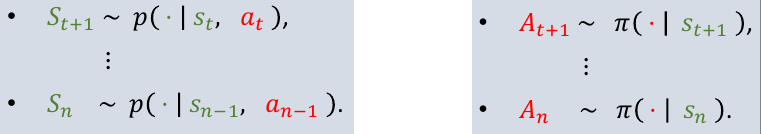
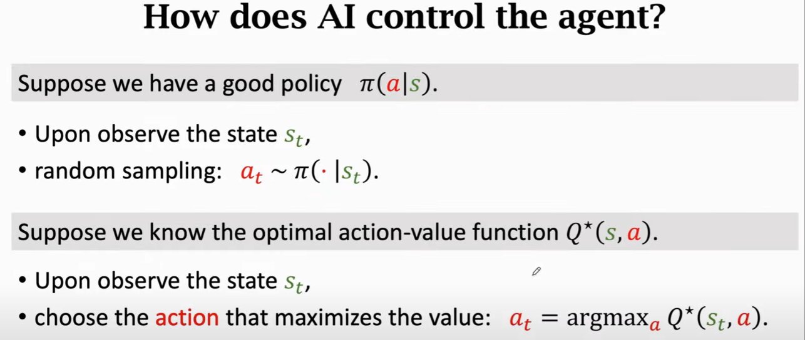
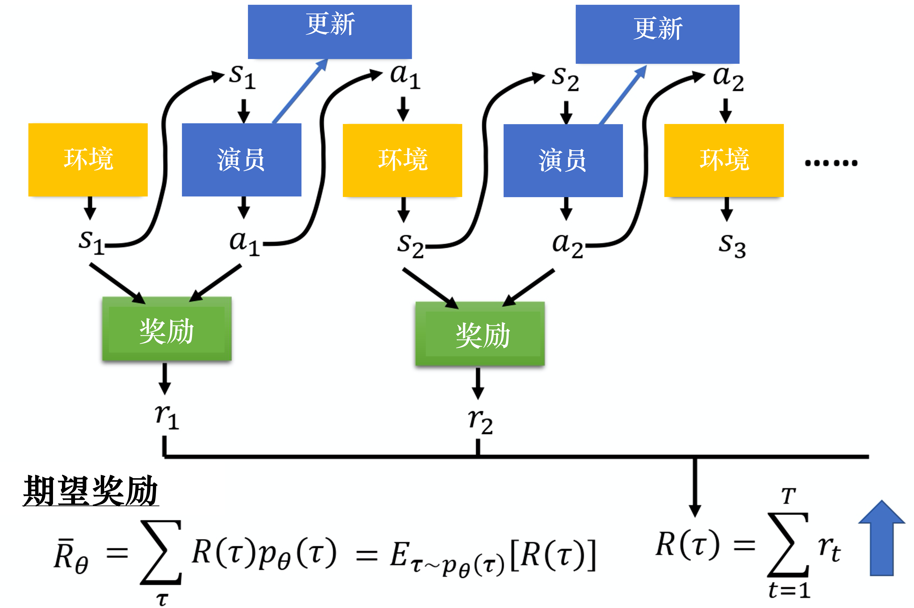

# Reinforcement Learning

> 强化学习的目标是研究从马尔科夫决策过程出发，放松各种限制。
>
> $s_t$ 可能是数量庞大或者无限的，或者是连续而非离散的，或者是只能部分被观察或者不能被观察。在此情况下，强化学习的目标不是寻找最优解，而是寻找次优解。

## **Terminology:**

- Agent
- policy function: $\pi(s,a) -> [0,1]$
  - $\pi(a|s)=p(A=a|S=s)$
  - Output the vector including probabilities for all the actions.
- reward: $R,r$
- state transition: random  randomness from environment
  - $p(s'|s,a)=P(S'=s'|,A=a)$
- Randomness
  - action
  - state transition 
- Return
  - Cumulative future reward
  - $U_t=R_t+R_{t+1}+R_{t+2}+R_{t+3}+\cdots+R_n.$
- Discounted return (at time $t$)
  - Future reward is less valuable than present reward.
  - $R_{t+1}$ should be given less weight than $R_t$.
  - $U_t=R_t+\gamma\cdot R_{t+1}+\gamma^2\cdot R_{t+2}+\gamma^3\cdot R_{t+3}+\cdots$
- Episode
  - An episode is usually assumed to be a finite trajectory. 

- Value Function for MRP

$$
\begin{aligned}
V(s)& =\mathbb{E}[U_t|S_t=s]  \\
&=\mathbb{E}[R_t+\gamma R_{t+1}+\gamma^2R_{t+2}+\ldots|S_t=s] \\
&=\mathbb{E}[R_t+\gamma(R_{t+1}+\gamma R_{t+2}+\ldots)|S_t=s] \\
&=\mathbb{E}[R_t+\gamma G_{t+1}|S_t=s] \\
&=\mathbb{E}[R_t+\gamma V(S_{t+1})|S_t=s]\\
&=r(s)+\gamma\sum_{s'\in S}p(s'|s)V(s')
\end{aligned}
$$

​		The above formula is Bellman equation.

- 	  Action-Value Function
  -  $Q_\pi(s_t,a_t)=\mathbb{E}_{S_{t+1},A_{t+1},\cdots,S_n,A_n}\Big[U_t\Big|S_t=s_t,A_t=a_t\Big]$
  -  Regard $S_{t+1},...S_n$ and $A_{t+1},...,A_n$ as random variables. 
  -  $Q_\pi(s_t,a_t)$ is dependent of $S_{t+1},...S_n$ and $A_{t+1},...,A_n$.
  -  
  -  Evaluates how good it is for an agent to pick action $a$ while being in state $s$.
  -  Relawtion with State-Value Function.
     -  $$Q_\pi(s,a)=r(s,a)+\gamma\sum_{s^{\prime}\in S}P(s^{\prime}|s,a)V^\pi(s^{\prime})$$
- 	  Optimal action-value function

  - $Q^*(s_t,{a_t})=\underset{\pi}{\max}Q_\pi(s_t,a_t).$
  - Whatever policy function $π$ is used, the result of taking $a_t$ at state $s_t$ cannot be better than $Q^*(s_t,{a_t})$.
  - Exclude the influenced of strategy $\pi$.
  - ~~Input $s_t$, output judgment for $a_t$ (vector), we can judge if $a_t$ is good at $s_t$ by $Q^*(s_t,a_t)$.~~
- 	  State-Value Function

  - 	  $V_\pi(s)=\mathbb{E}_\pi\big[U_t\mid S_t=s\big]$
  - 	  Consider $A\sim\pi(\cdot|s_{t})$.
  - 	  Relation with Action-Value Function.

       - 	  $V_{\pi}(s_{t})=\mathbb{E}_{A}\left[Q_{\pi}(s_{t},A)\right]=\underset{a}{\sum}\pi(a|s_{t})\cdot Q_{\pi}(s_{t},a)$
       - 	  $V_{\pi}(s_{t})=\mathbb{E}_{A}\left[Q_{\pi}(s_{t},A)\right]=\int\pi(a|s_{t})\cdot Q_{\pi}(s_{t},a)\text{d}a$

  - 	  Evaluates how good the situation is in state $s$.

  - 	  $\mathbb{E}_S[V_\pi(S)]$ evaluates how good the policy $\pi$ is.
- 	  Markov decision process (MDP)

  - [Link](https://hrl.boyuai.com/chapter/1/%E9%A9%AC%E5%B0%94%E5%8F%AF%E5%A4%AB%E5%86%B3%E7%AD%96%E8%BF%87%E7%A8%8B)

- Deterministic and stochastic

---

> So we have two choices, looking for good policy or optimal action-value function.

---

一局游戏：episode  reward $R=\sum_{t=1}^Tr_t$

How to do the optimization here is the main challenge in RL.
$$
\begin{aligned}
p_{\theta}(\tau)& =p\left(s_1\right)p_\theta\left(a_1|s_1\right)p\left(s_2|(s_1,a_1)\right)p_\theta\left(a_2|s_2\right)p\left(s_3|(s_2,a_2)\right)\cdots   \\
&=p\left(s_1\right)\prod_{t=1}^Tp_\theta\left(a_t|s_t\right)p\left(s_{t+1}|(s_t,a_t)\right)
\end{aligned}
$$
$R(τ)$并不只是一个标量（scalar），它是一个随机变量，因为actor在给定同样的状态下会采取什么样的动作是有随机性的  

$\bar{R}_\theta=\sum_\tau R(\tau)p_\theta(\tau)$

计算期望奖励 $\bar{R}_{\theta}$ 的梯度时，只有后者 $p_\theta$ 与策略有关。
$$
\begin{aligned}
        \nabla \bar{R}_{\theta}&=\sum_{\tau} R(\tau) \nabla p_{\theta}(\tau)\\&=\sum_{\tau} R(\tau) p_{\theta}(\tau) \frac{\nabla p_{\theta}(\tau)}{p_{\theta}(\tau)} \\&=
        \sum_{\tau} R(\tau) p_{\theta}(\tau) \nabla \log p_{\theta}(\tau) \\
        &=\mathbb{E}_{\tau \sim p_{\theta}(\tau)}\left[R(\tau) \nabla \log p_{\theta}(\tau)\right]
        \end{aligned} \tag{4.2}
$$
实际上期望值 $\mathbb{E}_{\tau \sim p_{\theta}(\tau)}\left[R(\tau) \nabla \log p_{\theta}(\tau)\right]$ 无法计算，所以我们用采样的方式采样 $N$ 个 $\tau$并计算每一个的值，把每一个的值加起来，就可以得到梯度，即
$$
\begin{aligned}
        \mathbb{E}_{\tau \sim p_{\theta}(\tau)}\left[R(\tau) \nabla \log p_{\theta}(\tau)\right] &\approx \frac{1}{N} \sum_{n=1}^{N} R\left(\tau^{n}\right) \nabla \log p_{\theta}\left(\tau^{n}\right) \\
        &=\frac{1}{N} \sum_{n=1}^{N} \sum_{t=1}^{T_{n}} R\left(\tau^{n}\right) \nabla \log p_{\theta}\left(a_{t}^{n} \mid s_{t}^{n}\right)
        \end{aligned}
$$
$\nabla \log p_{\theta}(\tau)$ 的具体计算过程可写为
$$
    \begin{aligned}
        \nabla \log p_{\theta}(\tau) &= \nabla \left(\log p(s_1)+\sum_{t=1}^{T}\log p_{\theta}(a_t|s_t)+ \sum_{t=1}^{T}\log p(s_{t+1}|s_t,a_t) \right) \\
        &= \nabla \log p(s_1)+ \nabla \sum_{t=1}^{T}\log p_{\theta}(a_t|s_t)+  \nabla \sum_{t=1}^{T}\log p(s_{t+1}|s_t,a_t) \\
        &=\nabla \sum_{t=1}^{T}\log p_{\theta}(a_t|s_t)\\
        &=\sum_{t=1}^{T} \nabla\log p_{\theta}(a_t|s_t)
        \end{aligned}
$$
注意， $p(s_1)$ 和 $p(s_{t+1}|s_t,a_t)$ 来自环境，$p_\theta(a_t|s_t)$ 来自智能体。$p(s_1)$ 和 $p(s_{t+1}|s_t,a_t)$ 由环境决定，与 $\theta$ 无关，因此 $\nabla \log p(s_1)=0$ ，$\nabla \sum_{t=1}^{T}\log p(s_{t+1}|s_t,a_t)=0$。

$$
\begin{aligned}
        \nabla \bar{R}_{\theta}&=\sum_{\tau} R(\tau) \nabla p_{\theta}(\tau)\\&=\sum_{\tau} R(\tau) p_{\theta}(\tau) \frac{\nabla p_{\theta}(\tau)}{p_{\theta}(\tau)} \\&=
        \sum_{\tau} R(\tau) p_{\theta}(\tau) \nabla \log p_{\theta}(\tau) \\
        &=\mathbb{E}_{\tau \sim p_{\theta}(\tau)}\left[R(\tau) \nabla \log p_{\theta}(\tau)\right]\\
        &\approx \frac{1}{N} \sum_{n=1}^{N} R\left(\tau^{n}\right) \nabla \log p_{\theta}\left(\tau^{n}\right) \\
        &=\frac{1}{N} \sum_{n=1}^{N} \sum_{t=1}^{T_{n}} R\left(\tau^{n}\right) \nabla \log p_{\theta}\left(a_{t}^{n} \mid s_{t}^{n}\right)
        \end{aligned} \tag{4.3}
$$

在我们采样到的数据里面，采样到在某一个状态 $s_t$ 要执行某一个动作 $a_t$，$(s_t,a_t)$ 是在整个轨迹 $\tau$ 的里面的某一个状态和动作的对。假设我们在 $s_t$ 执行 $a_t$，最后发现 $\tau$ 的奖励是正的，我们就要增加在 $s_t$ 执行 $a_t$ 的概率。反之，如果在 $s_t$ 执行 $a_t$ 会导致 $\tau$ 的奖励变成负的， 我们就要减少在 $s_t$ 执行 $a_t$ 的概率。这怎么实现呢？我们用梯度上升来更新参数，原来有一个参数 $\theta$ ，把 $\theta$  加上梯度$\nabla \bar{R}_{\theta}$，当然我们要有一个学习率 $\eta$，学习率也是要调整的，可用 Adam、RMSProp 等方法来调整学习率，即
$$
\theta \leftarrow \theta+\eta \nabla \bar{R}_{\theta}
$$

Critic

- Sparse Reward  If $r_t$ = 0 in most cases
  - Reward Shaping 定义一些新的小奖励

- No Reward: Learning from Demonstration
  - Inverse Reinforcement Learning
    - Using the reward function to find the optimal actor
    - 
