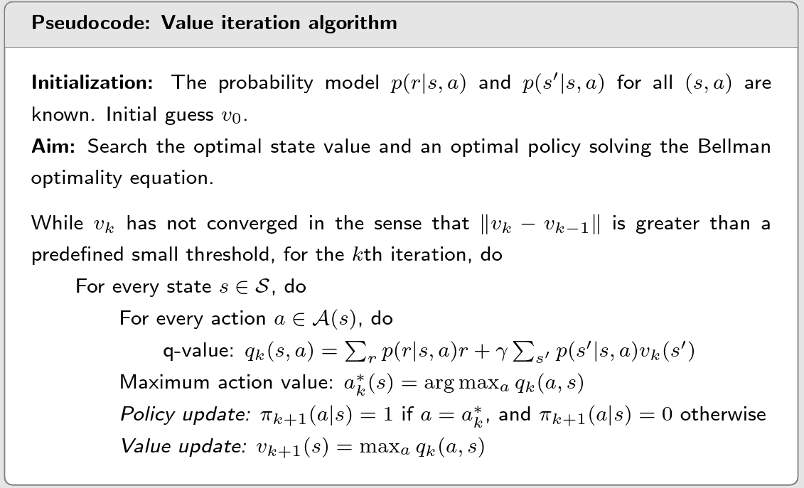

## **Bellman equation**
$$
\begin{aligned}
v_\pi(s)& \begin{aligned}&=\mathbb{E}[R_{t+1}|S_t=s]+\gamma\mathbb{E}[G_{t+1}|S_t=s],\end{aligned}  \\
&\underbrace{=\sum_a\pi(a|s)\sum_rp(r|s,a)r}_{\text{mean of immediate rewards}} +\underbrace{\gamma\sum_a\pi(a|s)\sum_{s^{\prime}}p(s'|s,a)v_\pi(s')}_\text{mean of future rewards}\\
\\
&=\sum_a\pi(a|s)\left[\sum_rp(r|s,a)r+\gamma\sum_{s^{\prime}}p(s^{\prime}|s,a)v_\pi(s^{\prime})\right],\quad\forall s\in\mathcal{S}.
\end{aligned}
$$

> The above equation is called the Bellman equation, which characterizes the relationship among the state-value functions of different states.

- $v_π (s)$ and $v_π (s')$ are state values to be calculated.

- $π(a|s)$ is a given policy. Solving the equation is called policy evaluation.

- $p(r|s, a)$ and $p(s'|s, a)$ represent the dynamic model. 

  

**Bellman Expectation Equation**

- $v_{\pi}(s)=\mathbb{E}_{\pi}[R_{t+1}+\gamma v_{\pi}(S_{t+1})|S_{t}=s]$
  - $v_{\pi}(s)=\sum_{a\in\mathcal{A}}\pi(a|s)\left(\mathcal{R}_{s}^{a}+\gamma\sum_{s'\in\mathcal{S}}\mathcal{P}_{ss'}^{a}v_{\pi}(s')\right)=\sum_{a\in\mathcal{A}}\pi(a|s)q_\pi(s,a)$

- $q_\pi(s,a)=\mathbb{E}_\pi[R_{t+1}+\gamma q_\pi(S_{t+1},A_{t+1})|S_t=s,A_t=a]$
  - $q_{\pi}(s,a)=\mathcal{R}_{s}^{a}+\gamma\sum_{s^{\prime}\in\mathcal{S}}\mathcal{P}_{\mathrm{~ss'}}^{a}\sum_{a^{\prime}\in\mathcal{A}}\pi(a^{\prime}|s^{\prime})q_{\pi}(s^{\prime},a^{\prime})=\mathcal{R}_s^a+\gamma\sum_{s^{\prime}\in\mathcal{S}}\mathcal{P}_{\mathrm{ss}^{\prime}}^av_\pi(s^{\prime})$

**Bellman equation: Matrix-vector form**
$$
\left.\left[\begin{array}{c}v_\pi(s_1)\\v_\pi(s_2)\\v_\pi(s_3)\\v_\pi(s_3)\\v_\pi(s_4)\end{array}\right.\right]=\left[\begin{array}{c}r_\pi(s_1)\\r_\pi(s_2)\\r_\pi(s_3)\\r_\pi(s_4)\end{array}\right]+\gamma\left[\begin{array}{cccc}p_\pi(s_1|s_1)&p_\pi(s_2|s_1)&p_\pi(s_3|s_1)&p_\pi(s_4|s_1)\\p_\pi(s_1|s_2)&p_\pi(s_2|s_2)&p_\pi(s_3|s_2)&p_\pi(s_4|s_2)\\p_\pi(s_1|s_3)&p_\pi(s_2|s_3)&p_\pi(s_3|s_3)&p_\pi(s_4|s_3)\\p_\pi(s_1|s_4)&p_\pi(s_2|s_4)&p_\pi(s_3|s_4)&p_\pi(s_4|s_4)\end{array}\right]\left[\begin{array}{c}v_\pi(s_1)\\v_\pi(s_2)\\v_\pi(s_3)\\v_\pi(s_4)\end{array}\right]
$$
$v_{\pi}=r_\pi+\gamma P_\pi v_\pi$

**Why to solve state values and how?**

> Given a policy, finding out the corresponding state values is called **policy evaluation**. It is a fundamental problem in RL.

- closed-form solution: $v_\pi=(I-\gamma P_\pi)^{-1}r_\pi $
- iterative solution: 
  - $v_{k+1}=(I-\gamma P_\pi)^{-1}v_k $
  - $v_k \to v_\pi=(I-\gamma P_\pi)^{-1}r_\pi,\quad k\to\infty $

**Action value**

Definition: $q_\pi(s,a)=\mathbb{E}[G_t|S_t=s,A_t=a]$

Considering $v_\pi(s)=\underset{a}{\sum}\pi(a|s)q_\pi(s,a)$, we have $q_\pi(s,a)=\sum_{r}p(r|s,a)r+\gamma\sum_{s^{\prime}}p(s^{\prime}|s,a)v_\pi(s^{\prime})$

## Bellman Optimality Equation

>  A policy $π^∗$ is optimal if $v_{π^∗}(s)$ ≥ $v_π (s)$ for all $s$ and for any other policy $π$.

${v=\underset{\pi}{\max}(r_\pi+\gamma P_\pi v)}$

### Value iteration algorithm

Summary:

### Policy iteration algorithm

### Truncated policy iteration algorithm

---

Value iteration algorithm and Policy iteration algorithm are both Dynamic Programming algorithm and model based.

> The term dynamic programming (DP) refers to a collection of algorithms that can be used to compute optimal policies given a perfect model of the environment as a Markov decision process (MDP).
>
> Classical DP algorithms are of limited utility in reinforcement learning both because of their assumption of a perfect model and because of their great computational expense, but they are still important theoretically. DP provides an essential foundation for the understanding of the methods presented in the rest of this book. In fact, all of these methods can be viewed as attempts to achieve much the same effect as DP, only with less computation and without assuming a perfect model of the environment.

 
