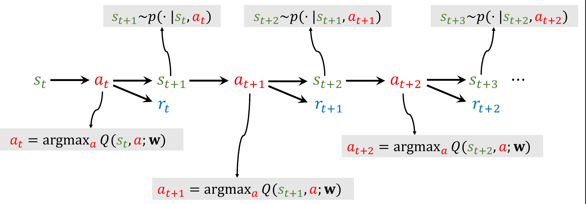

# Deep Q-Network (DQN)

To maximize the total reward, the best action for each step is  $a^*=\underset{a}{\operatorname*{argmax}}Q^*(s,a)$, and DQN is used to find optimal action-value function. 

> We need approximate $Q^*(s_t,{a_t})$ using neural network $Q(s,a;\mathbf{w})$.

## Temporal Difference (TD) Learning

