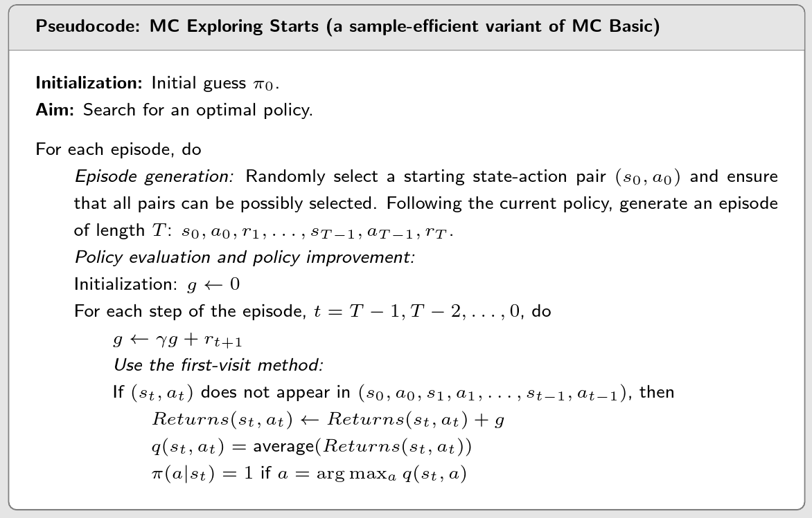

## The simplest MC-based RL algorithm

- MC Basic is a variant of the policy iteration algorithm.
- Policy iteration algorithm: v -> q while MC estimate action values directly.

-  When model is unavailable, we can use data(experience).

## Use data more efficiently

- Exploring starts means we need to generate sufficiently many episodes starting from every state-action pair.
- In theory, only if every action value for every state is well explored, can we select the optimal actions correctly.

## MC without exploring starts

> With a soft policy, a few episodes that are sufficiently long can visit every state-action pair for sufficiently many times. Then, we do not need to have a large number of episodes starting from every state-action pair. Hence, the requirement of exploring starts can thus be removed.

$$
\pi(a|s)=\left\{\begin{array}{ll}1-\frac\varepsilon{|\mathcal{A}(s)|}(|\mathcal{A}(s)|-1),&\text{for the greedy action,}\\\\\frac\varepsilon{|\mathcal{A}(s)|},&\text{for the other }|\mathcal{A}(s)|-1\text{ actions.}\end{array}\right.
$$

- Why use ε-greedy? Balance between exploitation(充分利用) and exploration
- When ε = 0, it becomes greedy! Less exploration but more
exploitation!
- When ε = 1, it becomes a uniform distribution. More exploration
but less exploitation.

- The advantage of ε-greedy policies is that they have stronger exploration ability so that the exploring starts condition is not required.
- The disadvantage is that ε-greedy polices are not optimal in general (we can only show that there always exist greedy policies that are optimal).
