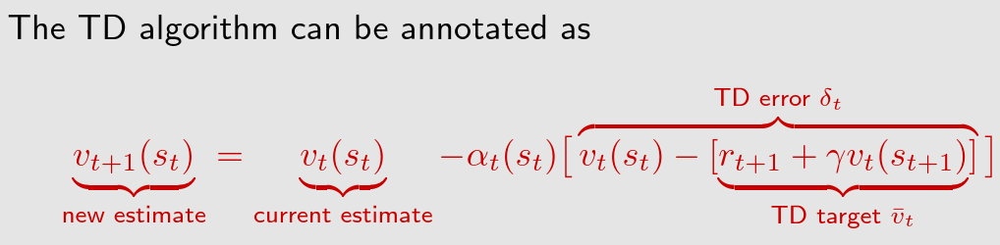
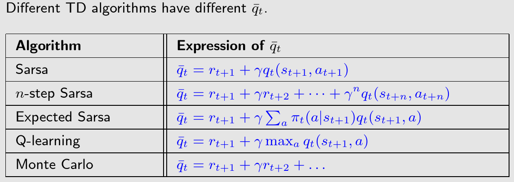
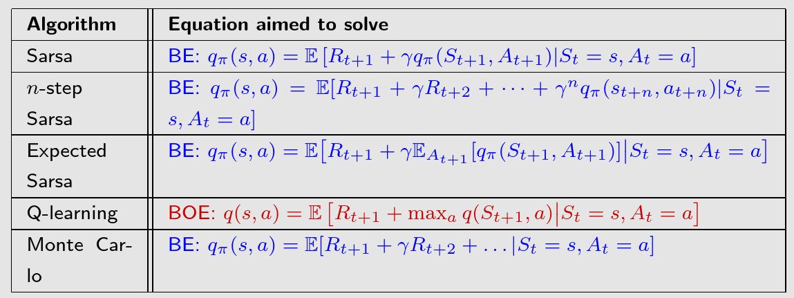
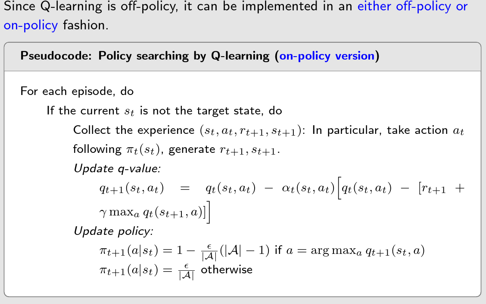
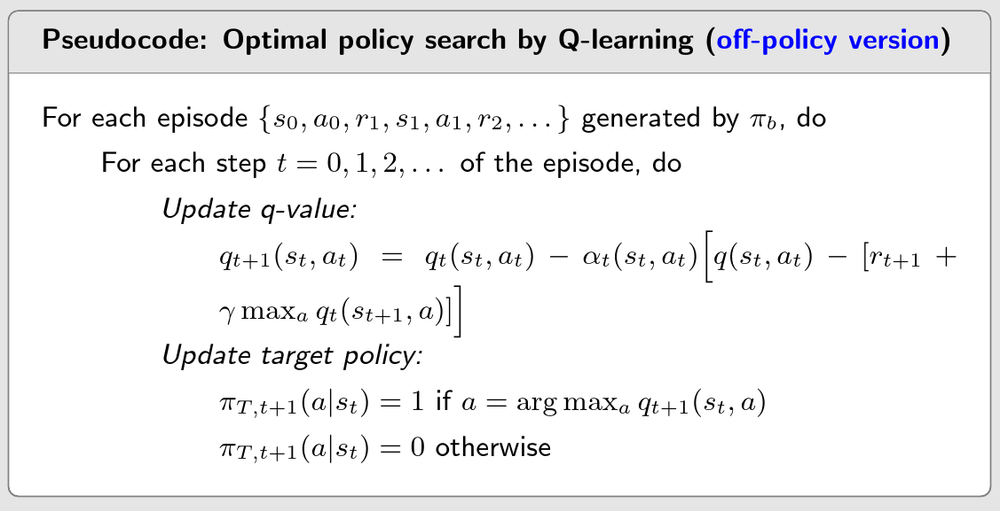

Using RM to get $\bar{q}_t$ .

All the algorithms can be viewed as stochastic approximation algorithms solving the Bellman equation or Bellman optimality equation:

## Q-learning

 First, Q-learning aims to solve the Bellman optimality equation.

## Off-policy vs on-policy

**There exist two policies in a TD learning task:**

- The behavior policy is used to generate experience samples.
- The target policy is constantly updated toward an optimal policy.

**On-policy vs off-policy:**

- When the behavior policy is the same as the target policy, such kind of learning is called on-policy.
- When they are different, the learning is called off-policy.

**Advantages of off-policy learning:**

- It can search for optimal policies based on the experience samples generated by any other policies.
- As an important special case, the behavior policy can be selected to be exploratory. For example, if we would like to estimate the action values of all state-action pairs, we can use a exploratory policy to generate episodes visiting every state-action pair sufficiently many times.

**How to judge if a TD algorithm is on-policy or off-policy?**

- First, check what the algorithm does mathematically.
- Second, check what things are required to implement the algorithm.

$\text{Softmax}(x_{i}) = \frac{\exp(x_i)}{\sum_j \exp(x_j)}$