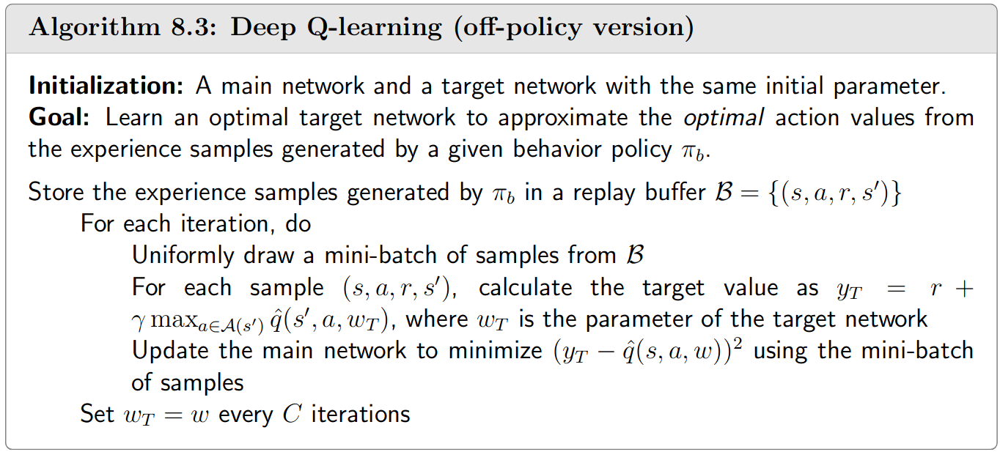
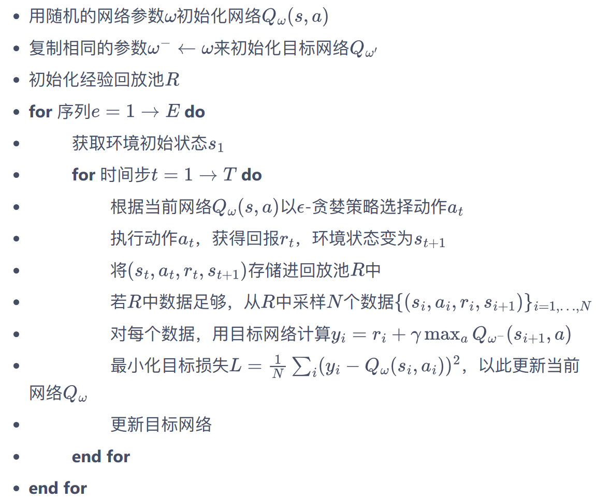

## DQN

 



## 经验回放

- 打破序列的相关性
- 重复利用收集到的经验,而不是用一次就丢弃


````
MNIH V, KAVUKCUOGLU K, SILVER D, 等, 2013. Playing Atari with Deep Reinforcement Learning[M/OL]. arXiv[2024-03-12]. http://arxiv.org/abs/1312.5602. DOI:10.48550/arXiv.1312.5602.
MNIH V, KAVUKCUOGLU K, SILVER D, 等, 2015. Human-level control through deep reinforcement learning[J/OL]. Nature, 518(7540): 529-533. DOI:10.1038/nature14236.
````

