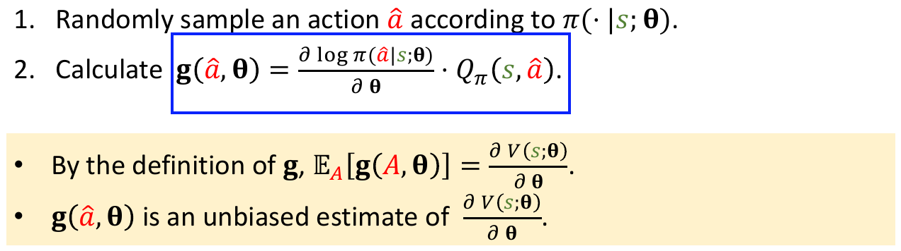
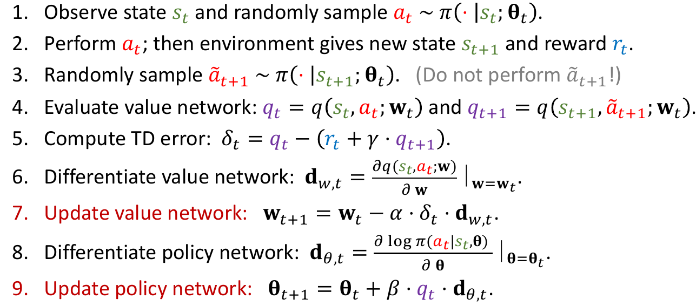

# Policy-Based RL

**Policy network:** 

Use a neural net to approximate $π(a|s)$.

- Use policy network $π(a|s;θ)$ to approximate $π (a|s)$ .

- $θ$: trainable parameters of the neural net.

**Definition of Policy-Based RL:** 

Approximate state-value function: $V(s;\mathbf{\theta})=\underset{a}{\sum}\pi(a|s;\mathbf{\theta})\cdot Q_{\pi}(s,a)$.

**Policy-based learning:**

- Learn $θ$ that maximizes $J(\mathbf{\theta})=\mathbb{E}_{S}[V(S;\mathbf{\theta})]$.
- $\theta_{t+1}=\theta_t+\alpha\nabla_\theta J(\theta_t)  =\theta_t+\alpha\mathbb{E}\left[\nabla_\theta\ln\pi(A|S,\theta_t)q_\pi(S,A)\right]$
  - $\theta_{t+1}=\theta_t+\underbrace{\alpha\left(\frac{q_t(s_t,a_t)}{\pi(a_t|s_t,\theta_t)}\right)}_{\beta_t}\nabla_\theta\pi(a_t|s_t,\theta_t)$
  - $\theta_{t+1}=\theta_t+\alpha\beta_t\nabla_\theta\pi(a_t|s_t,\theta_t)$

- Using policy gradient ascent:
  - Observe state $s$.
  - 3Update policy by: $\mathbf{\theta}\leftarrow\mathbf{\theta}+\beta\cdot\frac{\partial V(s;\mathbf{\theta})}{\partial\mathbf{\theta}}$
  - $\frac{\partial V(s;\mathbf{\theta})}{\partial\mathbf{\theta}}\neq \nabla_\theta J(\theta)$

## Policy Gradient

Two forms: 
$$
\begin{aligned}\frac{\partial V(s;\theta)}{\partial\theta}&=\sum_a\frac{\partial\pi(a|s;\theta)}{\partial\theta}\cdot Q_\pi(s,a)\\
\frac{\partial V(s;\theta)}{\partial\theta}&=\mathbb{E}_{A\sim\pi(\cdot|s;\theta)}\Big[\frac{\partial\log\pi(A|s,\theta)}{\partial\theta}\cdot Q_\pi(s,A)\Big]\end{aligned}
$$

## Algorithm

1. Observe the state $s_t.$ 

2. Randomly sample action ${a_t}$ according to $\pi(\cdot|s_t;\mathbf{\theta}_t).$

3. Compute $q_t\approx Q_\pi(s_t,a_t)$ (some estimate).

4. Differentiate policy network: $\mathbf{d}_{\theta,t}=\frac{\partial\log\pi(a_t|s_t,\theta)}{\partial\theta}\mid d_{\mathbf{\theta}=\mathbf{\theta}_t}.$

5. (Approximate) policy gradient: $\mathbf{g}(a_t,\theta_t)=q_t\cdot\mathbf{d}_{\theta,t}.$

6. Update policy network: $\theta_{t+1}=\theta_t+\beta\cdot\mathbf{g}(\alpha_t,\mathbf{\theta}_t).$

**How to  compute $q_t$?**

*Option1:*

Play the game to the end and generate the trajectory:
$$
s_1,{a_1},r_1,s_2,{a_2},r_2,\ ...\ ,s_T,{a_T},r_T.
$$

Compute the discounted return $u_t=\sum_{k=t}^T\gamma^{k-t}\gamma_k$ for all $t.$ Since $Q_\pi(s_t,{a_t})=\mathbb{E}[U_t]$, we can use $u_t$ to approximate $Q_\pi(s_t,{a_t}).$

*Option2:*

Approximate $Q_\pi$ using NN.

## Actor-Critic

$V_{\pi}(s)=\underset{{\color{red}{a}}}{\sum}\pi({\color{red}{a}}|s)\cdot Q_{\pi}(s,{\color{red}{a}})\approx\underset{{\color{red}{a}}}{\sum}\pi({\color{red}{a}}|s;\mathbf{\theta})\cdot q(s,{\color{red}{a}};\mathbf{w})$

Two neural nets for Value Network and Policy Network. 

- **Policy network (actor) && Value network (critic)**

During training:

- Agent is controlled by policy network (actor)

- Value network $q$ (critic) provides the actor with supervision.

- Update the policy network (actor) by **policy gradient**.
- Update the value network (critic) by **TD learning**.

After training:

- Agent is controlled by policy network (actor)
- Value network $q$ (critic) will not be used.

Training:

For last step, $\mathbf{\theta}_{t+1}=\mathbf{\theta}_t+\mathbf{\beta}\cdot\delta_t\cdot\mathbf{d}_{\theta,t}$ in policy gradient with baseline.
