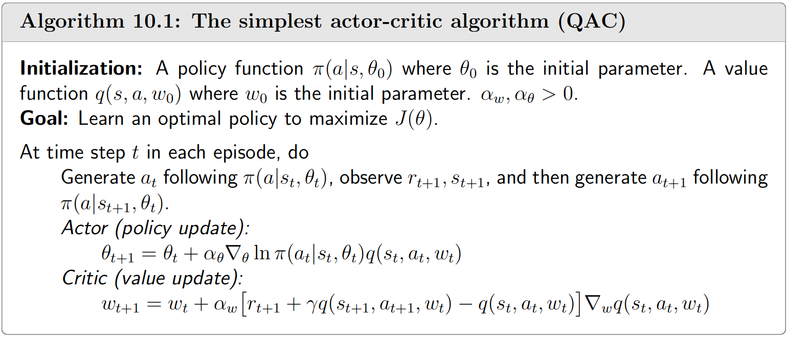
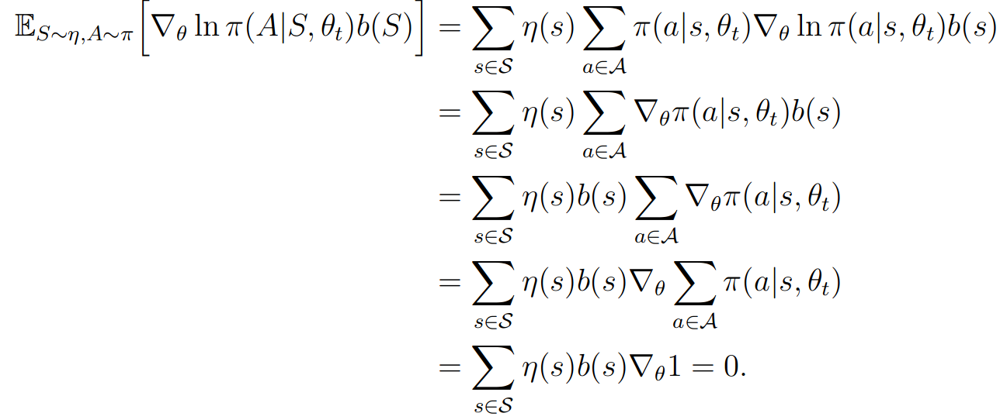
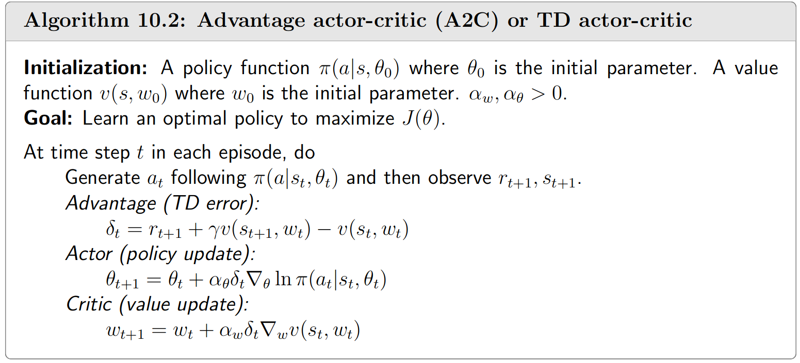
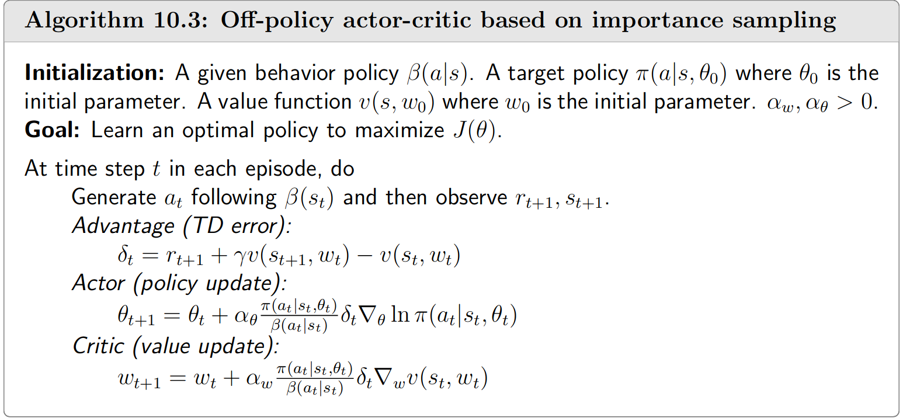
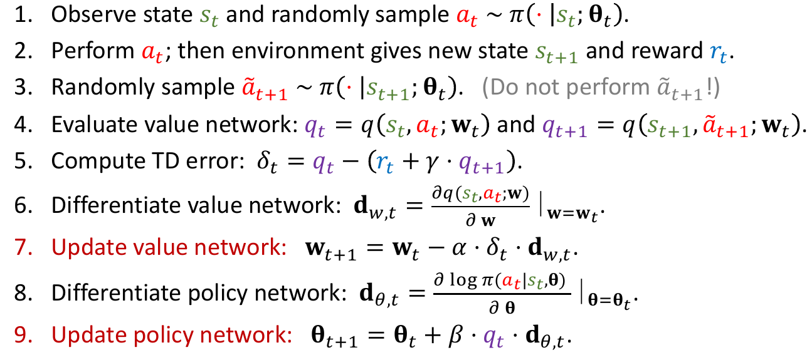

> If $q_t(s_t, a_t)$ is estimated by TD learning, the corresponding algorithms are usually called actor-critic.

## QAC

## Advantage actor-critic (A2C)

**Baseline invariance**

 $\mathbb{E}_{S\sim\eta,A\sim\pi}\left[\nabla_\theta\ln\pi(A|S,\theta_t)q_\pi(S,A)\right]=\mathbb{E}_{S\sim\eta,A\sim\pi}\left[\nabla_\theta\ln\pi(A|S,\theta_t)(q_\pi(S,A)-b(S))\right]$

Proof: 

The baseline is useful because it can reduce the **approximation variance** when we use samples to approximate the true gradient. We can select the suboptimal baseline: 
$$
b(s)=\mathbb{E}_{A\sim\pi}[q_\pi(s,A)=v_\pi(s)]
$$

The stochastic version of gradient-ascent algorithm is:
$$
\begin{aligned}
\theta_{t+1}& =\theta_t+\alpha\nabla_\theta\ln\pi(a_t|s_t,\theta_t)[q_t(s_t,a_t)-v_t(s_t)]  \\
&=\theta_t+\alpha\nabla_\theta\ln\pi(a_t|s_t,\theta_t)\delta_t(s_t,a_t)
\end{aligned}
$$

If $q_t(s_t,a_t)$ and $v_t(s_t)$ are estimated by TD learning, the algorithm is usually called advantage actor-critic (A2C). The advantage function in this implementation is approximated by the TD error:
$$
\begin{aligned}
q_t(s_t,a_t)-v_t(s_t)&\approx r_{t+1}+\gamma v_t(s_{t+1})-v_t(s_t)
\\
q_\pi(s_t,a_t)-v_\pi(s_t)&=\mathbb{E}\Big[R_{t+1}+\gamma v_\pi(S_{t+1})-v_\pi(S_t)|S_t=s_t,A_t=a_t\Big]\end{aligned}
$$

**merit:**

- Only need to use a single neural network to represent $v_\pi(s)$.

- The policy $π(\theta_t)$ is stochastic and hence exploratory. Therefore, it can be directly used to generate experience samples without relying on techniques such as ε-greedy.

## Off-policy actor-critic

The importance sampling is a general technique for estimating expected values defined over one probability distribution using some samples drawn from another distribution.
$$
\begin{aligned}
\mathbb{E}_{X\sim p_0}[X]&=\sum_{x\in\mathcal{X}}p_0(x)x=\sum_{x\in\mathcal{X}}p_1(x)\underbrace{\frac{p_0(x)}{p_1(x)}}_{f(x)}x=\mathbb{E}_{X\sim p_1}[f(X)]
\\
&\approx\bar{f}=\frac1n\sum_{i=1}^nf(x_i)=\frac1n\sum_{i=1}^n\underbrace{\frac{p_0(x_i)}{p_1(x_i)}}_{\text{importance}}x_i
\end{aligned}
$$

## Actor-Critic

$V_{\pi}(s)=\underset{{\color{red}{a}}}{\sum}\pi({\color{red}{a}}|s)\cdot Q_{\pi}(s,{\color{red}{a}})\approx\underset{{\color{red}{a}}}{\sum}\pi({\color{red}{a}}|s;\mathbf{\theta})\cdot q(s,{\color{red}{a}};\mathbf{w})$

Two neural nets for Value Network and Policy Network. 

- **Policy network (actor) && Value network (critic)**

During training:

- Agent is controlled by policy network (actor)

- Value network $q$ (critic) provides the actor with supervision.

- Update the policy network (actor) by **policy gradient**.
- Update the value network (critic) by **TD learning**.

After training:

- Agent is controlled by policy network (actor)
- Value network $q$ (critic) will not be used.

Training:

For last step, $\mathbf{\theta}_{t+1}=\mathbf{\theta}_t+\mathbf{\beta}\cdot\delta_t\cdot\mathbf{d}_{\theta,t}$ in policy gradient with baseline.
