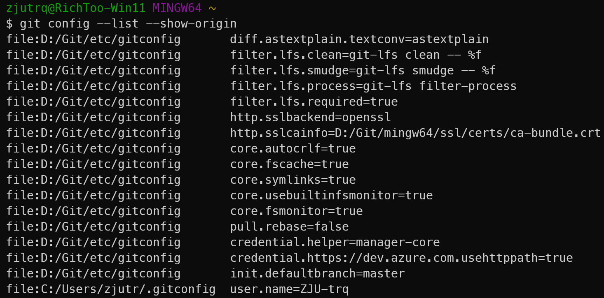

# Git起步

## Git是什么？

Git是分布式版本控制系统（Distributed Version Control System，简称DVCS）。

> Git 和其它版本控制系统（包括 Subversion 和近似工具）的主要差别在于 Git 对待数据的方式。从概念上来说，其它大部分系统以文件变更列表的方式存储信息，这类系统（CVS、Subversion、Perforce、Bazaar 等等） 将它们存储的信息看作是一组基本文件和每个文件随时间逐步累积的差异（它们通常称作 基于差异（delta-based）的版本控制）。


Git不按照以上方式对待或保存数据。反之，Git 更像是把数据看作是对小型文件系统的一系列快照。 在 Git中，每当你提交更新或保存项目状态时，它基本上就会对当时的全部文件创建一个快照并保存这个快照的索引。为了效率，如果文件没有修改，Git 不再重新存储该文件，而是只保留一个链接指向之前存储的文件。 Git对待数据更像是一个 ==快照流==。


## Git的特性

- 近乎所有操作都是本地执行
- 保证完整性
Git 用以计算校验和的机制叫做 SHA-1 散列（hash，哈希）。 这是一个由 40 个十六进制字符（0-9 和 a-f）组成的字符串，基于 Git 中文件的内容或目录结构计算出来。 SHA-1哈希看起来是这样：

```
24b9da6552252987aa493b52f8696cd6d3b00373
```
- 一般只添加数据

## **三种状态**

文件有三种状态，可能处于其中之一：已提交（committed）、已修改（modified）和已暂存（staged）。

- 已修改表示修改了文件，但还没保存到数据库中。
- 已暂存表示对一个已修改文件的当前版本做了标记，使之包含在下次提交的快照中。
- 已提交表示数据已经安全地保存在本地数据库中。

我们便拥有了三个阶段：工作区、暂存区以及 Git 目录。


- 工作区是对项目的某个版本独立提取出来的内容。
- 暂存区是一个文件，保存了下次将要提交的文件列表信息，一般在Git仓库目录中。==暂存区又名索引==。
- Git仓库目录是Git用来保存项目的元数据和对象数据库的地方。这是Git中最重要的部分，从其它计算机克隆仓库时，复制的就是这里的数据。

## Git配置

### 配置信息

Git自带一个`git config`的工具来控制配置变量。利用`git config --list --show-origin`查看所有的配置以及它们所在的文件，利用`git config --list`来查看所有的配置信息。

**对于Linux系统：**

1. /etc/gitconfig 文件:包含系统上每一个用户及他们仓库的通用配置。如果在执行git config时带上--system选项，那么它就会读写该文件中的配置变量。
2. ~/.gitconfig 或 ~/.config/git/config文件：只针对当前用户。你可以传递--global选项让Git读写此文件，这会对你系统上所有的仓库生效。
3. 当前使用仓库的Git目录中的config文件（即.git/config）：针对该仓库。你可以传递--local选项让Git强制读写此文件，虽然默认情况下用的就是它。

**对于Windows系统：**

在Windows系统中，Git会查找$HOME目录下（一般情况下是C:\Users\\\$USER）的.gitconfig文件。Git同样也会寻找/etc/gitconfig文件，即安装Git时所选的目标位置。



**对于mac系统：**

我没有mac，所以先不写了。

### 用户信息

安装完Git之后，设置用户名和邮件地址，每一个Git提交都会使用这些信息，它们会写入到每一次提交中，不可更改。

### 如何认证身份？

创建 SSH Key.

```BASH
ssh-keygen -t rsa -C "youremail@example.com"
```

查看`.ssh`目录，里面有`id_rsa`和`id_rsa.pub`两个文件。`id_rsa`是私钥，`id_rsa.pub`是公钥.

GitHub-->setting-->SSH and GPG keys 添加`id_rsa.pub`。

### 本地的项目上传到GitHub

连接远程仓库：

`git remote add origin git@github.com:yourGitHubId/testRepo.git` 注意使用 ssh。

首次push：

`git push -u origin master`
