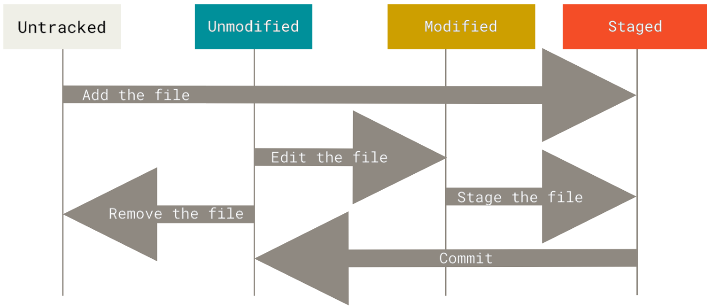

# Git基础

## Git仓库的获取

1. 在已存在的目录中初始化仓库

    ` git init`命令将创建一个名为.git的子目录，这个子目录含有初始化的Git仓库中所有的必须文件，这些文件是Git仓库的骨干.

2. 克隆现有的仓库

    `git clone https://github.com/libgit2/libgit2 mylibgit`从远程仓库拉取所有数据。

## 记录更新到仓库

工作目录下的每一个文件都处于两种状态：已跟踪或未跟踪。已跟踪的文件是指那些被纳入了版本控制的文件，在上一次快照中有它们的记录，在工作一段时间后，它们的状态可能是未修改，已修改或已放入暂存区。简而言之，已跟踪的文件就是Git已经知道的文件。其余文件为未跟踪文件。初次克隆某个仓库的时候，工作目录中的所有文件都属于已跟踪文件，并处于未修改状态。

<div align="center">

</div>
### 检查当前文件状态

利用`git status`来查看文件的状态，`git status -s`命令或`git status --short`命令可以缩短输出的长度。

```
$ git status -s
M README
MM Rakefile
A lib/git.rb
M lib/simplegit.rb
?? LICENSE.txt
```

新添加的未跟踪文件前面有??标记，新添加到暂存区中的文件前面有A标记，修改过的文件前面有M标记。输出中有两栏，左栏指明了暂存区的状态，右栏指明了工作区的状态。例如，上面的状态报告显示：README文件在工作区已修改但尚未暂存，而lib/simplegit.rb文件已修改且已暂存。Rakefile文件已修改，暂存后又作了修改，因此该文件的修改中既有已暂存的部分，又有未暂存的部分。

### 跟踪新文件和暂存已修改的文件

`git add`有多种用法，可以用它开始跟踪新文件，或者把已跟踪的文件放到暂存区，还能用于合并时把有冲突的文件标记为已解决状态。

当我们修改了一个已被跟踪的文件时：

```
On branch master
No commits yet
Changes to be committed:
  (use "git rm --cached <file>..." to unstage)
        new file:   CONTRIBUTING.md
        new file:   README
Changes not staged for commit:
  (use "git add <file>..." to update what will be committed)
  (use "git restore <file>..." to discard changes in working directory)
        modified:   CONTRIBUTING.md
```

文件`CONTRIBUTING.md`出现在`Changes not staged for commit`这行下面，说明已跟踪文件的内容发生了变化，但还没有放到暂存区。 要暂存这次更新，需要运行`git add`命令。

### 忽略文件

创建一个名为 .gitignore 的文件，列出要忽略的文件的模式。如：

```shell
cat .gitignore
*.[oa]
*~
```

第一行告诉 Git 忽略所有以.o或.a结尾的文件。一般这类对象文件和存档文件都是编译过程中出现的。 第二行告诉Git忽略所有名字以波浪符（~）结尾的文件，许多文本编辑软件（比如Emacs）都用这样的文件名保存副本。

```
# 忽略所有的 .a 文件
*.a
# 但跟踪所有的 lib.a，即便你在前面忽略了 .a 文件
!lib.a
# 只忽略当前目录下的 TODO 文件，而不忽略 subdir/TODO
/TODO
# 忽略任何目录下名为 build 的文件夹
build/
# 忽略 doc/notes.txt，但不忽略 doc/server/arch.txt
doc/*.txt
# 忽略 doc/ 目录及其所有子目录下的 .pdf 文件
doc/**/*.pdf
```

各种编程语言的`.gitignore`https://github.com/github/gitignore。

### 查看已暂存和未暂存的修改

> 看了就忘了干什么的了。

`git diff`比较「暂存区」与「工作区」之间的差异,即工作目录中当前文件和暂存区域快照之间的差异，换句话说就是修改之后还没有暂存起来的变化内容。如果直接暂存了所有更新过的文件，运行 `git diff`后就会无输出。

`git diff --cached`比较暂存区和上次提交的差异，(--staged)同义。

### 提交更新

提交命令`git commit`会启动你选择的文本编辑器来输入提交说明。`git commit -m "XXX"`让你完成提交。

提交时记录的是放在暂存区域的快照。任何还未暂存文件的仍然保持已修改状态，可以在下次提交时纳入版本管理。每一次运行提交操作，都是项目进行一次快照，以后可以回到这个状态，或者进行比较。

`git commit`加上`-a`选项,Git就会自动把所有已经跟踪过的文件暂存起来一并提交，从而跳过`git add`步骤。

### 移除文件

`git rm`用于从暂存区中删除文件或者同时从工作区和暂存区中删除文件。

| 命令            | 描述                                                         |
| --------------- | ------------------------------------------------------------ |
| git rm          | 同时从工作区和暂存区中删除文件，即本地的文件也被删除了。     |
| git rm --cached | 从索引（暂存区）中删除文件，但是本地文件还存在， 只是不希望这个文件被版本控制，即处于未跟踪状态。 |

如果要删除之前修改过或已经放到暂存区的文件，则必须使用强制删除选项-f。这是一种安全特性，用于防止误删尚未添加到快照的数据，这样的数据不能被Git恢复。

`git rm`命令后面可以列出文件或者目录的名字，也可以使用`glob`模式。如：

`git rm log/\*.log`删除log/目录下扩展名为`.log` 的所有文件。

### 重命名文件

`git mv`命令用于重命名文件，目录或符号链接。`git mv `命令其实是首先执行了` mv `命令，将旧文件重命名为新文件，接着，使用`git rm `命令删除旧文件，并使用`git add `添加新文件。

因此，`git mv`命令，相当于执行了以下三个命令：

```shell
mv README.md README; git rm README.md; git add README
```

## 查看提交历史

`git log` 常用命令如下：

| 参数                 | 描述                                                         |
| -------------------- | ------------------------------------------------------------ |
| git log              | 查看 git 提交记录。                                          |
| git log --oneline    | 以简短方式输出 git log。                                     |
| git log --stat       | 输出增删改的统计数据。                                       |
| git log file         | 查看文件 file 的提交记录。                                   |
| git log -p           | 输出每个 commit 具体修改的内容，输出的形式以 diff 的形式给出。 |
| git log --author     | 用来过滤 commit，限定输出给定的用户。                        |
| git log -n           | 限制要输出的数量。                                           |
| git log --after      | 输出在指定日期之后的记录。如`git log --before "2020-05-11 21:21"` |
| git log --before     | 输出在指定日期之前的记录。                                   |
| git log --grep       | 搜索提交信息，也支持正常表达式（只能搜索标签、不可搜索内容）。 |
| git log --branchName | branchName 为任意一个分支名字，查看莫个分支上的提交记录。    |
| git log --graph      | 以简单的图形方式列出提交记录。                               |

## 撤销操作

`git commit --amend`可以用来重新提交，例如：

```shell
git commit -m 'initial commit'
git add forgotten_file
git commit --amend
```

文本编辑器启动后，可以看到之前的提交信息。编辑后保存会覆盖原来的提交信息，从效果上来说，就像是旧有的提交从未存在过一样，它并不会出现在仓库的历史中。

`git reset HEAD <file>`用来取消暂存file文件。

`git checkout -- <file>`用来撤销对文件的修改。

> 请务必记得 git checkout -- <file> 是一个危险的命令。作用文件在本地的任何修改都会消失——Git会用最近提交的版本覆盖掉它。除非你确实清楚不想要对那个文件的本地修改了，否则请不要使用这个命令。
>
> 在 Git 中任何已提交的东西几乎总是可以恢复的。甚至那些被删除的分支中的提交或使用--amend选项覆盖的提交也可以恢复。但是未提交的东西丢失后很可能再也找不到了。

## 打标签和git别名

以后再学吧。
