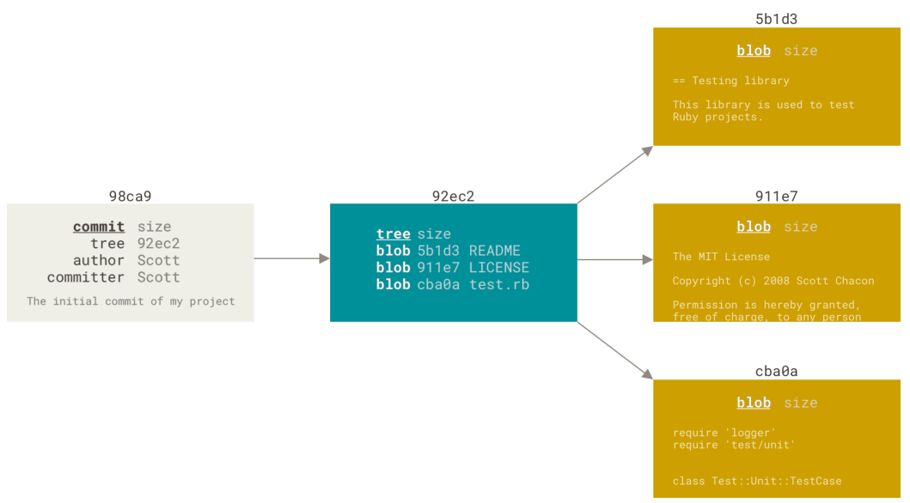
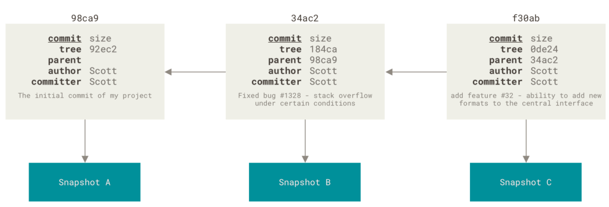
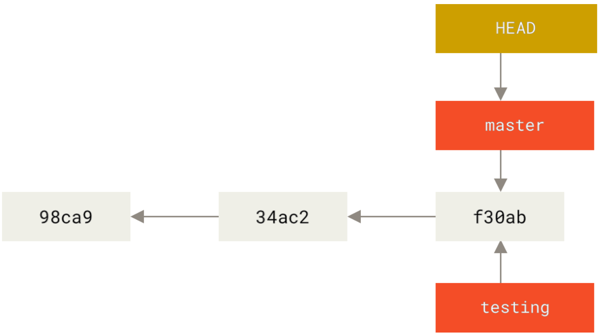
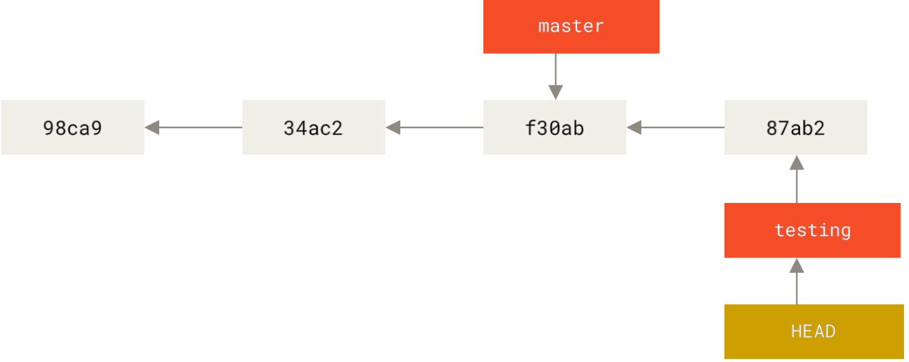
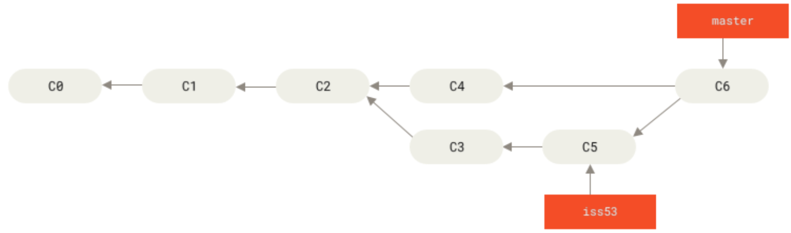
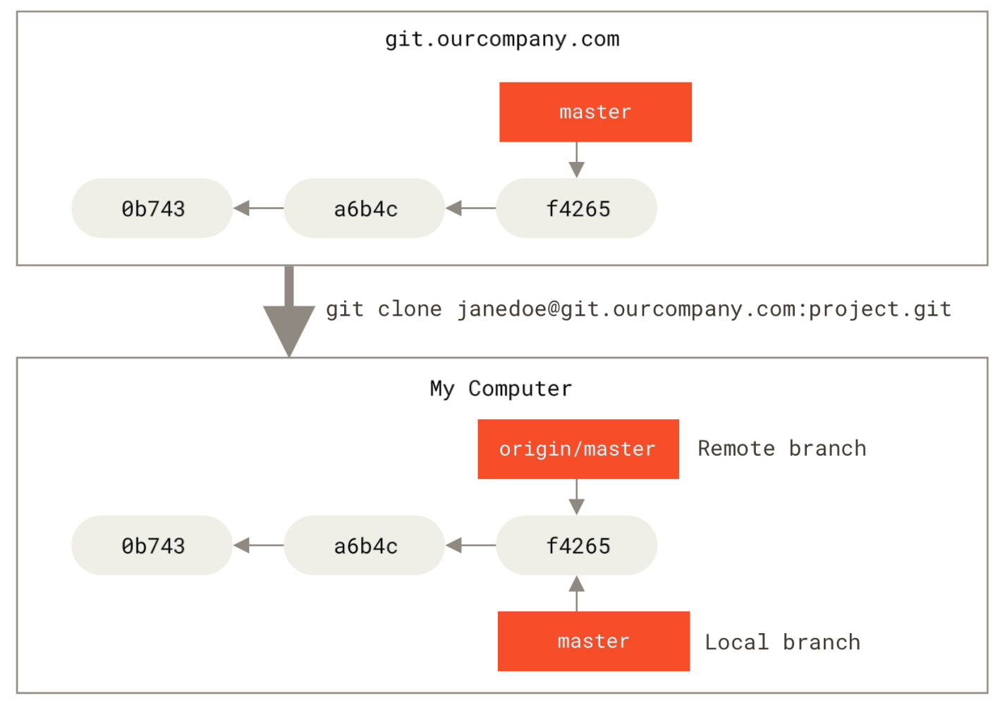
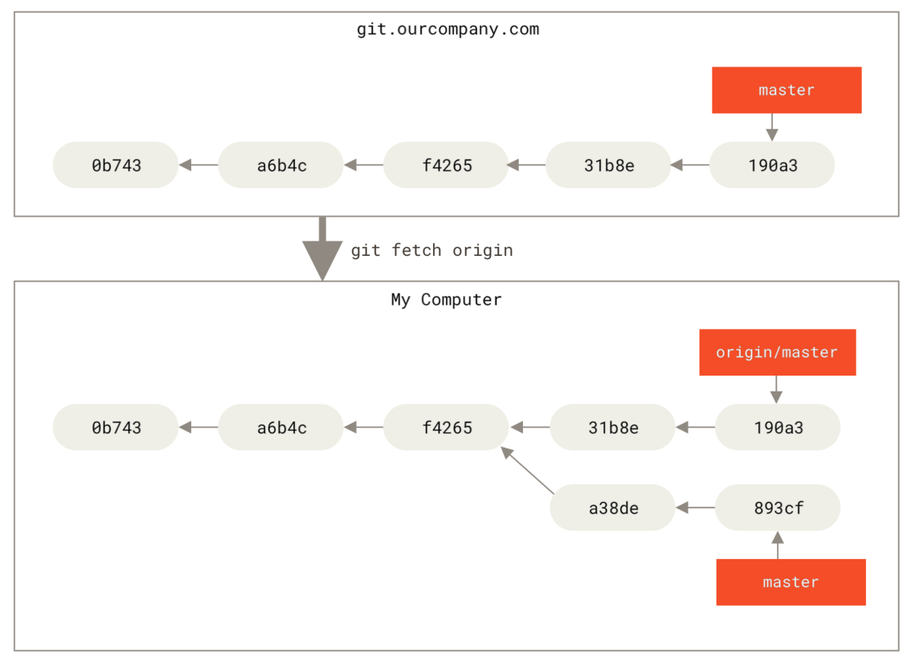
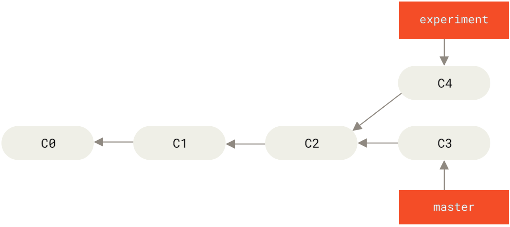
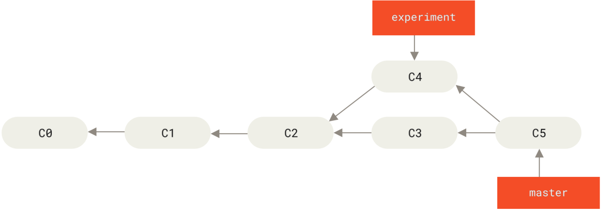

# 远程仓库与分支

## 远程仓库

### 查看远程仓库

查看 git 远程仓库的地址或者更详细的信息，可以使用` git remote `命令。

使用 `git remote show origin` 命令，查看 git 远程仓库的信息比 `git remote -v` 更详细。

### 添加和删除远程仓库

`git remote add [shortname] [url]`,添加一个新的远程 Git 仓库，同时指定一个方便使用的简写。使用 clone 命令克隆了一个仓库，命令会自动将其添加为远程仓库并默认以 “origin”为简写。
`git remote rm origin`删除远程仓库，origin为远程仓库名。

### 重命名和修改地址

`git remote rename old new` 重命名远程仓库

`git remote set-url origin url` origin为远程仓库名，url为新地址。也可以直接通过修改工作目录的 `.git` 目录下的 config 配置文件

### 拉取远程仓库

`git fetch [options]`

这个命令会访问远程仓库，从中拉取所有你还没有的数据。执行完成后，你将会拥有那个远程仓库中所有分支的引用，可以随时合并或查看。

如果你使用 clone 命令克隆了一个仓库，命令会自动将其添加为远程仓库并默认以 “origin”为简写。 所以，`git fetch origin `会抓取克隆（或上一次抓取）后新推送的所有工作。

| 实例                 | 描述                                              |
| -------------------- | ------------------------------------------------- |
| git fetch            | 创建并更新本地远程分支。                          |
| git fetch origin     | 将 origin 远程主机的更新，全部取回本地。          |
| git fetch origin dev | 将 origin 远程主机的dev分支的更新，全部取回本地。 |

git fetch 命令只会将数据下载到你的本地仓库——它并不会自动合并或修改你当前的工作。

### 推送到远程仓库

`git push <remote> <branch>`，默认情况下，`git clone`命令会自动设置本地master分支跟踪克隆的远程仓库origin的master分支（或其它名字的默认分支）。所以只需要执行`git push origin master`。

### git pull命令

`git pull [options] [remote] `命令的作用是取回远程主机某个分支的更新，再与本地的指定分支合并。 `git pull`是 `git fetch` 与 `git merge `两个命令的合并。使用克隆后，运行 git pull 通常会从最初克隆的服务器上抓取数据并自动尝试合并到当前所在的分支。

## Git分支

### 分支简介

假设有一个工作目录，里面包含了三个将要被暂存和提交的文件。暂存操作会为每一个文件计算校验和（SHA-1 哈希算法），然后会把当前版本的文件快照保存到Git仓库中 （Git 使用 blob 对象来保存它们），最终将校验和加入到暂存区域等待提交。

当使用 git commit 进行提交操作时，Git会先计算每一个子目录（本例中只有项目根目录）的校验和，然后在Git仓库中这些校验和保存为树对象。随后，Git便会创建一个提交对象，它除了包含上面提到的那些信息外，还包含指向这个树对象（项目根目录）的指针。现在，Git 仓库中有五个对象：三个 blob 对象（各保存着文件快照）、一个树对象（记录着目录结构和blob对象索引）以及提交对象（包含着指向前述树对象的指针和所有提交信息）


修改后产生的提交对象会包含一个指向上次提交对象（父对象）的指针。




Git 的 master 分支并不是一个特殊分支。 它就跟其它分支完全没有区别。之所以几乎每一个仓库都有 master 分支，是因为`git init`命令默认创建它。

### 分支操作

#### 分支创建和切换

`git branch testing`会在当前所在的提交对象上创建一个指针。git中存在一个`HEAD`指针，指向当前所在的本地分支，可以认为是当前分支的别名。




使用`git log --oneline --decorate`查看各个分支当前所指的对象。本例中，`(HEAD -> master, testing)`。

`git checkout testing`，切换到新创建的testing分支。再提交一次，testing分支向前移动，但是master分支不会，它仍然指向运行`git checkout`时所指的对象。




此时切换回master分支，一方面是使 HEAD 指回 master 分支，另一方面是工作目录会恢复成 master 分支所指向的快照内容。

`git checkout - b <newbranchname> ` 创建新分支并切换过去。

#### 分支查看

`git branch [options]`

| 参数 | 描述                                   |
| ---- | -------------------------------------- |
| -a   | 查看所有分支，包括本地分支和远程分支。 |
| -r   | 进查看远程分支。                       |

`git log --graph --decorate --oneline --simplify-by-decoration --all`

`gitk --simplify-by-decoration --all` 

#### 重命名和删除分支

`git branch -m oldBranchName newBranchName`

重命名远程分支：

```shell
git branch -m oldBranchName newBranchName   # 将本地的分支进行重命名
git push origin newBranchName               # 将新的分支推送到远程       
git push --delete origin oldBranchName      # 删除远程的旧的分支 
```

`git branch -d branchName`删除本地分支

#### 分支合并

`git merge branchName`会将当前分支和branchName分支进行合并。

试图合并两个分支时，如果顺着一个分支走下去能够到达另一个分支，那么 Git 在合并两者的时候，只会简单的将指针向前推进（指针右移），因为这种情况下的合并操作没有需要解决的分歧，即为“快进（fast-forward）”。

此外的合并分支需要考虑冲突的情况。




#### 分支管理

`git branch` 命令不只是可以创建与删除分支。如果不加任何参数运行它，会得到当前所有分支的一个列表。

`git branch -v `查看每一个分支的最后一次提交。

`git branch --merged`查看哪些分支已经合并到当前分支,这个列表中分支名字前没有*号的分支通常可以使用` git branch -d `删除掉；你已经将它们的工作整合到了另一个分支，所以并不会失去任何东西。

`git branch --no-merged` 查看所有包含未合并工作的分支，此时不能过-d命令删除，可以使用 -D 选项。

### 远程分支

克隆后，Git 的 clone 命令会自动将远程仓库命名为 origin，拉取它的所有数据， 创建一个指向它的 master 分支的指针，并且在本地将其命名为 origin/master。 Git 也会给你一个与 origin 的 master 分支指向同一个地方的本地 master 分支，从而进行操作。



运行`git fetch <remote> `，与给定的远程仓库同步数据，移动 origin/master 指针到更新之后的位置。



如果我们添加了一个新的远程仓库teamone，可以运行 `git fetch <remote>` 来抓取远程仓库有而本地没有的数据。 如果远程库的数据是 origin 服务器上的一个子集， Git 并不会抓取数据，但依然会设置远程跟踪分支 teamone/master 指向 teamone 的 master 分支。

#### 推送

`git push <remote> <branch>`

举个例子，`git push origin serverfix`，git 会自动将serverfix分支名字展开为 refs/ heads/
serverfix:refs/heads/serverfix，这意味着，“推送本地的 serverfix 分支来更新远程仓库上的 serverfix 分支。”`git push origin serverfix:serverfix`会起到相同的作用。同理，` git push origin serverfix:awesomebranch `会将本地的 serverfix 分支推送到远程仓库上的 awesomebranch 分支。

#### 跟踪分支

跟踪分支是与远程分支有直接关系的本地分支。如果在一个跟踪分支上输入`git pull`，Git 能自动地识别去哪个服务器上抓取、合并到哪个分支。当克隆一个仓库时，它通常会自动地创建一个跟踪 origin/master 的 master 分支。 

`git checkout --track origin/serverfix` 创建serverfix分支，跟踪远程分支。

`git checkout serverfix` 如果serverfix分支不存在，且存在唯一名字匹配的远程分支，git会自动创建跟踪分支。

`git checkout -b sf origin/serverfix` 不同名字。

`git branch -vv` 查看远程仓库连接情况。

#### 拉取

`git pull`

#### 删除远程分支

`git push origin --delete serverfix`

### 变基 Rebase



提取在 C4 中引入的补丁和修改，然后在 C3 的基础上应用一次。在 Git 中，这种操作就叫做变基（rebase）


`git checkout experiment git rebase master`，它的原理是首先找到这两个分支（即当前分支 experiment、变基操作的目标基底分支master） 的最近共同祖先 C2，然后对比当前分支相对于该祖先的历次提交，提取相应的修改并存为临时文件，然后将当前分支指向目标基底 C3, 最后以此将之前另存为临时文件的修改依序应用。

换句话说，rebase 就是将一系列的 commit 从一个分支转移到另一个分支上。它会将当前分支的提交应用到目标基底分支上，就好像它们是从目标基底分支上直接衍生出来的一样。

变基使得提交历史更加整洁。 你在查看一个经过变基的分支的历史记录时会发现，尽管实际的开发工作是并行的， 但它们看上去就像是串行的一样，提交历史是一条直线没有分叉。

